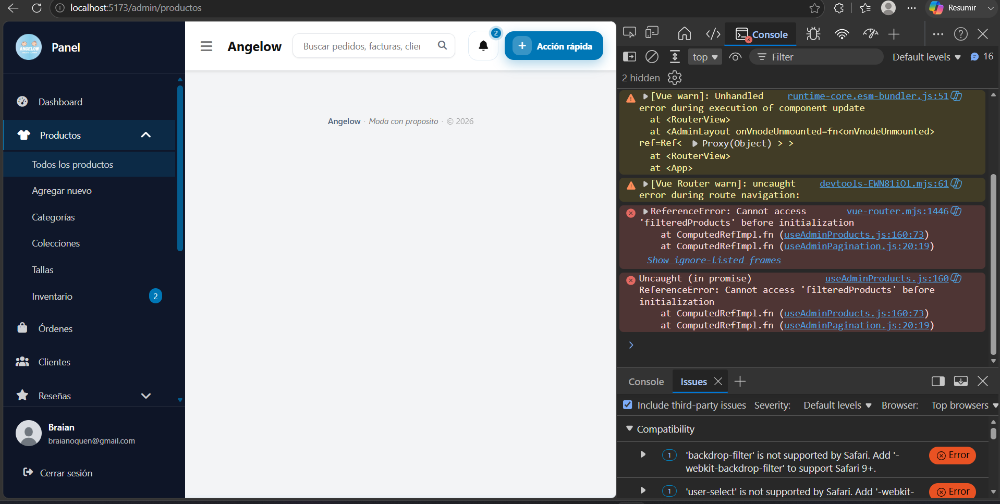

# Angelow Microservices

<!-- indice:auto:start -->
## Índice rápido

- [Guías clave](#guías-clave)
- [Servicios y puertos](#servicios-y-puertos)
- [PostgreSQL en pgAdmin (evitar confusión)](#postgresql-en-pgadmin-evitar-confusión)
- [Levantar todo con Docker](#levantar-todo-con-docker)
- [Ejecutar migraciones](#ejecutar-migraciones)
- [Importar datos desde `basededatos.sql`](#importar-datos-desde-basededatossql)
- [Ejecutar pruebas](#ejecutar-pruebas)
- [Documentación](#documentación)
<!-- indice:auto:end -->

Migración del monolito `angelow/` hacia microservicios Laravel con PostgreSQL, Redis, workers y frontend separado.

## Guías clave

- [Manual técnico](docs/operaciones/manual-tecnico.md)
- [Índice general de documentación](docs/README.md)
- [Ficha actual del proyecto](docs/proyecto/FICHA_PROYECTO_ANGELOW.md)
- [Diagramas de clases por microservicio](docs/arquitectura/diagramas-clases-microservicios-plantuml.md)
- [Modelos relacionales por microservicio](docs/arquitectura/modelos-relacionales-bases-datos-plantuml.md)
- [Modelo relacional completo](docs/arquitectura/modelo-relacional-completo-plantuml.md)
- [Estructura SQL unificada de microservicios](docs/datos/estructura-unificada-microservicios.sql)
- [Rendimiento de base de datos en microservicios](docs/datos/rendimiento-bd-microservicios.md)
- [Patrones de rendimiento de base de datos](docs/patrones/datos/patrones-diseno-rendimiento-bd-microservicios-2026-06-29.md)
- [Historias de usuario](docs/referencias/historias-usuario-angelow.md)
- [Casos de uso del sistema](docs/referencias/casos-uso-angelow.md)
- [Requisitos no funcionales](docs/referencias/requisitos-no-funcionales-angelow.md)
- [Patrón de términos y condiciones públicos](docs/patrones/legal/patrones-diseno-terminos-condiciones-2026-06-30.md)
- [Documentación por microservicio](docs/microservicios/README.md)
- [Guía de testing compartido](docs/testing/README.md)
- [Matriz de requerimientos funcionales actualizada](docs/referencias/matriz-requerimientos-funcionales-actualizada.md)
- [Guía del frontend](frontend/README.md)
- [Guía de exportaciones admin reutilizables](frontend/docs/exportaciones-admin-reutilizables.md)
- [Validaciones numéricas de productos, inventario y carrito](docs/patrones/admin/patrones-diseno-validaciones-numericas-2026-06-10.md)
- [Verificación de seguridad en autenticación nativa](docs/patrones/auth/patrones-diseno-auth-turnstile-2026-06-21.md)
- [Código compartido para registro y recuperación](docs/patrones/auth/patrones-diseno-auth-codigo-registro-recuperacion-2026-06-22.md)
- [Acceso autenticado al checkout](docs/patrones/checkout/patrones-diseno-checkout-2026-04-03.md)

## Servicios y puertos

| Servicio | Puerto API | Base de datos |
|---|---:|---|
| `auth-service` | 8001 | `angelow_auth` |
| `catalog-service` | 8002 | `angelow_catalog` |
| `cart-service` | 8003 | `angelow_cart` |
| `order-service` | 8004 | `angelow_orders` |
| `payment-service` | 8005 | `angelow_payments` |
| `discount-service` | 8006 | `angelow_discounts` |
| `shipping-service` | 8007 | `angelow_shipping` |
| `notification-service` | 8008 | `angelow_notifications` |
| `audit-service` | 8009 | `angelow_audit` |
| `realtime-gateway` | 8090 | n/a |
| `frontend` | 5173 | n/a |

## PostgreSQL en pgAdmin (evitar confusión)

Cada microservicio usa su propia base PostgreSQL en un puerto distinto.
Si en pgAdmin te conectas solo a `localhost:5432`, verás la instancia local general, no las bases de microservicios.

| Base de datos | Host | Puerto | Usuario | Contraseña |
|---|---|---:|---|---|
| `angelow_auth` | `localhost` | 5433 | `postgres` | `root` |
| `angelow_catalog` | `localhost` | 5434 | `postgres` | `root` |
| `angelow_cart` | `localhost` | 5435 | `postgres` | `root` |
| `angelow_orders` | `localhost` | 5436 | `postgres` | `root` |
| `angelow_payments` | `localhost` | 5437 | `postgres` | `root` |
| `angelow_discounts` | `localhost` | 5438 | `postgres` | `root` |
| `angelow_shipping` | `localhost` | 5439 | `postgres` | `root` |
| `angelow_notifications` | `localhost` | 5440 | `postgres` | `root` |
| `angelow_audit` | `localhost` | 5441 | `postgres` | `root` |

Validación rápida en pgAdmin (sobre cada base):

```sql
SELECT count(*) AS total_tablas
FROM information_schema.tables
WHERE table_schema = 'public';
```

## Levantar todo con Docker

Antes de levantar `auth-service` en entornos protegidos, define `TURNSTILE_SECRET_KEY` como variable externa del entorno o secreto de despliegue. El frontend recibe la llave pública con `VITE_TURNSTILE_SITE_KEY`; la llave secreta nunca debe ir en Vue ni en archivos versionados.

```bash
docker compose up -d --build
docker compose ps
```

## Ejecutar migraciones

```bash
docker compose exec -T auth-service php artisan migrate --force
docker compose exec -T catalog-service php artisan migrate --force
docker compose exec -T cart-service php artisan migrate --force
docker compose exec -T order-service php artisan migrate --force
docker compose exec -T payment-service php artisan migrate --force
docker compose exec -T discount-service php artisan migrate --force
docker compose exec -T shipping-service php artisan migrate --force
docker compose exec -T notification-service php artisan migrate --force
docker compose exec -T audit-service php artisan migrate --force
```

## Importar datos desde `basededatos.sql`

```powershell
powershell -NoProfile -ExecutionPolicy Bypass -File .\scripts\importar-datos-microservicios.ps1
```

## Ejecutar pruebas

```bash
docker compose exec -T auth-service php artisan test
docker compose exec -T catalog-service php artisan test
docker compose exec -T cart-service php artisan test
docker compose exec -T order-service php artisan test
docker compose exec -T payment-service php artisan test
docker compose exec -T discount-service php artisan test
docker compose exec -T shipping-service php artisan test
docker compose exec -T notification-service php artisan test
docker compose exec -T audit-service php artisan test
```

## Documentación

- [Manual técnico](docs/operaciones/manual-tecnico.md)
- [Índice general de documentación](docs/README.md)
- [Ficha actual del proyecto](docs/proyecto/FICHA_PROYECTO_ANGELOW.md)
- [Diagramas de clases por microservicio](docs/arquitectura/diagramas-clases-microservicios-plantuml.md)
- [Modelos relacionales por microservicio](docs/arquitectura/modelos-relacionales-bases-datos-plantuml.md)
- [Modelo relacional completo](docs/arquitectura/modelo-relacional-completo-plantuml.md)
- [Estructura SQL unificada de microservicios](docs/datos/estructura-unificada-microservicios.sql)
- [Rendimiento de base de datos en microservicios](docs/datos/rendimiento-bd-microservicios.md)
- [Patrones de rendimiento de base de datos](docs/patrones/datos/patrones-diseno-rendimiento-bd-microservicios-2026-06-29.md)
- [Historias de usuario](docs/referencias/historias-usuario-angelow.md)
- [Casos de uso del sistema](docs/referencias/casos-uso-angelow.md)
- [Requisitos no funcionales](docs/referencias/requisitos-no-funcionales-angelow.md)
- [Patrón de términos y condiciones públicos](docs/patrones/legal/patrones-diseno-terminos-condiciones-2026-06-30.md)
- [Mapa de tablas por microservicio](docs/datos/migracion-tablas.md)
- [Importación de datos](docs/datos/importacion-datos.md)
- [Registro de patrones](docs/patrones/README.md)
- [Validaciones numéricas de productos, inventario y carrito](docs/patrones/admin/patrones-diseno-validaciones-numericas-2026-06-10.md)
- [Verificación de seguridad en autenticación nativa](docs/patrones/auth/patrones-diseno-auth-turnstile-2026-06-21.md)
- [Código compartido para registro y recuperación](docs/patrones/auth/patrones-diseno-auth-codigo-registro-recuperacion-2026-06-22.md)
- [Acceso autenticado al checkout](docs/patrones/checkout/patrones-diseno-checkout-2026-04-03.md)
- [Registro de librerías y dependencias](docs/referencias/librerias-y-composer-uso.md)
- [Matriz de requerimientos funcionales actualizada](docs/referencias/matriz-requerimientos-funcionales-actualizada.md)
- [Guía de exportaciones admin reutilizables](frontend/docs/exportaciones-admin-reutilizables.md)
