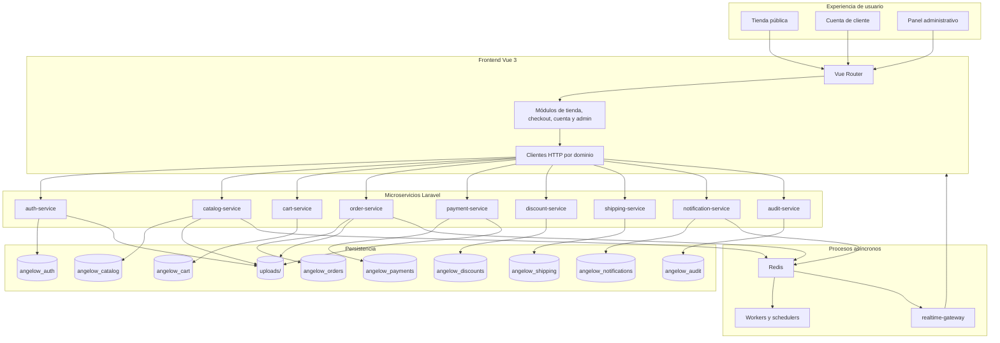
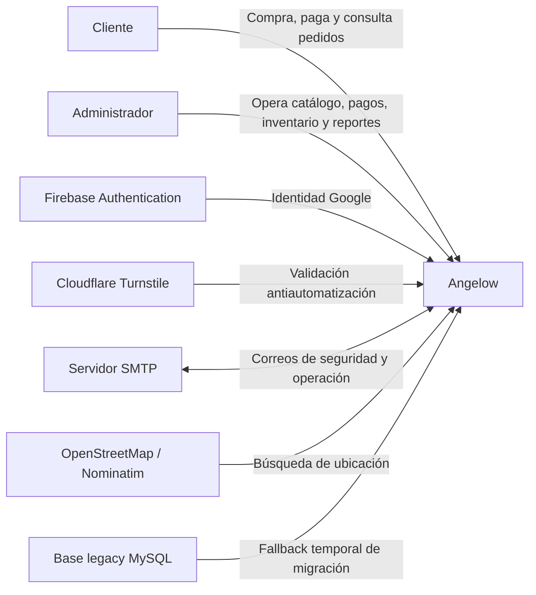
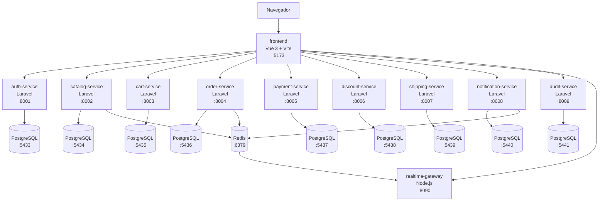
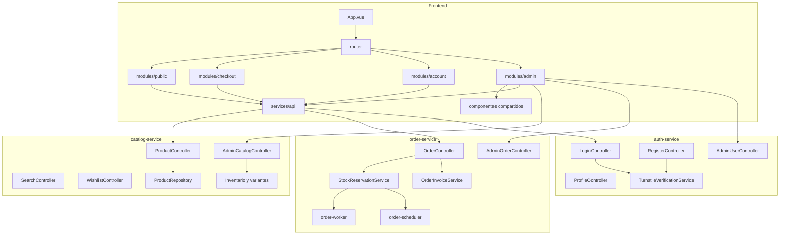
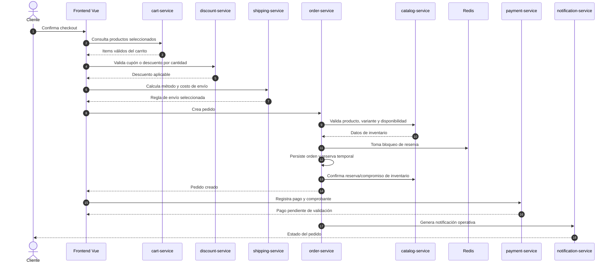
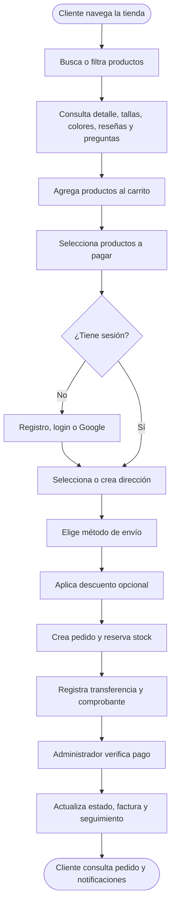
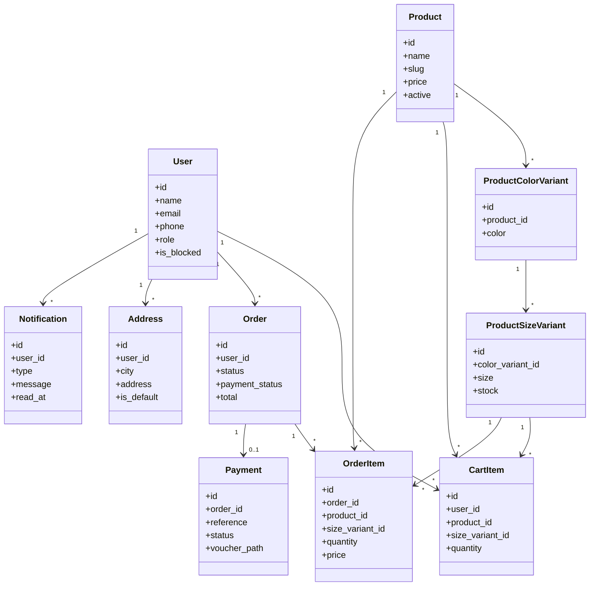
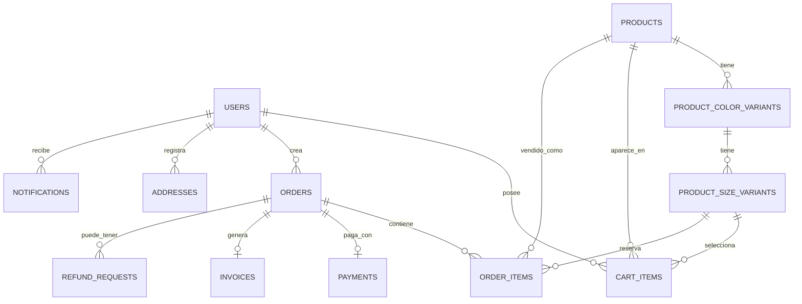

# Angelow Microservices

Plataforma de comercio electrónico para ropa infantil, desarrollada como migración progresiva desde un monolito PHP hacia una arquitectura de microservicios con Laravel, PostgreSQL, Redis y una SPA en Vue 3.

Angelow separa los dominios de autenticación, catálogo, carrito, pedidos, pagos, descuentos, envíos, notificaciones y auditoría. El frontend consume cada API por responsabilidad, conserva una experiencia de navegación SPA y centraliza la operación comercial de clientes y administradores.

## Índice

- [Resumen del Proyecto](#resumen-del-proyecto)
- [Funcionalidades Principales](#funcionalidades-principales)
- [Stack Técnico](#stack-técnico)
- [Arquitectura del Software](#arquitectura-del-software)
- [C1 - Contexto del Sistema](#c1---contexto-del-sistema)
- [C2 - Contenedores](#c2---contenedores)
- [C3 - Componentes](#c3---componentes)
- [C4 - Código y Flujo Interno](#c4---código-y-flujo-interno)
- [Mapa de Proceso de Compra](#mapa-de-proceso-de-compra)
- [UML de Dominios](#uml-de-dominios)
- [Modelo de Datos Resumido](#modelo-de-datos-resumido)
- [Servicios y Puertos](#servicios-y-puertos)
- [PostgreSQL en pgAdmin](#postgresql-en-pgadmin)
- [Instalación y Arranque](#instalación-y-arranque)
- [Migraciones e Importación de Datos](#migraciones-e-importación-de-datos)
- [Pruebas y Verificación](#pruebas-y-verificación)
- [Estructura del Proyecto](#estructura-del-proyecto)
- [Documentación Relacionada](#documentación-relacionada)
- [Calidad, Seguridad y Mantenibilidad](#calidad-seguridad-y-mantenibilidad)
- [Licencia](#licencia)

## Resumen del Proyecto

| Campo | Detalle |
|---|---|
| Nombre | Angelow Microservices |
| Dominio | E-commerce de ropa infantil al detal y al por mayor |
| Frontend | Vue 3, Vite, Vue Router, Axios, Chart.js |
| Backend | Laravel por microservicio |
| Bases de datos | PostgreSQL independiente por dominio |
| Comunicación | HTTP/JSON, Redis, workers, gateway WebSocket |
| Archivos | Volumen compartido `uploads/` |
| Entorno local | Docker Compose |

El sistema permite publicar productos, administrar variantes por talla y color, controlar stock, gestionar carrito, crear pedidos, registrar pagos por transferencia, validar comprobantes, generar facturas, configurar envíos, aplicar descuentos, enviar notificaciones y operar reportes administrativos.

## Funcionalidades Principales

- Tienda pública con inicio, catálogo, colecciones, detalle de producto, búsqueda, preguntas, reseñas y favoritos.
- Registro, inicio de sesión, ingreso con Google, verificación de correo, recuperación de contraseña y perfil de usuario.
- Carrito con selección parcial de productos, validación de disponibilidad y cantidades.
- Checkout con dirección, método de envío, descuentos, pago por transferencia y comprobante.
- Pedidos con historial de estados, facturas PDF, cancelaciones y solicitudes de reembolso.
- Panel administrativo para clientes, administradores, productos, categorías, colecciones, tallas, inventario, pedidos, pagos, reembolsos, facturas, descuentos, envíos, anuncios, sliders y configuración.
- Reservas temporales de stock con Redis para reducir sobreventas.
- Notificaciones, preferencias de usuario, alertas operativas y eventos en tiempo real.
- Auditoría y reportes para trazabilidad administrativa.

## Stack Técnico

| Capa | Tecnologías |
|---|---|
| SPA | Vue 3, Vite, Vue Router, Axios |
| UI y reportes | Chart.js, jsPDF, jsPDF AutoTable, ExcelJS |
| APIs | Laravel, Sanctum, Eloquent, Jobs, Scheduler |
| Datos | PostgreSQL 17 por servicio |
| Cache y colas | Redis 7 |
| Tiempo real | Gateway Node.js con WebSocket y Redis Pub/Sub |
| Autenticación externa | Firebase Authentication para Google |
| Protección de formularios | Cloudflare Turnstile |
| Infraestructura local | Docker Compose |

## Arquitectura del Software

Angelow aplica separación por dominio: cada microservicio es dueño de su modelo, su base de datos y sus reglas principales. Las integraciones entre dominios se hacen por APIs internas, eventos Redis o referencias lógicas, evitando que un servicio dependa directamente de las tablas de otro.



## C1 - Contexto del Sistema



## C2 - Contenedores



## C3 - Componentes



## C4 - Código y Flujo Interno

El flujo más sensible es la creación de pedidos con reserva de inventario. El frontend bloquea doble envío, `order-service` valida la orden, consulta catálogo, reserva stock con Redis y deja el pedido listo para pago.



## Mapa de Proceso de Compra



## UML de Dominios



## Modelo de Datos Resumido



Para el modelo relacional completo y los diagramas por microservicio, consulta:

- [Modelo relacional completo](docs/arquitectura/modelo-relacional-completo-plantuml.md)
- [Modelos relacionales por microservicio](docs/arquitectura/modelos-relacionales-bases-datos-plantuml.md)
- [Diagramas de clases por microservicio](docs/arquitectura/diagramas-clases-microservicios-plantuml.md)

## Servicios y Puertos

| Servicio | Puerto API | Base de datos | Puerto PostgreSQL | Responsabilidad |
|---|---:|---|---:|---|
| `frontend` | 5173 | n/a | n/a | SPA pública, cuenta y administración |
| `auth-service` | 8001 | `angelow_auth` | 5433 | Usuarios, sesión, perfil, roles y seguridad |
| `catalog-service` | 8002 | `angelow_catalog` | 5434 | Productos, categorías, colecciones, inventario, favoritos y contenido del sitio |
| `cart-service` | 8003 | `angelow_cart` | 5435 | Carrito, cantidades, selección y recordatorios |
| `order-service` | 8004 | `angelow_orders` | 5436 | Pedidos, reservas, estados, facturas, reembolsos y reportes |
| `payment-service` | 8005 | `angelow_payments` | 5437 | Bancos, cuenta de pago, comprobantes y validación |
| `discount-service` | 8006 | `angelow_discounts` | 5438 | Cupones, descuentos por cantidad y campañas |
| `shipping-service` | 8007 | `angelow_shipping` | 5439 | Direcciones, métodos y reglas de envío |
| `notification-service` | 8008 | `angelow_notifications` | 5440 | Notificaciones, preferencias y anuncios |
| `audit-service` | 8009 | `angelow_audit` | 5441 | Auditoría de pedidos, usuarios y productos |
| `realtime-gateway` | 8090 | n/a | n/a | Eventos WebSocket de inventario |
| `redis` | 6379 | n/a | n/a | Cache, colas, locks y Pub/Sub |

## PostgreSQL en pgAdmin

Cada microservicio publica una instancia PostgreSQL en un puerto local distinto. Si te conectas solo a `localhost:5432`, verás tu instancia local general, no las bases de Angelow.

| Base de datos | Host | Puerto | Usuario | Contraseña |
|---|---|---:|---|---|
| `angelow_auth` | `localhost` | 5433 | `postgres` | `root` |
| `angelow_catalog` | `localhost` | 5434 | `postgres` | `root` |
| `angelow_cart` | `localhost` | 5435 | `postgres` | `root` |
| `angelow_orders` | `localhost` | 5436 | `postgres` | `root` |
| `angelow_payments` | `localhost` | 5437 | `postgres` | `root` |
| `angelow_discounts` | `localhost` | 5438 | `postgres` | `root` |
| `angelow_shipping` | `localhost` | 5439 | `postgres` | `root` |
| `angelow_notifications` | `localhost` | 5440 | `postgres` | `root` |
| `angelow_audit` | `localhost` | 5441 | `postgres` | `root` |

Validación rápida sobre cada base:

```sql
SELECT count(*) AS total_tablas
FROM information_schema.tables
WHERE table_schema = 'public';
```

## Instalación y Arranque

### Requisitos

- Docker Desktop o Docker Engine con `docker compose`.
- PowerShell para scripts de importación.
- Puertos libres: `5173`, `6379`, `8001-8009`, `8090`, `5433-5441`.
- Variables sensibles configuradas fuera del código cuando aplique: `TURNSTILE_SECRET_KEY`, `MAIL_PASSWORD`, `PHPMAILER_PASSWORD`.

### Levantar todo

```bash
docker compose up -d --build
docker compose ps
```

### Levantar solo frontend después de cambios visuales

```bash
docker compose up -d --build frontend
docker compose exec frontend sh -c "rm -rf /app/node_modules/.vite"
docker compose restart frontend
docker compose logs --tail=120 frontend
```

### URLs locales

| Recurso | URL |
|---|---|
| Frontend | http://localhost:5173 |
| Auth API | http://localhost:8001/api |
| Catalog API | http://localhost:8002/api |
| Cart API | http://localhost:8003/api |
| Order API | http://localhost:8004/api |
| Payment API | http://localhost:8005/api |
| Discount API | http://localhost:8006/api |
| Shipping API | http://localhost:8007/api |
| Notification API | http://localhost:8008/api |
| Audit API | http://localhost:8009/api |
| WebSocket stock | ws://localhost:8090 |

## Migraciones e Importación de Datos

### Migraciones por servicio

```bash
docker compose exec -T auth-service php artisan migrate --force
docker compose exec -T catalog-service php artisan migrate --force
docker compose exec -T cart-service php artisan migrate --force
docker compose exec -T order-service php artisan migrate --force
docker compose exec -T payment-service php artisan migrate --force
docker compose exec -T discount-service php artisan migrate --force
docker compose exec -T shipping-service php artisan migrate --force
docker compose exec -T notification-service php artisan migrate --force
docker compose exec -T audit-service php artisan migrate --force
```

### Importar datos desde `basededatos.sql`

```powershell
powershell -NoProfile -ExecutionPolicy Bypass -File .\scripts\importar-datos-microservicios.ps1
```

Documentos relacionados:

- [Importación de datos](docs/datos/importacion-datos.md)
- [Mapa de tablas por microservicio](docs/datos/migracion-tablas.md)
- [Estructura SQL unificada](docs/datos/estructura-unificada-microservicios.sql)

## Pruebas y Verificación

### Pruebas backend

```bash
docker compose exec -T auth-service php artisan test
docker compose exec -T catalog-service php artisan test
docker compose exec -T cart-service php artisan test
docker compose exec -T order-service php artisan test
docker compose exec -T payment-service php artisan test
docker compose exec -T discount-service php artisan test
docker compose exec -T shipping-service php artisan test
docker compose exec -T notification-service php artisan test
docker compose exec -T audit-service php artisan test
```

### Build del frontend

```bash
docker compose exec -T frontend npm run build
```

### Salud de APIs

```bash
curl http://localhost:8001/api/health
curl http://localhost:8002/api/health
curl http://localhost:8003/api/health
curl http://localhost:8004/api/health
curl http://localhost:8005/api/health
curl http://localhost:8006/api/health
curl http://localhost:8007/api/health
curl http://localhost:8008/api/health
curl http://localhost:8009/api/health
```

### Logs operativos

```bash
docker compose logs --tail=120 frontend
docker compose logs --tail=120 auth-service catalog-service cart-service order-service
docker compose logs --tail=120 payment-service discount-service shipping-service notification-service audit-service
docker compose logs --tail=120 order-worker order-scheduler notification-worker realtime-gateway
```

## Estructura del Proyecto

```text
Angelow_microservices/
|-- docker-compose.yml
|-- README.md
|-- basededatos.sql
|-- scripts/
|   `-- importar-datos-microservicios.ps1
|-- docs/
|   |-- arquitectura/
|   |-- datos/
|   |-- microservicios/
|   |-- operaciones/
|   |-- patrones/
|   |-- proyecto/
|   |-- referencias/
|   `-- testing/
|-- frontend/
|   |-- src/
|   |   |-- components/
|   |   |-- modules/
|   |   |-- services/
|   |   |-- styles/
|   |   `-- utils/
|   |-- docs/
|   `-- README.md
|-- services/
|   |-- auth-service/
|   |-- catalog-service/
|   |-- cart-service/
|   |-- order-service/
|   |-- payment-service/
|   |-- discount-service/
|   |-- shipping-service/
|   |-- notification-service/
|   |-- audit-service/
|   `-- realtime-gateway/
|-- shared/
|-- uploads/
`-- image/
```

## Documentación Relacionada

- [Índice general de documentación](docs/README.md)
- [Manual técnico](docs/operaciones/manual-tecnico.md)
- [Ficha del proyecto](docs/proyecto/FICHA_PROYECTO_ANGELOW.md)
- [Documentación por microservicio](docs/microservicios/README.md)
- [Guía del frontend](frontend/README.md)
- [Guía de testing compartido](docs/testing/README.md)
- [Historias de usuario](docs/referencias/historias-usuario-angelow.md)
- [Casos de uso del sistema](docs/referencias/casos-uso-angelow.md)
- [Requisitos no funcionales](docs/referencias/requisitos-no-funcionales-angelow.md)
- [Matriz de requerimientos funcionales](docs/referencias/matriz-requerimientos-funcionales-actualizada.md)
- [Registro de patrones](docs/patrones/README.md)
- [Registro de librerías y dependencias](docs/referencias/librerias-y-composer-uso.md)
- [Exportaciones admin reutilizables](frontend/docs/exportaciones-admin-reutilizables.md)

## Calidad, Seguridad y Mantenibilidad

- Arquitectura por microservicios con propiedad de datos por dominio.
- Frontend SPA con componentes reutilizables para estados, tablas, formularios, modales, filtros, paginación y exportaciones.
- Validación de formularios en frontend y backend, incluyendo reglas de cantidades, precios, pagos y archivos.
- Protección de autenticación con Laravel Sanctum, Turnstile, control de intentos y bloqueo temporal.
- Control de doble envío en operaciones sensibles como creación de pedidos.
- Reservas de stock con locks Redis y procesos de conciliación.
- Trazabilidad mediante historial de pedidos, notificaciones y auditoría.
- Documentación navegable en `README.md`, `docs/README.md` y `docs/operaciones/manual-tecnico.md`.
- Nombres de archivos Markdown en ASCII seguro y contenido documental en español con UTF-8 real.

## Licencia

Este repositorio usa la licencia definida en [LICENSE](LICENSE).
