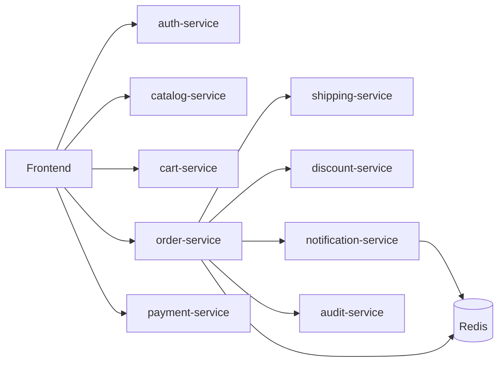

# Arquitectura General

## Objetivo

Separar el monolito Angelow en microservicios de dominio, cada uno con su base PostgreSQL, comunicacion por API y soporte asincrono con Redis + workers.

## Flujo de alto nivel

## Patrones aplicados

- `Database per service`
- `Service Layer`
- `Repository Pattern` (servicios existentes)
- `Event + Job` para notificaciones y colas
- `Health Check` estandar en `GET /api/health`

## Infraestructura

- Docker Compose para todos los servicios
- Redis para cache y cola
- Workers dedicados: `order-worker` y `notification-worker`
- Carpeta compartida `uploads/` montada en microservicios y frontend
- Importacion de datos automatizada desde `basededatos.sql` con `scripts/importar-datos-microservicios.ps1`
