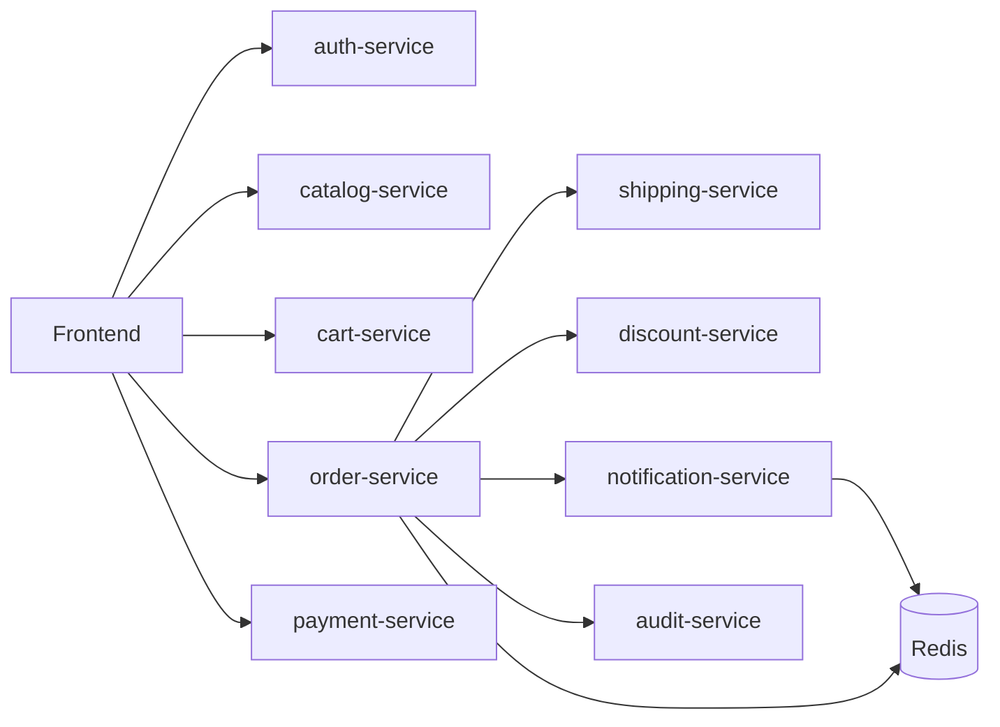

# Documentación Angelow

<!-- indice:auto:start -->
## Índice rápido

- [Objetivo](#objetivo)
- [Puntos de entrada](#puntos-de-entrada)
- [Resumen de arquitectura](#resumen-de-arquitectura)
- [Índice por categoría](#índice-por-categoría)
- [Criterio de ubicación](#criterio-de-ubicación)
<!-- indice:auto:end -->

## Objetivo

Centralizar la documentación compartida del repositorio y dejarla organizada por tipo, dominio y responsabilidad para evitar archivos sueltos fuera de contexto.

## Puntos de entrada

- `operaciones/manual-tecnico.md`: manual técnico central del repositorio.
- `microservicios/README.md`: navegación hacia documentación específica por servicio.
- `testing/README.md`: ubicación de guías y evidencias de validación transversal.
- `../frontend/docs/exportaciones-admin-reutilizables.md`: arquitectura compartida para exportaciones administrativas PDF y Excel.

## Resumen de arquitectura

Angelow separa el monolito en microservicios de dominio con PostgreSQL por servicio, Redis para colas/eventos y un frontend SPA que consume APIs por contexto funcional.

```mermaid
flowchart LR
  FE[Frontend] --> AUTH[auth-service]
  FE --> CAT[catalog-service]
  FE --> CART[cart-service]
  FE --> ORD[order-service]
  FE --> PAY[payment-service]

  ORD --> SHIP[shipping-service]
  ORD --> DISC[discount-service]
  ORD --> NOTI[notification-service]
  ORD --> AUD[audit-service]

  NOTI --> REDIS[(Redis)]
  ORD --> REDIS
```

## Índice por categoría

- `arquitectura/`: diagramas y mapas estructurales del sistema.
  - `arquitectura/arquitectura-web-plantuml.md`
  - `arquitectura/mapas-navegacion-sistema-plantuml.md`
  - `arquitectura/modelos-relacionales-bases-datos-plantuml.md`
- `datos/`: importación, trazabilidad y migración de datos.
  - `datos/importacion-datos.md`
  - `datos/migracion-tablas.md`
- `operaciones/`: despliegue, operación y mantenimiento de infraestructura compartida.
  - `operaciones/manual-tecnico.md`
  - `operaciones/DESPLIEGUE_SERVIDOR_NGINX.md`
- `referencias/`: catálogos de dependencias y referencias compartidas del repositorio.
  - `referencias/librerias-y-composer-uso.md`
  - `referencias/matriz-requerimientos-funcionales-actualizada.md`
- `investigacion/`: cronogramas, informes y material de apoyo académico o de seguimiento.
  - `investigacion/contenido-poster-innovacion-desarrollo-tecnologico-angelow.md`
  - `investigacion/contenido-poster-investigacion-en-curso-angelow.md`
  - `investigacion/cronograma-semillero-giaiteq-soft-angelow-2026.md`
  - `investigacion/informe-desarrollo-y-estado-actual.md`
  - `investigacion/reservas-stock-ecommerce-2026-06-08.md`
- `patrones/`: documentación de patrones de diseño organizada por módulo o contexto.
  - `patrones/README.md`
  - `patrones/admin/`
    - `patrones/admin/patrones-diseno-admin-product-form-refactor-vue-2026-06-10.md`
    - `patrones/admin/patrones-diseno-validaciones-numericas-2026-06-10.md`
  - `patrones/checkout/`
  - `patrones/dashboard/`
    - `patrones/dashboard/patrones-diseno-dashboard-pedidos-realtime-2026-06-16.md`
  - `patrones/home/`
  - `patrones/tienda/`
- `microservicios/`: índice de acceso a la documentación específica de cada servicio.
  - `microservicios/README.md`
- `testing/`: carpeta reservada para guías, evidencias y bitácoras de pruebas compartidas.
  - `testing/README.md`

## Criterio de ubicación

- La documentación específica de un microservicio debe vivir preferentemente en `services/<servicio>/docs/`.
- La documentación específica del frontend debe vivir preferentemente en `frontend/docs/`.
- En `docs/` solo deben quedar documentos compartidos por múltiples dominios o índices de navegación del repositorio.
- Si un documento cambia de responsabilidad, se debe mover a la carpeta correcta y actualizar sus referencias en la misma intervención.
- Los nombres de archivo Markdown de documentación deben mantenerse en ASCII seguro para evitar problemas de rutas en GitHub.
