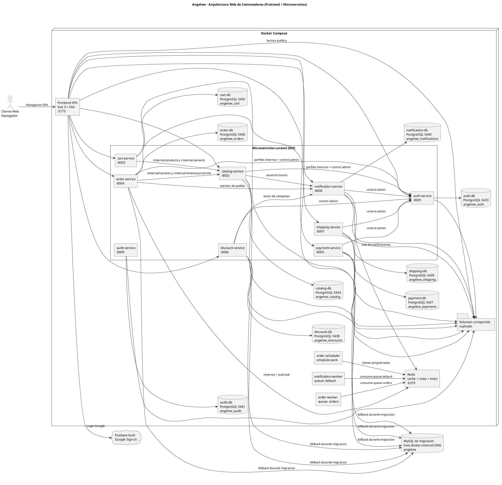
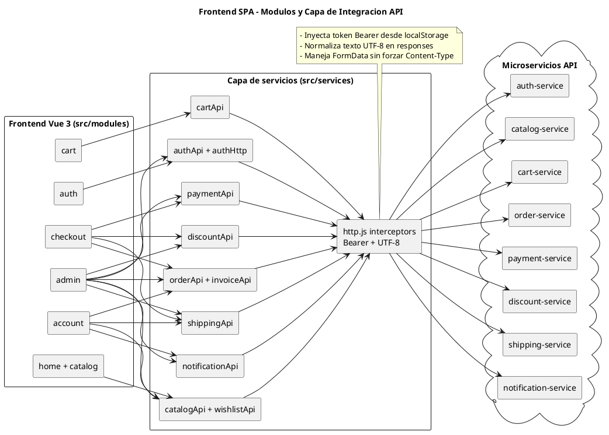
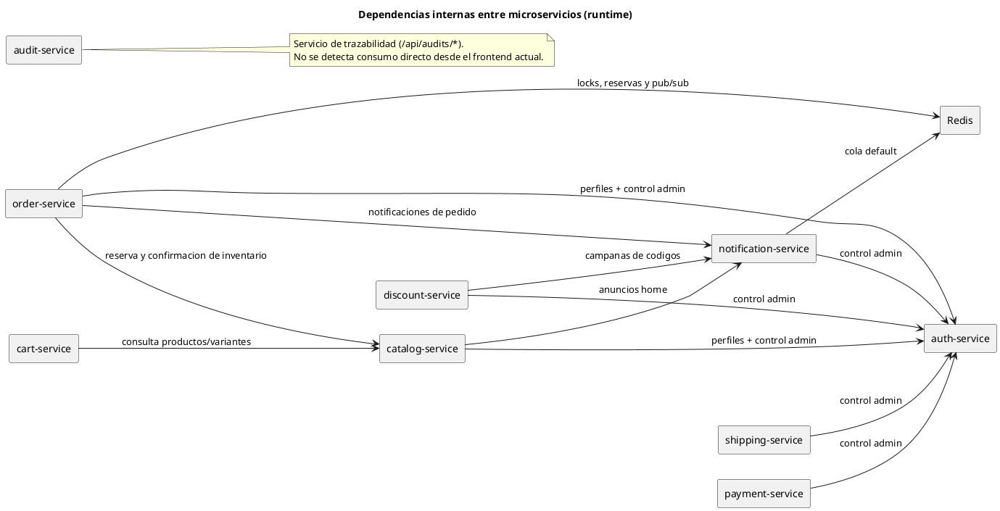
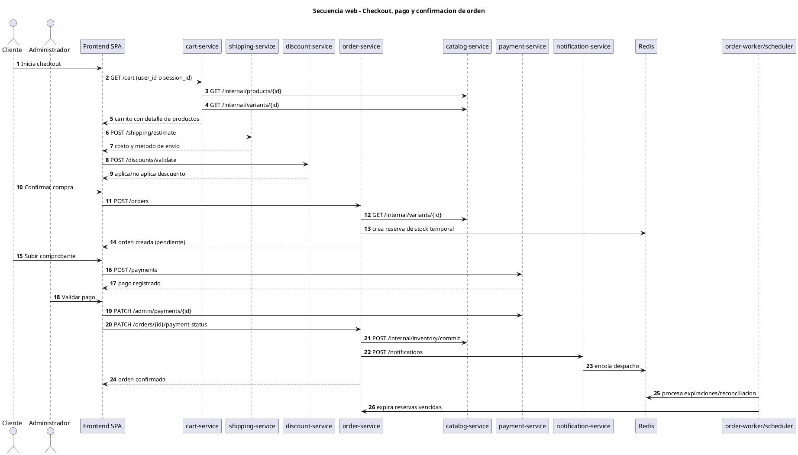

# Diagramas de arquitectura web en PlantUML

Analisis realizado sobre microservicios, frontend y capas compartidas, excluyendo la carpeta `angelow/`.

## 1) Arquitectura de contenedores (Docker Compose)

## 2) Frontend modular y capa API

## 3) Dependencias entre microservicios

## 4) Secuencia checkout, pago y confirmacion

