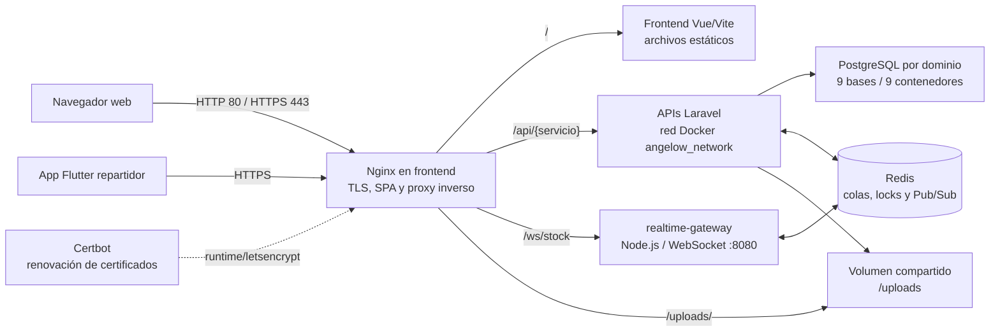

# 3.4 Diagrama simple de despliegue e instalación

Este documento describe el despliegue vigente de Angelow con Docker Compose. En producción, el contenedor `frontend` ejecuta Nginx: sirve los archivos compilados de Vue, termina HTTPS cuando existen los certificados de Let's Encrypt y funciona como proxy inverso hacia las APIs y el gateway de tiempo real.

## Flujo principal



La ruta funcional queda así:

```text
Navegador o app repartidor
  → Nginx/HTTPS del contenedor frontend
  → Frontend Vue o proxy de APIs/gateway
  → Microservicios Laravel y procesos worker/scheduler
  → PostgreSQL por dominio, Redis y volumen /uploads
```

## Componentes y límites

| Capa | Implementación vigente | Exposición en desarrollo | Exposición en producción |
|---|---|---:|---:|
| Entrada web | Nginx del contenedor `frontend` | Vite en `localhost:5173` | `80` y `443` |
| Frontend | SPA Vue 3 compilada con Vite | `5173` | Servida por Nginx |
| APIs | `auth`, `catalog`, `cart`, `order`, `payment`, `discount`, `shipping`, `notification` y `audit` | `8001`–`8009` | Solo red Docker; rutas `/api/{servicio}-service/` |
| Repartidor | Flutter; consume autenticación y logística | URLs configurables con `--dart-define` | `https://angelow.online/api/auth-service` y `/api/shipping-service` |
| Tiempo real | `realtime-gateway` Node.js | `localhost:8090` → `8080` interno | Ruta `/ws/stock` por Nginx |
| Persistencia | PostgreSQL 17, una base por dominio | `5433`–`5441` | Solo red Docker |
| Colas y eventos | Redis 7 | `6379` | Solo red Docker |
| Archivos | Volumen compartido `uploads/` | Montaje local | Montaje de solo lectura en el frontend de producción |

Las bases relacionales vigentes son `angelow_auth`, `angelow_catalog`, `angelow_cart`, `angelow_orders`, `angelow_payments`, `angelow_discounts`, `angelow_shipping`, `angelow_notifications` y `angelow_audit`. El `shipping-service` es propietario de direcciones, tarifas, repartidores, asignaciones y ubicación; sus relaciones con pedidos y usuarios son referencias lógicas entre dominios.

## Instalación local

1. Copiar la plantilla global y completar únicamente los valores del ambiente:

   ```powershell
   Copy-Item .env.example .env
   ```

2. Validar la composición sin levantar contenedores:

   ```powershell
   docker compose config --quiet
   ```

3. Construir e iniciar la plataforma:

   ```powershell
   docker compose up -d --build
   docker compose ps
   ```

4. Ejecutar las migraciones de cada servicio Laravel según el [manual de instalación](../operaciones/manual-instalacion.md) y comprobar frontend, APIs, Redis, workers y gateway.

## Despliegue productivo

El despliegue productivo combina el Compose base con `docker-compose.production.yml`:

```bash
docker compose -f docker-compose.yml -f docker-compose.production.yml up -d --build
docker compose -f docker-compose.yml -f docker-compose.production.yml ps
```

El override productivo retira los puertos directos de PostgreSQL, Redis, APIs y gateway, publica únicamente `80` y `443` desde `frontend`, monta los certificados en `runtime/letsencrypt` y mantiene `certbot` para su renovación. Antes de ejecutar el comando:

- configurar el DNS de `angelow.online` hacia el servidor;
- preparar los certificados o el desafío ACME en `runtime/certbot`;
- definir las variables de producción del [`.env.example` global](../../.env.example);
- usar `APP_DEBUG=false`, secretos únicos y URLs `https://`/`wss://`;
- validar que el firewall exponga únicamente `80`, `443` y el acceso administrativo autorizado.

El dominio y las rutas de certificados del Nginx actual están definidos como `angelow.online` en `deploy/nginx/templates` y `deploy/nginx/start-nginx.sh`. Si se cambia el dominio, también deben actualizarse esas plantillas, los argumentos `VITE_*` y el volumen de certificados antes de reconstruir `frontend`.

## Fuentes de verdad

- Orquestación: [`docker-compose.yml`](../../docker-compose.yml) y [`docker-compose.production.yml`](../../docker-compose.production.yml).
- Rutas, TLS y WebSocket: [`deploy/nginx/templates`](../../deploy/nginx/templates).
- Construcción del frontend: [`frontend/Dockerfile.production`](../../frontend/Dockerfile.production).
- Variables globales de Compose: [`.env.example`](../../.env.example).
- Procedimiento operativo: [`manual-instalacion.md`](../operaciones/manual-instalacion.md) y [`DESPLIEGUE_SERVIDOR_NGINX.md`](../operaciones/DESPLIEGUE_SERVIDOR_NGINX.md).

> El archivo `.env` real nunca debe versionarse ni copiarse a la documentación. La plantilla global contiene nombres y valores de ejemplo, no credenciales operativas.
