# auth-service - Diagrama de clases en PlantUML

<!-- indice:auto:start -->
## Índice rápido

- [Alcance](#alcance)
- [Diagrama](#diagrama)
- [Fuentes revisadas](#fuentes-revisadas)
- [Documentos relacionados](#documentos-relacionados)
<!-- indice:auto:end -->

## Alcance

Diagrama del microservicio de autenticación, registro, perfil, recuperación de contraseña, verificación de correo, administración de usuarios y perfiles internos. Incluye atributos de DTOs, modelos, tablas de sesión/token e intentos de acceso, además de relaciones UML con multiplicidad.

## Diagrama

```plantuml
@startuml
title auth-service - Autenticación, usuarios y verificación
left to right direction
skinparam classAttributeIconSize 0
skinparam packageStyle rectangle

package "Controladores HTTP" {
  class "RegisterController" as AuthRegisterController <<Controller>> {
    -authService: AuthService
    -turnstile: TurnstileVerificationService
    -registrationVerification: RegistrationVerificationService
    +__construct(authService, turnstile, registrationVerification)
    +__invoke(RegisterRequest)
  }
  class "LoginController" as AuthLoginController <<Controller>> {
    -authService: AuthService
    -turnstile: TurnstileVerificationService
    -attemptProtection: LoginAttemptProtectionService
    +__construct(authService, turnstile, attemptProtection)
    +login(LoginRequest)
    +google(GoogleLoginRequest)
    +logout()
    +me()
  }
  class "ProfileController" as AuthProfileController <<Controller>> {
    +updateProfile(request)
    +updatePassword(request)
  }
  class "PasswordRecoveryController" as AuthPasswordRecoveryController <<Controller>> {
    -service: PasswordRecoveryService
    -turnstile: TurnstileVerificationService
    +__construct(service, turnstile)
    +requestCode(PasswordRecoveryCodeRequest)
    +resendCode(PasswordRecoveryCodeRequest)
    +verifyCode(PasswordRecoveryVerifyCodeRequest)
    +resetPassword(PasswordRecoveryResetRequest)
  }
  class "RegistrationVerificationController" as AuthRegistrationVerificationController <<Controller>> {
    -service: RegistrationVerificationService
    -turnstile: TurnstileVerificationService
    +__construct(service, turnstile)
    +requestCode(RegistrationCodeRequest)
    +resendCode(RegistrationCodeRequest)
    +verifyCode(RegistrationVerifyCodeRequest)
  }
  class "AdminUserController" as AuthAdminUserController <<Controller>> {
    +customers(request)
    +toggleBlock(request, id)
    +administrators(request)
    +storeAdmin(request)
    +updateAdmin(request, id)
    +destroyAdmin(id)
    +reportCustomers(request)
  }
  class "UserProfileController" as AuthUserProfileController <<Controller>> {
    +index(request)
  }
  class "HealthController" as AuthHealthController <<Controller>> {
    +__invoke()
  }
}

package "Requests y DTOs" {
  class "RegisterRequest" as AuthRegisterRequest <<Request>> {
    +authorize()
    +rules()
    +messages()
  }
  class "LoginRequest" as AuthLoginRequest <<Request>> {
    +authorize()
    +rules()
    +messages()
  }
  class "GoogleLoginRequest" as AuthGoogleLoginRequest <<Request>> {
    +authorize()
    +rules()
    +messages()
  }
  class "PasswordRecoveryCodeRequest" as AuthPasswordRecoveryCodeRequest <<Request>> {
    +authorize()
    +rules()
    +messages()
  }
  class "PasswordRecoveryVerifyCodeRequest" as AuthPasswordRecoveryVerifyCodeRequest <<Request>> {
    +authorize()
    +rules()
    +messages()
  }
  class "PasswordRecoveryResetRequest" as AuthPasswordRecoveryResetRequest <<Request>> {
    +authorize()
    +rules()
    +messages()
  }
  class "RegistrationCodeRequest" as AuthRegistrationCodeRequest <<Request>> {
    +authorize()
    +rules()
    +messages()
  }
  class "RegistrationVerifyCodeRequest" as AuthRegistrationVerifyCodeRequest <<Request>> {
    +authorize()
    +rules()
    +messages()
  }
  class "RegisterUserDTO" as AuthRegisterUserDTO <<DTO>> {
    +name: String
    +email: String
    +phone: String
    +password: String
    +registration_token: String
    +__construct(name, email, phone, password)
    +fromArray(data)
  }
  class "LoginUserDTO" as AuthLoginUserDTO <<DTO>> {
    +credential: String
    +password: String
    +remember: Boolean
    +__construct(credential, password, remember)
    +fromArray(data)
    +isEmail()
  }
}

package "Servicios" {
  class "AuthService" as AuthService <<Service>> {
    -users: UserRepositoryInterface
    -welcomeEmail: WelcomeEmailService
    +__construct(users, welcomeEmail)
    +register(RegisterUserDTO)
    +login(LoginUserDTO)
    +loginWithGoogleToken(idToken)
    +logout(User)
  }
  class "PasswordRecoveryService" as AuthPasswordRecoveryService <<Service>> {
    -passwordResetModel: PasswordReset
    -mail: Mail SMTP
    -redis: Redis
    +requestCode(identifier, isResend)
    +verifyCode(identifier, code)
    +resetPassword(sessionToken, password, confirmation)
  }
  class "RegistrationVerificationService" as AuthRegistrationVerificationService <<Service>> {
    -mail: Mail SMTP
    -redis: Redis
    +requestCode(email, isResend)
    +verifyCode(email, code)
    +consumeVerifiedEmail(email, token)
  }
  class "TurnstileVerificationService" as AuthTurnstileService <<Service>> {
    -secretKey: String
    -verifyUrl: String
    +verify(token, remoteIp)
  }
  class "LoginAttemptProtectionService" as AuthLoginAttemptService <<Service>> {
    -attemptModel: AuthLoginAttempt
    +status(credential, ip)
    +recordFailure(credential, ip)
    +clear(credential, ip)
  }
  class "WelcomeEmailService" as AuthWelcomeEmailService <<Service>> {
    -mail: Mail SMTP
    +send(User)
  }
}

package "Persistencia" {
  interface "UserRepositoryInterface" as AuthUserRepositoryInterface <<Interface>> {
    +create(data)
    +findByEmail(email)
    +findByPhone(phone)
    +findByCredential(credential)
    +findById(id)
    +updateLastAccess(user)
    +emailExists(email)
  }
  class "QueryBuilderUserRepository" as AuthQueryBuilderUserRepository <<Repository>> {
    -usersTable: users
    +create(data)
    +findByEmail(email)
    +findByPhone(phone)
    +findByCredential(credential)
    +findById(id)
    +updateLastAccess(user)
    +emailExists(email)
  }
  class "User (users)" as AuthUser <<Model>> {
    +id: String
    +name: String
    +email: String
    +phone: String
    -password: String
    +image: String
    +role: String
    +is_blocked: Boolean
    +created_at: DateTime
    +updated_at: DateTime
    +last_access: DateTime
    -remember_token: String
    +token_expiry: DateTime
    +isAdmin()
    +isBlocked()
  }
  class "PasswordReset (password_resets)" as AuthPasswordReset <<Model>> {
    +id: Integer
    +user_id: String
    +token: String
    +expires_at: DateTime
    +is_used: Boolean
    +created_at: DateTime
  }
  class "AuthLoginAttempt (auth_login_attempts)" as AuthLoginAttempt <<Model>> {
    +id: Integer
    +credential: String
    +ip_address: String
    +failed_attempts: Integer
    +last_failed_at: DateTime
    +blocked_until: DateTime
    +created_at: DateTime
    +updated_at: DateTime
  }
  class "login_attempts" as AuthLoginAttemptsTable <<Tabla>> {
    +id: Integer
    +username: String
    +ip_address: String
    +attempt_date: DateTime
  }
  class "personal_access_tokens" as AuthPersonalAccessTokensTable <<Tabla>> {
    +id: Integer
    +tokenable_type: String
    +tokenable_id: String
    +name: Text
    +token: String
    +abilities: Text
    +last_used_at: DateTime
    +expires_at: DateTime
    +created_at: DateTime
    +updated_at: DateTime
  }
  class "access_tokens" as AuthAccessTokensTable <<Tabla>> {
    +id: Integer
    +user_id: String
    +token: String
    +ip_address: String
    +user_agent: Text
    +created_at: DateTime
    +expires_at: DateTime
    +is_revoked: Boolean
  }
  class "google_auth" as AuthGoogleAuthTable <<Tabla>> {
    +id: Integer
    +user_id: String
    +google_id: String
    +access_token: String
    +created_at: DateTime
  }
  class "sessions" as AuthSessionsTable <<Tabla>> {
    +id: String
    +user_id: String
    +ip_address: String
    +user_agent: Text
    +payload: Text
    +last_activity: Integer
  }
}

package "Soporte Laravel" {
  class "EnsureAdmin" as AuthEnsureAdmin <<Middleware>> {
    +handle(request, next)
  }
  class "CorsMiddleware" as AuthCorsMiddleware <<Middleware>> {
    +handle(request, next)
  }
  class "AuthException" as AuthException <<Exception>> {
    +message: String
    +statusCode: Integer
    +__construct(message, statusCode)
  }
  class "AppServiceProvider" as AuthAppServiceProvider <<Provider>> {
    +register()
    +boot()
  }
  class "RepositoryServiceProvider" as AuthRepositoryServiceProvider <<Provider>> {
    +register()
    +boot()
  }
}

package "Servicios externos" {
  class "Firebase Identity Toolkit" as AuthFirebaseExternal <<External>>
  class "Cloudflare Turnstile" as AuthTurnstileExternal <<External>>
  class "Mail SMTP" as AuthMailExternal <<External>>
  class "Redis cache" as AuthRedisExternal <<External>>
}

AuthRegisterController --> AuthRegisterRequest
AuthRegisterController --> AuthRegisterUserDTO
AuthRegisterController --> AuthService
AuthRegisterController --> AuthTurnstileService
AuthRegisterController --> AuthRegistrationVerificationService

AuthLoginController --> AuthLoginRequest
AuthLoginController --> AuthGoogleLoginRequest
AuthLoginController --> AuthLoginUserDTO
AuthLoginController --> AuthService
AuthLoginController --> AuthTurnstileService
AuthLoginController --> AuthLoginAttemptService

AuthProfileController --> AuthUser
AuthPasswordRecoveryController --> AuthPasswordRecoveryCodeRequest
AuthPasswordRecoveryController --> AuthPasswordRecoveryVerifyCodeRequest
AuthPasswordRecoveryController --> AuthPasswordRecoveryResetRequest
AuthPasswordRecoveryController --> AuthPasswordRecoveryService
AuthPasswordRecoveryController --> AuthTurnstileService
AuthRegistrationVerificationController --> AuthRegistrationCodeRequest
AuthRegistrationVerificationController --> AuthRegistrationVerifyCodeRequest
AuthRegistrationVerificationController --> AuthRegistrationVerificationService
AuthRegistrationVerificationController --> AuthTurnstileService
AuthAdminUserController --> AuthUser
AuthUserProfileController --> AuthUser

AuthService --> AuthUserRepositoryInterface
AuthService --> AuthWelcomeEmailService
AuthService --> AuthPersonalAccessTokensTable : Sanctum
AuthService --> AuthAccessTokensTable : tokens legacy
AuthService --> AuthGoogleAuthTable : login Google
AuthService ..> AuthFirebaseExternal : valida idToken
AuthPasswordRecoveryService --> AuthPasswordReset
AuthPasswordRecoveryService ..> AuthMailExternal : envía código
AuthPasswordRecoveryService ..> AuthRedisExternal : session_token y cooldown
AuthRegistrationVerificationService ..> AuthMailExternal : código de registro
AuthRegistrationVerificationService ..> AuthRedisExternal : token y cooldown
AuthLoginAttemptService --> AuthLoginAttempt
AuthTurnstileService ..> AuthTurnstileExternal : siteverify
AuthWelcomeEmailService ..> AuthMailExternal : bienvenida

AuthUserRepositoryInterface <|.. AuthQueryBuilderUserRepository
AuthQueryBuilderUserRepository --> AuthUser
AuthRepositoryServiceProvider --> AuthUserRepositoryInterface : binding
AuthRepositoryServiceProvider --> AuthQueryBuilderUserRepository : implementación
AuthEnsureAdmin --> AuthUser : valida rol admin

AuthUser "1" *-- "0..*" AuthPasswordReset : códigos de recuperación
AuthUser "1" o-- "0..*" AuthPersonalAccessTokensTable : tokens Sanctum
AuthUser "1" o-- "0..*" AuthAccessTokensTable : tokens legacy
AuthUser "1" o-- "0..1" AuthGoogleAuthTable : cuenta Google
AuthUser "1" o-- "0..*" AuthSessionsTable : sesiones
AuthUser "1" o-- "0..*" AuthLoginAttemptsTable : intentos históricos
AuthLoginAttempt "1" --> "1" AuthUser : credencial normalizada
@enduml
```

## Fuentes revisadas

- `services/auth-service/app/**/*.php`
- `services/auth-service/routes/api.php`
- `services/auth-service/database/migrations/*.php`

## Documentos relacionados

- [Índice de diagramas](../diagramas-clases-microservicios-plantuml.md)
- [Documentación por microservicio](../../microservicios/README.md)
