# cart-service - Diagrama de clases en PlantUML

<!-- indice:auto:start -->
## Índice rápido

- [Alcance](#alcance)
- [Diagrama](#diagrama)
- [Fuentes revisadas](#fuentes-revisadas)
- [Documentos relacionados](#documentos-relacionados)
<!-- indice:auto:end -->

## Alcance

Diagrama del microservicio de carrito, consulta de ítems, actualización de cantidades, eliminación de productos y recordatorios de carrito abandonado. Incluye atributos de las tablas de dominio y relaciones con multiplicidad, agregación y composición.

## Diagrama

```plantuml
@startuml
title cart-service - Carrito, disponibilidad y recordatorios
left to right direction
skinparam classAttributeIconSize 0
skinparam packageStyle rectangle

package "Controladores HTTP" {
  class "CartController" as CartController <<Controller>> {
    -cartService: CartService
    +__construct(cartService)
    +index(request)
    +add(request)
    +update(request, itemId)
    +destroy(itemId)
    +productIds(request)
    +dispatchAbandonedReminders(request)
  }
  class "HealthController" as CartHealthController <<Controller>> {
    +__invoke()
  }
}

package "Servicio de dominio" {
  class "CartService" as CartService <<Service>> {
    -repository: CartRepositoryInterface
    -catalogClient: HTTP Client
    -notificationClient: HTTP Client
    -redis: Redis
    +__construct(repository)
    +addToCart(userId, sessionId, productId, colorVariantId, sizeVariantId, quantity)
    +getCartItems(userId, sessionId)
    +updateQuantity(itemId, quantity)
    +removeFromCart(itemId)
    +getCartProductIds(userId, sessionId)
    +dispatchAbandonedCartReminders(inactiveMinutes, limit)
  }
}

package "Persistencia" {
  interface "CartRepositoryInterface" as CartRepositoryInterface <<Interface>> {
    +getOrCreateCart(userId, sessionId)
    +getItems(cartId)
    +addItem(cartId, productId, colorVariantId, sizeVariantId, quantity)
    +updateItemQuantity(itemId, quantity)
    +removeItem(itemId)
    +findItem(itemId)
    +findExistingItem(cartId, productId, colorVariantId, sizeVariantId)
    +getCartProductIds(userId, sessionId)
  }
  class "QueryBuilderCartRepository" as CartRepository <<Repository>> {
    -cartsTable: carts
    -itemsTable: cart_items
    +getOrCreateCart(userId, sessionId)
    +getItems(cartId)
    +addItem(cartId, productId, colorVariantId, sizeVariantId, quantity)
    +updateItemQuantity(itemId, quantity)
    +removeItem(itemId)
    +findItem(itemId)
    +findExistingItem(cartId, productId, colorVariantId, sizeVariantId)
    +getCartProductIds(userId, sessionId)
  }
  class "User" as CartUser <<Model>> {
    +id: Integer
    +name: String
    +email: String
    -password: String
    +email_verified_at: DateTime
    +created_at: DateTime
    +updated_at: DateTime
  }
  class "carts" as CartCartsTable <<Tabla>> {
    +id: Integer
    +user_id: String
    +session_id: String
    +created_at: DateTime
    +updated_at: DateTime
  }
  class "cart_items" as CartItemsTable <<Tabla>> {
    +id: Integer
    +cart_id: Integer
    +product_id: Integer
    +color_variant_id: Integer
    +size_variant_id: Integer
    +quantity: Integer
    +created_at: DateTime
    +updated_at: DateTime
  }
}

package "Soporte Laravel" {
  class "AppServiceProvider" as CartAppServiceProvider <<Provider>> {
    +register()
    +boot()
  }
  class "RepositoryServiceProvider" as CartRepositoryServiceProvider <<Provider>> {
    +register()
    +boot()
  }
}

package "Servicios externos" {
  class "catalog-service" as CartCatalogExternal <<External>>
  class "notification-service" as CartNotificationExternal <<External>>
  class "Redis stock/reserved" as CartRedis <<External>>
}

CartController --> CartService
CartService --> CartRepositoryInterface
CartService ..> CartCatalogExternal : valida producto y variante
CartService ..> CartNotificationExternal : recordatorios
CartService ..> CartRedis : disponibilidad y reservas

CartRepositoryInterface <|.. CartRepository
CartRepository --> CartCartsTable
CartRepository --> CartItemsTable
CartRepositoryServiceProvider --> CartRepositoryInterface : binding
CartRepositoryServiceProvider --> CartRepository : implementación

CartUser "1" o-- "0..*" CartCartsTable : posee
CartCartsTable "1" *-- "0..*" CartItemsTable : contiene
CartItemsTable "0..*" --> "1" CartCatalogExternal : producto
CartItemsTable "0..*" --> "0..1" CartCatalogExternal : variante color/talla
@enduml
```

## Fuentes revisadas

- `services/cart-service/app/**/*.php`
- `services/cart-service/routes/api.php`
- `services/cart-service/database/migrations/*.php`

## Documentos relacionados

- [Índice de diagramas](../diagramas-clases-microservicios-plantuml.md)
- [Documentación por microservicio](../../microservicios/README.md)
