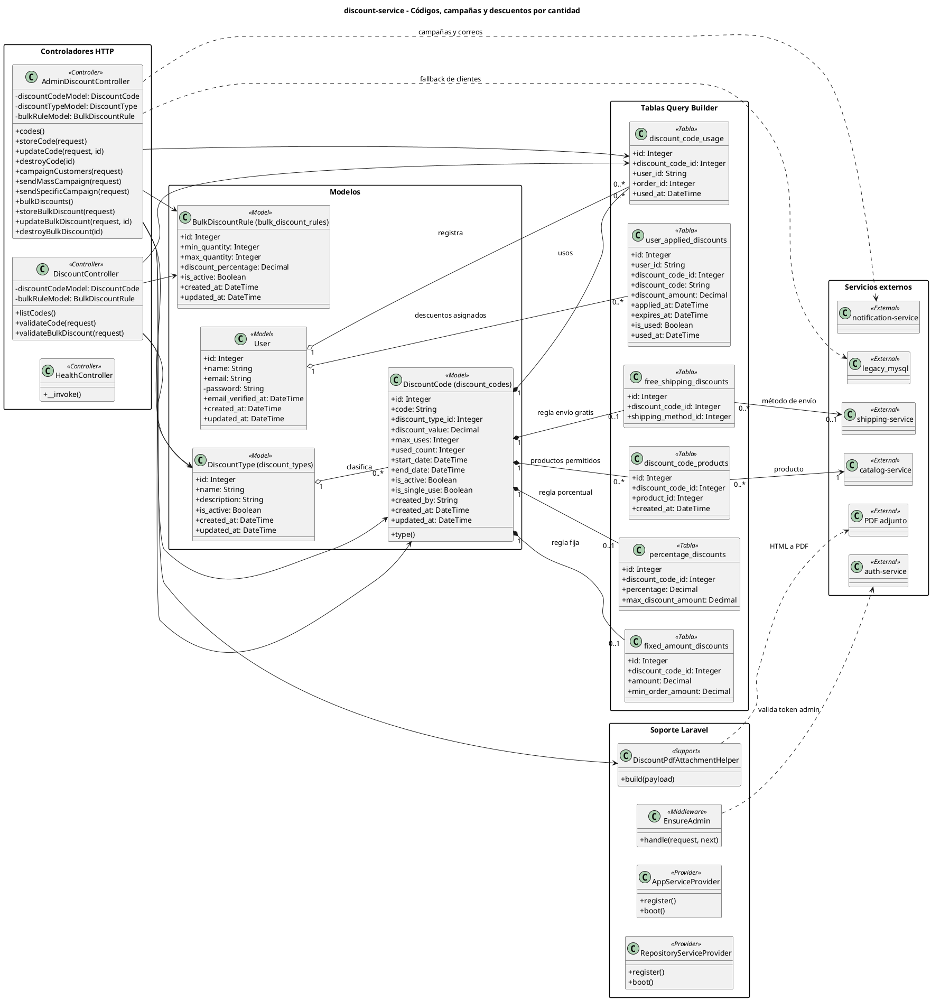

# discount-service - Diagrama de clases en PlantUML

<!-- indice:auto:start -->
## Índice rápido

- [Alcance](#alcance)
- [Diagrama](#diagrama)
- [Fuentes revisadas](#fuentes-revisadas)
- [Documentos relacionados](#documentos-relacionados)
<!-- indice:auto:end -->

## Alcance

Diagrama del microservicio de códigos de descuento, validación de cupones, descuentos por cantidad y campañas administrativas por correo. Incluye atributos de modelos, tablas auxiliares y relaciones de composición para reglas específicas del cupón.

## Diagrama

## Fuentes revisadas

- `services/discount-service/app/**/*.php`
- `services/discount-service/routes/api.php`
- `services/discount-service/database/migrations/*.php`

## Documentos relacionados

- [Índice de diagramas](../diagramas-clases-microservicios-plantuml.md)
- [Documentación por microservicio](../../microservicios/README.md)
