# order-service - Diagrama de clases en PlantUML

<!-- indice:auto:start -->
## Índice rápido

- [Alcance](#alcance)
- [Diagrama](#diagrama)
- [Fuentes revisadas](#fuentes-revisadas)
- [Documentos relacionados](#documentos-relacionados)
<!-- indice:auto:end -->

## Alcance

Diagrama del microservicio de órdenes, reembolsos, facturación, reservas de stock, conciliación de reservas y reportes administrativos. Incluye atributos persistentes y relaciones UML con multiplicidad, agregación y composición.

## Diagrama

```plantuml
@startuml
title order-service - Órdenes, reembolsos, facturas y reservas
left to right direction
skinparam classAttributeIconSize 0
skinparam packageStyle rectangle

package "Controladores HTTP" {
  class "OrderController" as OrderController <<Controller>> {
    -invoiceService: OrderInvoiceService
    -reservationService: StockReservationService
    -realtimePublisher: StockReservationRealtimePublisher
    +__construct(invoiceService, reservationService, realtimePublisher)
    +index(request)
    +show(request, id)
    +downloadInvoice(request, id)
    +store(request)
    +sendCheckoutConfirmation(request, id)
    +updateStatus(request, id)
    +updatePaymentStatus(request, id)
    +deactivate(request, id)
    +cancel(request, id)
    +requestRefund(request, id)
    +update(request, id)
  }
  class "AdminOrderController" as OrderAdminController <<Controller>> {
    -realtimePublisher: StockReservationRealtimePublisher
    +__construct(realtimePublisher)
    +recentOrders(request)
    +refundRequests(request)
    +updateRefundRequest(request, id)
    +reportSales(request)
    +reportProducts(request)
    +reportCustomers(request)
  }
  class "AdminInvoiceController" as OrderAdminInvoiceController <<Controller>> {
    -invoiceService: OrderInvoiceService
    +__construct(invoiceService)
    +index(request)
    +download(request, id)
    +resend(request, id)
  }
  class "HealthController" as OrderHealthController <<Controller>> {
    +__invoke()
  }
}

package "Servicios" {
  class "OrderInvoiceService" as OrderInvoiceService <<Service>> {
    -ordersTable: orders
    -itemsTable: order_items
    -notificationClient: HTTP Client
    +sendCheckoutConfirmationEmail(orderId, context, source)
    +ensureInvoiceForCompletedOrder(orderId, source)
    +resendInvoiceEmail(orderId, source)
    +buildInvoicePdfForDownload(orderId, source)
    +listGeneratedInvoices(filters, limit)
  }
  class "StockReservationService" as OrderStockReservationService <<Service>> {
    -reservationModel: StockReservation
    -realtimePublisher: StockReservationRealtimePublisher
    -redis: Redis
    +__construct(realtimePublisher)
    +reserveForOrder(orderId, orderNumber, items, ttl)
    +extendReservation(orderId, ttl)
    +confirmReservation(orderId)
    +releaseReservation(orderId, targetStatus, reason)
    +expireReservation(orderId)
    +reconcileExpiredReservations(batchSize)
    +reconcileReservationCounters(batchSize)
  }
  class "StockReservationRealtimePublisher" as OrderStockRealtimePublisher <<Service>> {
    -redis: Redis
    +publish(event, payload)
  }
}

package "Jobs y comandos" {
  class "ExpireStockReservationJob" as OrderExpireStockReservationJob <<Job>> {
    +orderId: Integer
    +__construct(orderId)
    +handle(reservationService, realtimePublisher)
  }
  class "ReconcileStockReservationsJob" as OrderReconcileStockReservationsJob <<Job>> {
    +batchSize: Integer
    +__construct(batchSize)
    +handle(reservationService)
  }
  class "ReconcileStockReservationsCommand" as OrderReconcileCommand <<Command>> {
    +signature: String
    +description: String
    +handle(reservationService)
  }
}

package "Modelos y tablas" {
  class "StockReservation (stock_reservations)" as OrderStockReservation <<Model>> {
    +id: Integer
    +order_id: Integer
    +product_id: Integer
    +size_variant_id: Integer
    +reservation_key: String
    +quantity: Integer
    +status: String
    +expires_at: DateTime
    +confirmed_at: DateTime
    +released_at: DateTime
    +metadata: JSON
    +created_at: DateTime
    +updated_at: DateTime
  }
  class "User" as OrderUser <<Model>> {
    +id: Integer
    +name: String
    +email: String
    -password: String
    +email_verified_at: DateTime
    +created_at: DateTime
    +updated_at: DateTime
  }
  class "orders" as OrderOrdersTable <<Tabla>> {
    +id: Integer
    +order_number: String
    +invoice_number: String
    +user_id: String
    +status: String
    +subtotal: Decimal
    +shipping_cost: Decimal
    +discount_amount: Decimal
    +total: Decimal
    +payment_method: String
    +payment_status: String
    +shipping_address: Text
    +shipping_city: String
    +shipping_method_id: Integer
    +shipping_address_id: Integer
    +billing_address: Text
    +billing_address_id: Integer
    +notes: Text
    +invoice_resolution: String
    +invoice_date: DateTime
    +created_at: DateTime
    +updated_at: DateTime
  }
  class "order_items" as OrderItemsTable <<Tabla>> {
    +id: Integer
    +order_id: Integer
    +product_id: Integer
    +color_variant_id: Integer
    +size_variant_id: Integer
    +product_name: String
    +variant_name: String
    +price: Decimal
    +quantity: Integer
    +total: Decimal
    +created_at: DateTime
  }
  class "order_status_history" as OrderStatusHistoryTable <<Tabla>> {
    +id: Integer
    +order_id: Integer
    +changed_by: String
    +changed_by_name: String
    +change_type: String
    +field_changed: String
    +old_value: Text
    +new_value: Text
    +description: Text
    +ip_address: String
    +user_agent: Text
    +created_at: DateTime
  }
  class "order_refund_requests" as OrderRefundRequestsTable <<Tabla>> {
    +id: Integer
    +order_id: Integer
    +user_id: String
    +user_email: String
    +reason: String
    +details: Text
    +evidence_path: String
    +evidence_original_name: String
    +status: String
    +requested_at: DateTime
    +resolved_at: DateTime
    +created_at: DateTime
    +updated_at: DateTime
  }
  class "order_views" as OrderViewsTable <<Tabla>> {
    +id: Integer
    +order_id: Integer
    +user_id: String
    +viewed_at: DateTime
  }
}

package "Soporte Laravel" {
  class "EnsureAdmin" as OrderEnsureAdmin <<Middleware>> {
    +handle(request, next)
  }
  class "PreventDuplicateOrderSubmission" as OrderPreventDuplicate <<Middleware>> {
    -lockKey: String
    +handle(request, next)
    +terminate(request, response)
  }
  class "AppServiceProvider" as OrderAppServiceProvider <<Provider>> {
    +register()
    +boot()
  }
  class "RepositoryServiceProvider" as OrderRepositoryServiceProvider <<Provider>> {
    +register()
    +boot()
  }
}

package "Servicios externos" {
  class "catalog-service" as OrderCatalogExternal <<External>>
  class "auth-service" as OrderAuthExternal <<External>>
  class "notification-service" as OrderNotificationExternal <<External>>
  class "payment-service" as OrderPaymentExternal <<External>>
  class "shipping-service" as OrderShippingExternal <<External>>
  class "Redis reservas/locks/ws" as OrderRedis <<External>>
}

OrderController --> OrderInvoiceService
OrderController --> OrderStockReservationService
OrderController --> OrderStockRealtimePublisher
OrderController --> OrderExpireStockReservationJob
OrderController --> OrderOrdersTable
OrderController --> OrderItemsTable
OrderController --> OrderStatusHistoryTable
OrderController --> OrderRefundRequestsTable
OrderController ..> OrderCatalogExternal : valida productos y variantes
OrderController ..> OrderPaymentExternal : estado de pago
OrderController ..> OrderNotificationExternal : orden y reembolso
OrderController ..> OrderShippingExternal : método y dirección

OrderAdminController --> OrderStockRealtimePublisher
OrderAdminController --> OrderOrdersTable
OrderAdminController --> OrderItemsTable
OrderAdminController --> OrderStatusHistoryTable
OrderAdminController --> OrderRefundRequestsTable
OrderAdminController ..> OrderAuthExternal : perfiles de clientes
OrderAdminController ..> OrderNotificationExternal : avisos de reembolso
OrderAdminInvoiceController --> OrderInvoiceService

OrderInvoiceService --> OrderOrdersTable
OrderInvoiceService --> OrderItemsTable
OrderInvoiceService ..> OrderNotificationExternal : correo con factura
OrderStockReservationService --> OrderStockReservation
OrderStockReservationService --> OrderItemsTable
OrderStockReservationService --> OrderStockRealtimePublisher
OrderStockReservationService ..> OrderCatalogExternal : confirma inventario
OrderStockReservationService ..> OrderRedis : locks, contadores y TTL
OrderStockRealtimePublisher ..> OrderRedis : websocket de stock

OrderExpireStockReservationJob --> OrderStockReservationService
OrderExpireStockReservationJob --> OrderStockRealtimePublisher
OrderExpireStockReservationJob --> OrderOrdersTable
OrderExpireStockReservationJob --> OrderStatusHistoryTable
OrderReconcileStockReservationsJob --> OrderStockReservationService
OrderReconcileCommand --> OrderStockReservationService
OrderPreventDuplicate --> OrderOrdersTable
OrderEnsureAdmin ..> OrderAuthExternal : valida token admin

OrderUser "1" o-- "0..*" OrderOrdersTable : realiza
OrderOrdersTable "1" *-- "1..*" OrderItemsTable : contiene
OrderOrdersTable "1" *-- "0..*" OrderStatusHistoryTable : historial
OrderOrdersTable "1" *-- "0..*" OrderRefundRequestsTable : solicitudes
OrderOrdersTable "1" *-- "0..*" OrderViewsTable : lecturas
OrderOrdersTable "1" *-- "0..*" OrderStockReservation : reservas
OrderItemsTable "0..*" --> "1" OrderCatalogExternal : producto
OrderItemsTable "0..*" --> "0..1" OrderCatalogExternal : variante
OrderOrdersTable "0..*" --> "0..1" OrderShippingExternal : envío
OrderOrdersTable "0..*" --> "0..1" OrderPaymentExternal : pago
OrderRefundRequestsTable "0..*" o-- "0..1" OrderUser : solicitante
@enduml
```

## Fuentes revisadas

- `services/order-service/app/**/*.php`
- `services/order-service/routes/api.php`
- `services/order-service/database/migrations/*.php`
- `services/order-service/database/sql/*.sql`

## Documentos relacionados

- [Índice de diagramas](../diagramas-clases-microservicios-plantuml.md)
- [Documentación por microservicio](../../microservicios/README.md)
