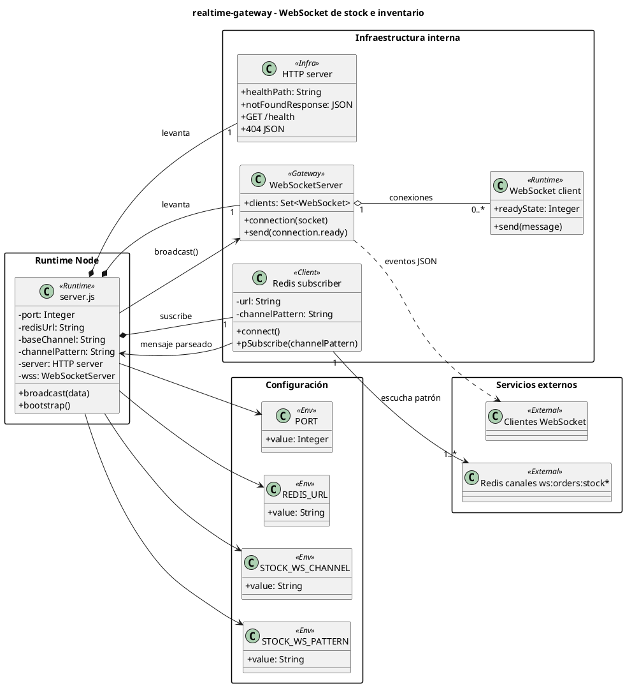

# realtime-gateway - Diagrama de clases en PlantUML

<!-- indice:auto:start -->
## Índice rápido

- [Alcance](#alcance)
- [Diagrama](#diagrama)
- [Fuentes revisadas](#fuentes-revisadas)
- [Documentos relacionados](#documentos-relacionados)
<!-- indice:auto:end -->

## Alcance

Diagrama del microservicio Node que reenvía eventos de stock publicados en Redis hacia clientes WebSocket. No contiene clases PHP ni tablas de dominio; se representa como módulo runtime con atributos de configuración, conexiones y relaciones de agregación.

## Diagrama

## Fuentes revisadas

- `services/realtime-gateway/server.js`
- `services/realtime-gateway/package.json`
- `services/realtime-gateway/Dockerfile`

## Documentos relacionados

- [Índice de diagramas](../diagramas-clases-microservicios-plantuml.md)
- [Documentación por microservicio](../../microservicios/README.md)
