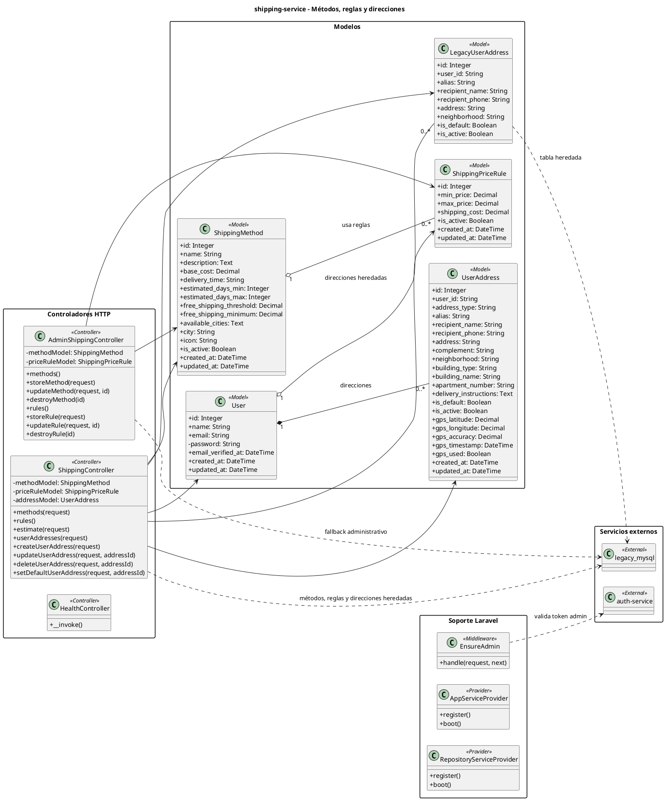

# shipping-service - Diagrama de clases en PlantUML

<!-- indice:auto:start -->
## Índice rápido

- [Alcance](#alcance)
- [Diagrama](#diagrama)
- [Fuentes revisadas](#fuentes-revisadas)
- [Documentos relacionados](#documentos-relacionados)
<!-- indice:auto:end -->

## Alcance

Diagrama del microservicio de métodos de envío, reglas de precio, estimación de costos y direcciones de usuario con fallback a datos heredados durante la migración. Incluye atributos de modelos y relaciones con multiplicidad.

## Diagrama

## Fuentes revisadas

- `services/shipping-service/app/**/*.php`
- `services/shipping-service/routes/api.php`
- `services/shipping-service/database/migrations/*.php`

## Documentos relacionados

- [Índice de diagramas](../diagramas-clases-microservicios-plantuml.md)
- [Documentación por microservicio](../../microservicios/README.md)
