# shipping-service - Diagrama de clases en PlantUML

<!-- indice:auto:start -->
## Índice rápido

- [Alcance](#alcance)
- [Diagrama](#diagrama)
- [Fuentes revisadas](#fuentes-revisadas)
- [Documentos relacionados](#documentos-relacionados)
<!-- indice:auto:end -->

## Alcance

Diagrama del microservicio de métodos de envío, direcciones, vinculación de repartidores y ejecución de entregas, con fallback a datos heredados donde continúa vigente.

## Diagrama

```plantuml
@startuml
title shipping-service - Envíos, repartidores y entregas
left to right direction
skinparam classAttributeIconSize 0
skinparam packageStyle rectangle

package "Controladores HTTP" {
  class "ShippingController" as ShippingController <<Controller>> {
    -methodModel: ShippingMethod
    -priceRuleModel: ShippingPriceRule
    -addressModel: UserAddress
    +methods(request)
    +rules()
    +estimate(request)
    +userAddresses(request)
    +createUserAddress(request)
    +updateUserAddress(request, addressId)
    +deleteUserAddress(request, addressId)
    +setDefaultUserAddress(request, addressId)
  }
  class "AdminShippingController" as ShippingAdminController <<Controller>> {
    -methodModel: ShippingMethod
    -priceRuleModel: ShippingPriceRule
    +methods()
    +storeMethod(request)
    +updateMethod(request, id)
    +destroyMethod(id)
    +rules()
    +storeRule(request)
    +updateRule(request, id)
    +destroyRule(id)
  }
  class "HealthController" as ShippingHealthController <<Controller>> {
    +__invoke()
  }
  class "CourierController" as CourierController <<Controller>> {
    +profile(request)
    +saveProfile(request)
    +mapConfig(request)
    +assignments(request)
    +accept(request, assignmentId)
    +startRoute(request, assignmentId)
    +location(request, assignmentId)
    +arrive(request, assignmentId)
    +complete(request, assignmentId)
  }
  class "DeliveryEligibilityController" as EligibilityController <<Controller>> {
    +store(request)
  }
  class "DeliveryTrackingController" as TrackingController <<Controller>> {
    +show(request, orderId)
  }
  class "AdminCourierController" as AdminCourierController <<Controller>> {
    +summary()
    +index(request)
    +show(id)
    +update(request, id)
    +toggleActive(request, id)
    +deliveries(request)
  }
}

package "Solicitudes HTTP" {
  class "CourierProfileRequest" as CourierProfileRequest <<Request>> {
    +authorize()
    +rules()
    +withValidator(validator)
    +messages()
  }
}

package "Modelos" {
  class "ShippingMethod" as ShippingMethod <<Model>> {
    +id: Integer
    +name: String
    +description: Text
    +base_cost: Decimal
    +delivery_time: String
    +estimated_days_min: Integer
    +estimated_days_max: Integer
    +free_shipping_threshold: Decimal
    +free_shipping_minimum: Decimal
    +available_cities: Text
    +city: String
    +icon: String
    +is_active: Boolean
    +created_at: DateTime
    +updated_at: DateTime
  }
  class "ShippingPriceRule" as ShippingPriceRule <<Model>> {
    +id: Integer
    +min_price: Decimal
    +max_price: Decimal
    +shipping_cost: Decimal
    +is_active: Boolean
    +created_at: DateTime
    +updated_at: DateTime
  }
  class "UserAddress" as ShippingUserAddress <<Model>> {
    +id: Integer
    +user_id: String
    +address_type: String
    +alias: String
    +recipient_name: String
    +recipient_phone: String
    +address: String
    +complement: String
    +neighborhood: String
    +building_type: String
    +building_name: String
    +apartment_number: String
    +delivery_instructions: Text
    +is_default: Boolean
    +is_active: Boolean
    +gps_latitude: Decimal
    +gps_longitude: Decimal
    +gps_accuracy: Decimal
    +gps_timestamp: DateTime
    +gps_used: Boolean
    +created_at: DateTime
    +updated_at: DateTime
  }
  class "LegacyUserAddress" as ShippingLegacyUserAddress <<Model>> {
    +id: Integer
    +user_id: String
    +alias: String
    +recipient_name: String
    +recipient_phone: String
    +address: String
    +neighborhood: String
    +is_default: Boolean
    +is_active: Boolean
  }
  class "User" as ShippingUser <<Model>> {
    +id: Integer
    +name: String
    +email: String
    -password: String
    +email_verified_at: DateTime
    +created_at: DateTime
    +updated_at: DateTime
  }
  class "CourierProfile" as CourierProfile <<Model>> {
    +id: Integer
    +user_id: String
    +email: String
    +document_type: String
    +document_number: String <<cifrado>>
    +document_number_hash: String
    +birth_date: Date
    +phone: String
    +address: String
    +status: String
    +rejection_reason: Text
    +is_active: Boolean
    +terms_version: String
    +terms_accepted_at: DateTime
    +reviewed_at: DateTime
    +reviewed_by: String
    +created_at: DateTime
    +updated_at: DateTime
  }
  class "CourierVehicle" as CourierVehicle <<Model>> {
    +id: Integer
    +courier_profile_id: Integer
    +type: String
    +make_id: String
    +make_name: String
    +model_id: String
    +model_name: String
    +color_name: String
    +color_hex: String
    +year: Integer
    +plate: String
    +ownership_type: String
  }
  class "CourierDocument" as CourierDocument <<Model>> {
    +id: Integer
    +courier_profile_id: Integer
    +type: String
    +path: String
    +expires_at: Date
    +status: String
    +review_note: Text
  }
  class "DeliveryAssignment" as DeliveryAssignment <<Model>> {
    +id: Integer
    +order_id: Integer
    +order_number: String
    +order_source: String
    +courier_profile_id: Integer
    +customer_user_id: String
    +customer_email: String
    +shipping_method_id: Integer
    +shipping_method_name: String
    +delivery_time: String
    +destination_address: Text
    +destination_city: String
    +destination_latitude: Decimal
    +destination_longitude: Decimal
    +status: String
    +delivery_code_hash: String
    +delivery_code: String <<cifrado>>
    +sharing_location: Boolean
    +accepted_at: DateTime
    +route_started_at: DateTime
    +arrived_at: DateTime
    +delivered_at: DateTime
  }
  class "CourierLocation" as CourierLocation <<Model>> {
    +id: Integer
    +delivery_assignment_id: Integer
    +latitude: Decimal
    +longitude: Decimal
    +heading: Decimal
    +speed: Decimal
    +accuracy: Decimal
    +recorded_at: DateTime
  }
}

package "Soporte Laravel" {
  class "EnsureAdmin" as ShippingEnsureAdmin <<Middleware>> {
    +handle(request, next)
  }
  class "EnsureCourier" as ShippingEnsureCourier <<Middleware>> {
    +handle(request, next)
  }
  class "AppServiceProvider" as ShippingAppServiceProvider <<Provider>> {
    +register()
    +boot()
  }
  class "RepositoryServiceProvider" as ShippingRepositoryServiceProvider <<Provider>> {
    +register()
    +boot()
  }
}

package "Servicios externos" {
  class "auth-service" as ShippingAuthExternal <<External>>
  class "legacy_mysql" as ShippingLegacyExternal <<External>>
  class "order-service" as ShippingOrderExternal <<External>>
  class "notification-service" as ShippingNotificationExternal <<External>>
}

ShippingController --> ShippingMethod
ShippingController --> ShippingPriceRule
ShippingController --> ShippingUserAddress
ShippingController --> ShippingLegacyUserAddress
ShippingController --> ShippingUser
ShippingController ..> ShippingLegacyExternal : métodos, reglas y direcciones heredadas

ShippingAdminController --> ShippingMethod
ShippingAdminController --> ShippingPriceRule
ShippingAdminController ..> ShippingLegacyExternal : fallback administrativo
ShippingEnsureAdmin ..> ShippingAuthExternal : valida token admin

ShippingUser "1" *-- "0..*" ShippingUserAddress : direcciones
ShippingUser "1" o-- "0..*" ShippingLegacyUserAddress : direcciones heredadas
ShippingMethod "1" o-- "0..*" ShippingPriceRule : usa reglas
ShippingLegacyUserAddress ..> ShippingLegacyExternal : tabla heredada
CourierController --> CourierProfileRequest
CourierController --> CourierProfile
CourierController --> DeliveryAssignment
CourierProfile "1" *-- "0..1" CourierVehicle : vehículo operativo
CourierProfile "1" *-- "0..*" CourierDocument : documentos
CourierProfile "0..1" -- "0..*" DeliveryAssignment : asignaciones
DeliveryAssignment "1" *-- "0..*" CourierLocation : trazas de ubicación
EligibilityController --> DeliveryAssignment
EligibilityController --> ShippingMethod
EligibilityController --> ShippingUserAddress
EligibilityController --> ShippingLegacyUserAddress
TrackingController --> DeliveryAssignment
TrackingController --> CourierLocation
AdminCourierController --> CourierProfile
AdminCourierController --> CourierDocument
AdminCourierController --> DeliveryAssignment
AdminCourierController ..> ShippingNotificationExternal : revisión y estado
ShippingEnsureCourier ..> ShippingAuthExternal : valida rol courier
CourierController ..> ShippingOrderExternal : estados del pedido
CourierController ..> ShippingNotificationExternal : avisos y código
@enduml
```

## Fuentes revisadas

- `services/shipping-service/app/**/*.php`
- `services/shipping-service/routes/api.php`
- `services/shipping-service/database/migrations/*.php`

## Documentos relacionados

- [Índice de diagramas](../diagramas-clases-microservicios-plantuml.md)
- [Documentación por microservicio](../../microservicios/README.md)
