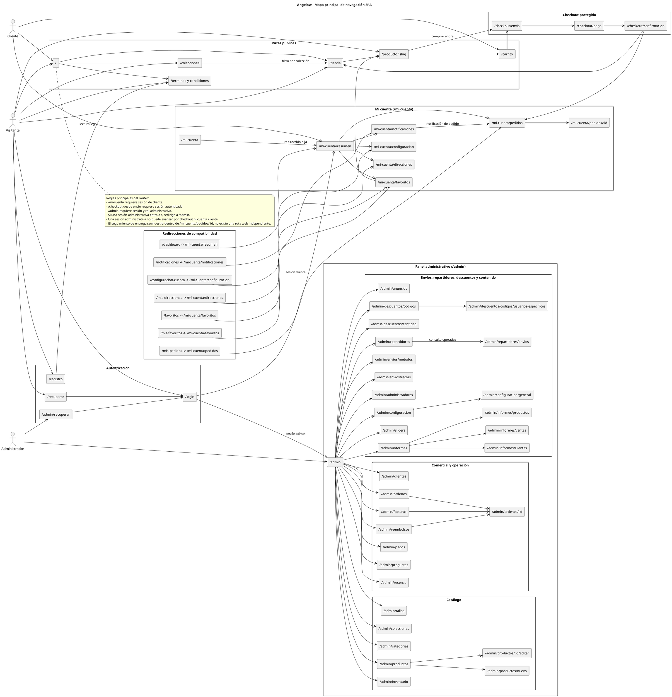
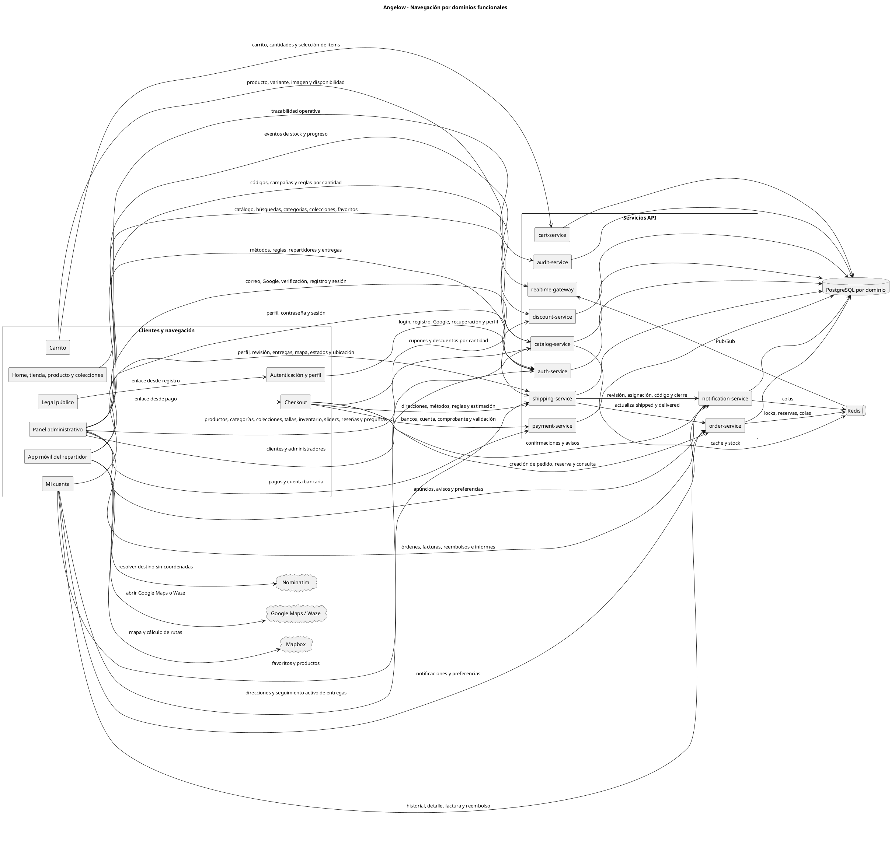
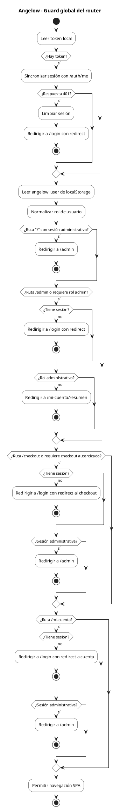
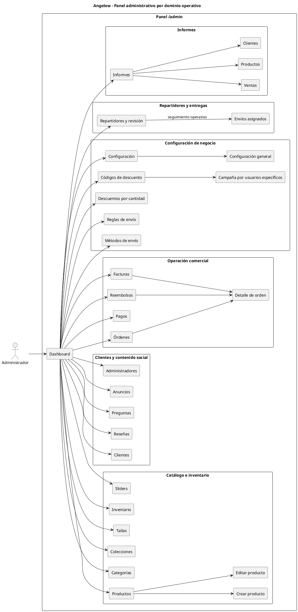
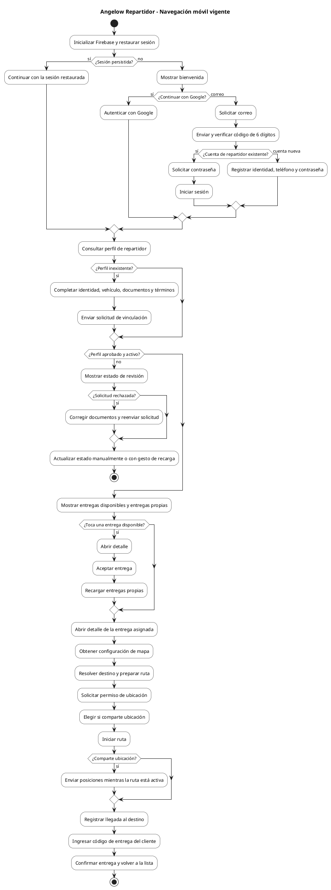
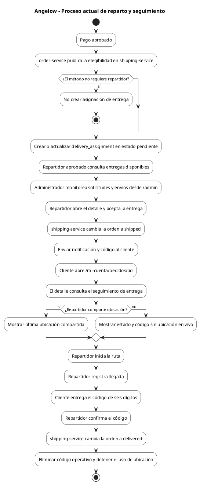

# Mapas de navegación del sistema en PlantUML

<!-- indice:auto:start -->
## Índice rápido

- [Objetivo](#objetivo)
- [Fuente de verdad](#fuente-de-verdad)
- [1) Mapa principal de rutas SPA](#1-mapa-principal-de-rutas-spa)
- [2) Mapa de navegación por dominios funcionales](#2-mapa-de-navegación-por-dominios-funcionales)
- [3) Flujo de protección del router](#3-flujo-de-protección-del-router)
- [4) Mapa administrativo por dominio](#4-mapa-administrativo-por-dominio)
- [5) Navegación de la app móvil del repartidor](#5-navegación-de-la-app-móvil-del-repartidor)
- [6) Proceso operativo de entrega y seguimiento](#6-proceso-operativo-de-entrega-y-seguimiento)
- [Rutas cubiertas](#rutas-cubiertas)
- [Documentos relacionados](#documentos-relacionados)
<!-- indice:auto:end -->

## Objetivo

Este documento describe la navegación SPA vigente de Angelow, la navegación de la app Flutter del repartidor y su relación con los microservicios que atienden cada dominio funcional. El mapa está pensado como una guía de arquitectura para entender qué rutas existen, qué actor las usa, qué estados intermedios aparecen y qué reglas de acceso aplica cada cliente.

## Fuente de verdad

La fuente principal de las rutas web es `frontend/src/router/index.js`. Para la navegación móvil se revisan `mobile/repartidor/lib/app.dart`, `mobile/repartidor/lib/ui/features/auth/views/auth_flow_view.dart`, `mobile/repartidor/lib/ui/features/courier/views/courier_workspace.dart` y `mobile/repartidor/lib/ui/features/deliveries/views/deliveries_home_view.dart`. El proceso operativo se contrasta además con `services/order-service/app/Http/Controllers/OrderController.php`, `services/shipping-service/routes/api.php` y `frontend/src/modules/account/pages/OrderDetailPage.vue`.

## 1) Mapa principal de rutas SPA

## 2) Mapa de navegación por dominios funcionales

## 3) Flujo de protección del router

Nota de comportamiento actual: la sincronización ante un error temporal distinto de 401 conserva la sesión local. La ruta `/admin/recuperar` está declarada, pero también coincide con el prefijo `/admin`; con el guard actual exige sesión y rol administrativo antes de mostrar la pantalla.

## 4) Mapa administrativo por dominio

## 5) Navegación de la app móvil del repartidor

La app Flutter no usa rutas URL. `AngelowCourierApp` decide entre `AuthFlowView` y `CourierWorkspace`; el workspace decide entre registro, revisión o `DeliveriesHomeView`, y el detalle abre `DeliveryRouteView` según la sesión y el estado del perfil.

## 6) Proceso operativo de entrega y seguimiento

## Rutas cubiertas

| Grupo | Rutas |
|---|---|
| Públicas | `/`, `/tienda`, `/producto/:slug`, `/colecciones`, `/carrito`, `/terminos-y-condiciones` |
| Checkout | `/checkout/envio`, `/checkout/pago`, `/checkout/confirmacion` |
| Autenticación | `/login`, `/registro`, `/recuperar`, `/admin/recuperar` |
| Mi cuenta | `/mi-cuenta`, `/mi-cuenta/resumen`, `/mi-cuenta/pedidos`, `/mi-cuenta/pedidos/:id`, `/mi-cuenta/notificaciones`, `/mi-cuenta/direcciones`, `/mi-cuenta/favoritos`, `/mi-cuenta/configuracion` |
| Admin catálogo | `/admin`, `/admin/productos`, `/admin/productos/nuevo`, `/admin/productos/:id/editar`, `/admin/categorias`, `/admin/colecciones`, `/admin/tallas`, `/admin/inventario` |
| Admin operación | `/admin/ordenes`, `/admin/ordenes/:id`, `/admin/clientes`, `/admin/resenas`, `/admin/preguntas`, `/admin/pagos`, `/admin/reembolsos`, `/admin/facturas` |
| Admin repartidores y entregas | `/admin/repartidores`, `/admin/repartidores/envios` |
| Admin configuración | `/admin/envios/reglas`, `/admin/envios/metodos`, `/admin/descuentos/cantidad`, `/admin/descuentos/codigos`, `/admin/descuentos/codigos/usuarios-especificos`, `/admin/anuncios`, `/admin/sliders`, `/admin/configuracion`, `/admin/configuracion/general`, `/admin/administradores` |
| Admin informes | `/admin/informes`, `/admin/informes/ventas`, `/admin/informes/productos`, `/admin/informes/clientes` |
| Redirecciones | `/dashboard`, `/mis-pedidos`, `/notificaciones`, `/mis-direcciones`, `/mis-favoritos`, `/configuracion-cuenta`, `/favoritos` |
| App móvil de repartidor | Sin URL: bienvenida, autenticación, registro, revisión, entregas, detalle de ruta y cierre con código |

## Documentos relacionados

- [Arquitectura web](arquitectura-web-plantuml.md)
- [Diagramas de clases por microservicio](diagramas-clases-microservicios-plantuml.md)
- [Modelos relacionales por microservicio](modelos-relacionales-bases-datos-plantuml.md)
- [Manual técnico](../operaciones/manual-tecnico.md)
- [Casos de uso](../referencias/casos-uso-angelow.md)
- [Historias de usuario](../referencias/historias-usuario-angelow.md)
- [Patrones de diseño aplicados](../patrones/README.md)
- [README de la app de repartidores](../../mobile/repartidor/README.md)
- [Casos de prueba de repartidores y entregas](../testing/casos-de-prueba/repartidores-entregas.md)
