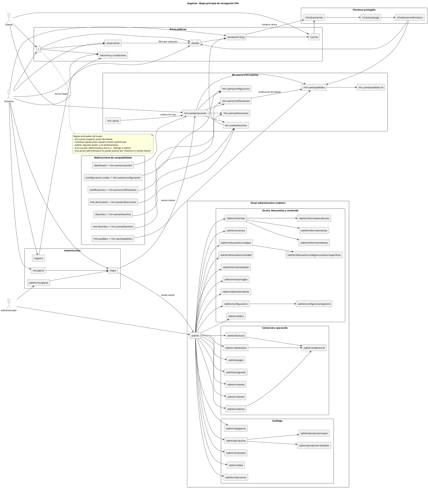
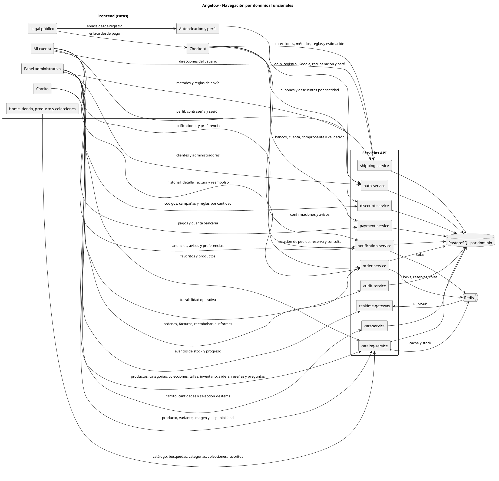
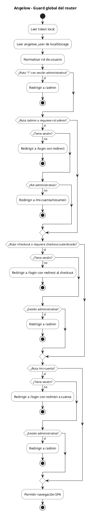
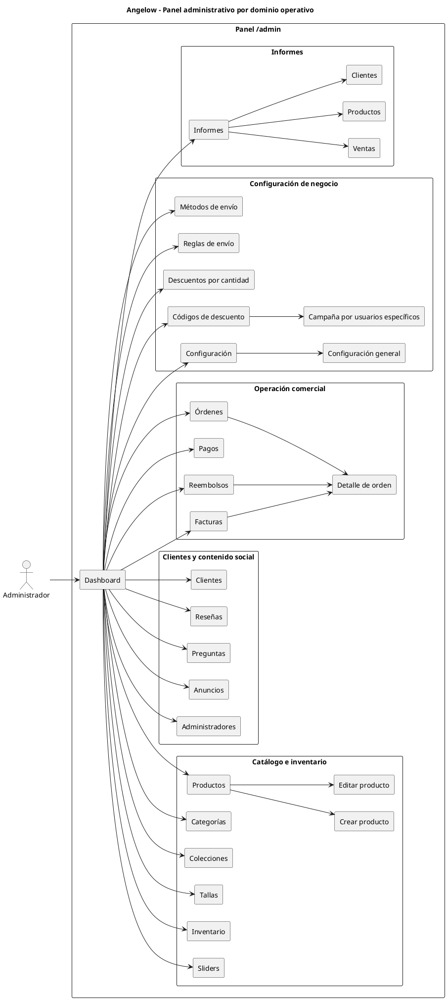

# Mapas de navegación del sistema en PlantUML

<!-- indice:auto:start -->
## Índice rápido

- [Objetivo](#objetivo)
- [Fuente de verdad](#fuente-de-verdad)
- [1) Mapa principal de rutas SPA](#1-mapa-principal-de-rutas-spa)
- [2) Mapa de navegación por dominios funcionales](#2-mapa-de-navegación-por-dominios-funcionales)
- [3) Flujo de protección del router](#3-flujo-de-protección-del-router)
- [4) Mapa administrativo por dominio](#4-mapa-administrativo-por-dominio)
- [Rutas cubiertas](#rutas-cubiertas)
- [Documentos relacionados](#documentos-relacionados)
<!-- indice:auto:end -->

## Objetivo

Este documento describe la navegación SPA vigente de Angelow y su relación con los microservicios que atienden cada dominio funcional. El mapa está pensado como una guía de arquitectura para entender qué rutas existen, qué actor las usa y qué reglas de acceso aplica el router.

## Fuente de verdad

La fuente principal para este mapa es `frontend/src/router/index.js`. Las rutas públicas, rutas de cuenta, rutas administrativas, redirecciones y reglas de guard se derivan de ese archivo para evitar divergencias entre la documentación y la SPA.

## 1) Mapa principal de rutas SPA

## 2) Mapa de navegación por dominios funcionales

## 3) Flujo de protección del router

## 4) Mapa administrativo por dominio

## Rutas cubiertas

| Grupo | Rutas |
|---|---|
| Públicas | `/`, `/tienda`, `/producto/:slug`, `/colecciones`, `/carrito`, `/terminos-y-condiciones` |
| Checkout | `/checkout/envio`, `/checkout/pago`, `/checkout/confirmacion` |
| Autenticación | `/login`, `/registro`, `/recuperar`, `/admin/recuperar` |
| Mi cuenta | `/mi-cuenta`, `/mi-cuenta/resumen`, `/mi-cuenta/pedidos`, `/mi-cuenta/pedidos/:id`, `/mi-cuenta/notificaciones`, `/mi-cuenta/direcciones`, `/mi-cuenta/favoritos`, `/mi-cuenta/configuracion` |
| Admin catálogo | `/admin`, `/admin/productos`, `/admin/productos/nuevo`, `/admin/productos/:id/editar`, `/admin/categorias`, `/admin/colecciones`, `/admin/tallas`, `/admin/inventario` |
| Admin operación | `/admin/ordenes`, `/admin/ordenes/:id`, `/admin/clientes`, `/admin/resenas`, `/admin/preguntas`, `/admin/pagos`, `/admin/reembolsos`, `/admin/facturas` |
| Admin configuración | `/admin/envios/reglas`, `/admin/envios/metodos`, `/admin/descuentos/cantidad`, `/admin/descuentos/codigos`, `/admin/descuentos/codigos/usuarios-especificos`, `/admin/anuncios`, `/admin/sliders`, `/admin/configuracion`, `/admin/configuracion/general`, `/admin/administradores` |
| Admin informes | `/admin/informes`, `/admin/informes/ventas`, `/admin/informes/productos`, `/admin/informes/clientes` |
| Redirecciones | `/dashboard`, `/mis-pedidos`, `/notificaciones`, `/mis-direcciones`, `/mis-favoritos`, `/configuracion-cuenta`, `/favoritos` |

## Documentos relacionados

- [Arquitectura web](arquitectura-web-plantuml.md)
- [Diagramas de clases por microservicio](diagramas-clases-microservicios-plantuml.md)
- [Modelos relacionales por microservicio](modelos-relacionales-bases-datos-plantuml.md)
- [Manual técnico](../operaciones/manual-tecnico.md)
- [Casos de uso](../referencias/casos-uso-angelow.md)
- [Historias de usuario](../referencias/historias-usuario-angelow.md)
- [Patrones de diseño aplicados](../patrones/README.md)
