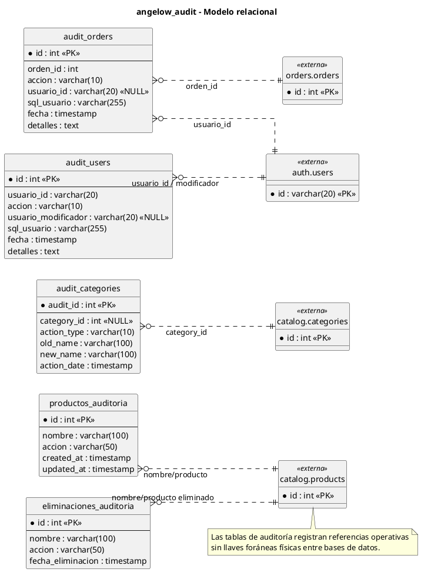

# audit-service - Modelo relacional en PlantUML

<!-- indice:auto:start -->
## Índice rápido

- [Alcance](#alcance)
- [Diagrama](#diagrama)
- [Fuentes revisadas](#fuentes-revisadas)
- [Documentos relacionados](#documentos-relacionados)
<!-- indice:auto:end -->

## Alcance

Modelo de la base `angelow_audit`, responsable de trazabilidad de categorías, órdenes, usuarios, productos y eliminaciones. La nomenclatura conserva nombres heredados para mantener compatibilidad con datos migrados.

## Diagrama

## Fuentes revisadas

- `services/audit-service/database/migrations/0001_01_01_000000_create_users_table.php`
- `services/audit-service/app/Http/Controllers/AuditController.php`
- `services/audit-service/routes/api.php`

## Documentos relacionados

- [Índice de modelos relacionales](../modelos-relacionales-bases-datos-plantuml.md)
- [Documentación por microservicio](../../microservicios/README.md)
