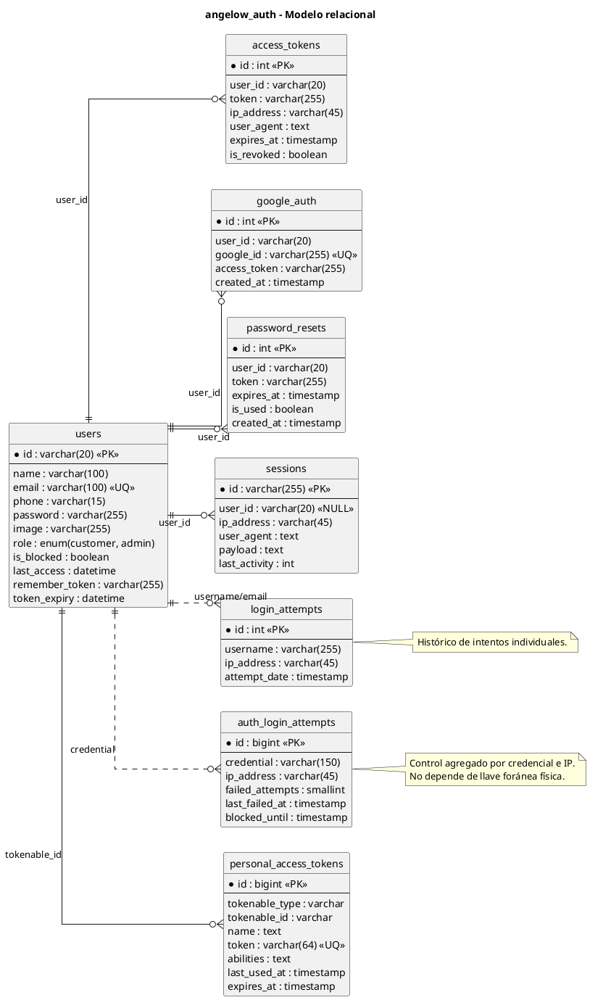

# auth-service - Modelo relacional en PlantUML

<!-- indice:auto:start -->
## Índice rápido

- [Alcance](#alcance)
- [Diagrama](#diagrama)
- [Fuentes revisadas](#fuentes-revisadas)
- [Documentos relacionados](#documentos-relacionados)
<!-- indice:auto:end -->

## Alcance

Modelo de la base `angelow_auth`, responsable de usuarios, sesiones, tokens, acceso con Google, recuperación de contraseña e intentos de inicio de sesión. Se incluyen las tablas propias del dominio y se omiten tablas técnicas de Laravel como `cache`, `jobs`, `failed_jobs` y `job_batches`.

## Diagrama

## Fuentes revisadas

- `services/auth-service/database/migrations/2026_02_16_000001_create_users_table.php`
- `services/auth-service/database/migrations/2026_02_16_000002_create_login_attempts_table.php`
- `services/auth-service/database/migrations/2026_02_16_185802_create_personal_access_tokens_table.php`
- `services/auth-service/database/migrations/2026_03_24_010000_create_auth_domain_tables.php`
- `services/auth-service/database/migrations/2026_06_21_000001_create_auth_login_attempts_table.php`
- `services/auth-service/app/Models/*.php`

## Documentos relacionados

- [Índice de modelos relacionales](../modelos-relacionales-bases-datos-plantuml.md)
- [Documentación por microservicio](../../microservicios/README.md)
