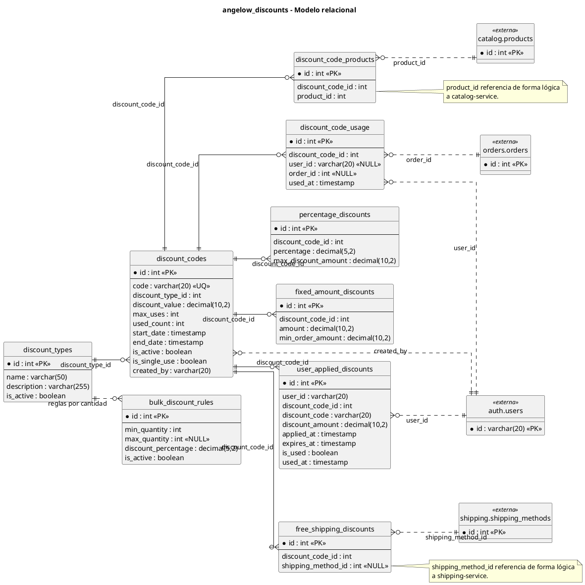

# discount-service - Modelo relacional en PlantUML

<!-- indice:auto:start -->
## Índice rápido

- [Alcance](#alcance)
- [Diagrama](#diagrama)
- [Fuentes revisadas](#fuentes-revisadas)
- [Documentos relacionados](#documentos-relacionados)
<!-- indice:auto:end -->

## Alcance

Modelo de la base `angelow_discounts`, responsable de tipos de descuento, códigos, productos asociados, uso de códigos, reglas por cantidad y descuentos asignados a usuarios.

## Diagrama

## Fuentes revisadas

- `services/discount-service/database/migrations/0001_01_01_000000_create_users_table.php`
- `services/discount-service/app/Models/*.php`
- `services/discount-service/routes/api.php`

## Documentos relacionados

- [Índice de modelos relacionales](../modelos-relacionales-bases-datos-plantuml.md)
- [Documentación por microservicio](../../microservicios/README.md)
