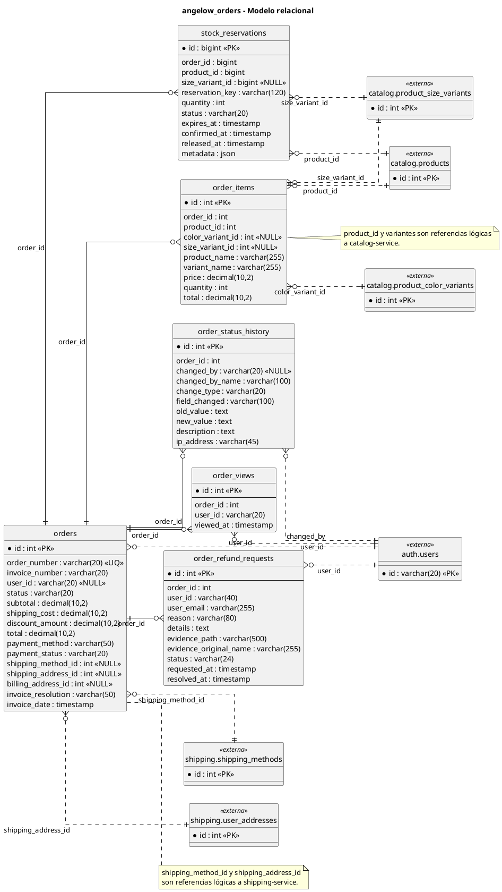

# order-service - Modelo relacional en PlantUML

<!-- indice:auto:start -->
## Índice rápido

- [Alcance](#alcance)
- [Diagrama](#diagrama)
- [Fuentes revisadas](#fuentes-revisadas)
- [Documentos relacionados](#documentos-relacionados)
<!-- indice:auto:end -->

## Alcance

Modelo de la base `angelow_orders`, responsable de pedidos, productos del pedido, historial de cambios, vistas, reservas de inventario, facturación básica y solicitudes de reembolso. Se actualiza con `stock_reservations` y `order_refund_requests`.

## Diagrama

## Fuentes revisadas

- `services/order-service/database/migrations/0001_01_01_000000_create_users_table.php`
- `services/order-service/database/migrations/2026_04_17_180000_create_stock_reservations_table.php`
- `services/order-service/database/migrations/2026_06_19_000001_create_order_refund_requests_table.php`
- `services/order-service/app/Models/StockReservation.php`
- `services/order-service/routes/api.php`

## Documentos relacionados

- [Índice de modelos relacionales](../modelos-relacionales-bases-datos-plantuml.md)
- [Documentación por microservicio](../../microservicios/README.md)
