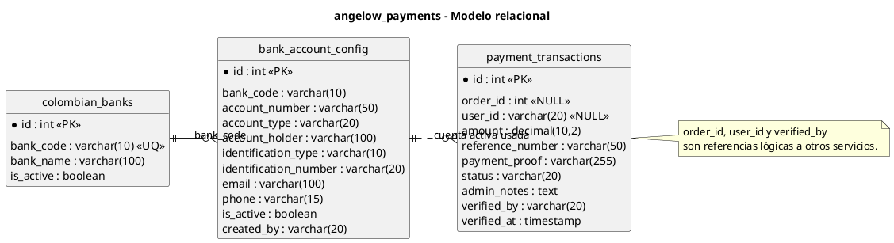

# payment-service - Modelo relacional en PlantUML

<!-- indice:auto:start -->
## Índice rápido

- [Alcance](#alcance)
- [Diagrama](#diagrama)
- [Fuentes revisadas](#fuentes-revisadas)
- [Documentos relacionados](#documentos-relacionados)
<!-- indice:auto:end -->

## Alcance

Modelo de la base `angelow_payments`, responsable del catálogo de bancos colombianos, cuenta bancaria activa y transacciones de pago manual con comprobante.

## Diagrama

## Fuentes revisadas

- `services/payment-service/database/migrations/0001_01_01_000000_create_users_table.php`
- `services/payment-service/database/migrations/2026_04_18_000001_seed_colombian_banks_catalog.php`
- `services/payment-service/routes/api.php`

## Documentos relacionados

- [Índice de modelos relacionales](../modelos-relacionales-bases-datos-plantuml.md)
- [Documentación por microservicio](../../microservicios/README.md)
