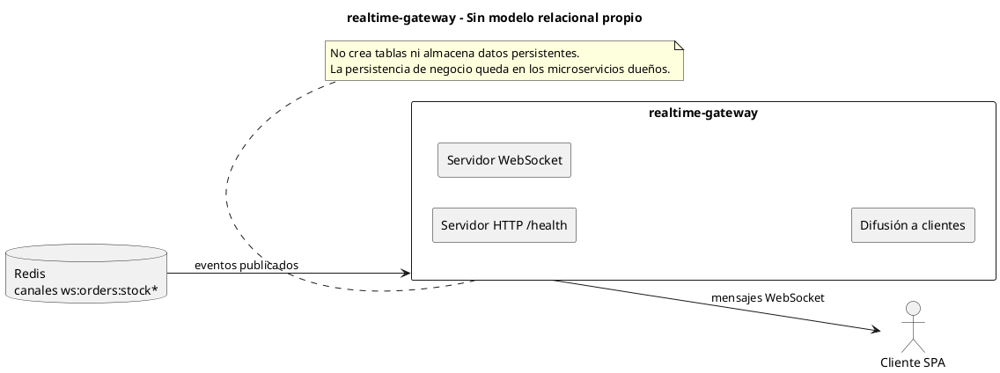

# realtime-gateway - Persistencia relacional

<!-- indice:auto:start -->
## Índice rápido

- [Alcance](#alcance)
- [Diagrama](#diagrama)
- [Fuentes revisadas](#fuentes-revisadas)
- [Documentos relacionados](#documentos-relacionados)
<!-- indice:auto:end -->

## Alcance

`realtime-gateway` no posee base de datos relacional propia. El servicio mantiene conexiones WebSocket y reenvía eventos recibidos desde Redis hacia clientes conectados, por lo que se documenta como módulo sin tablas.

## Diagrama

## Fuentes revisadas

- `services/realtime-gateway/server.js`
- `services/realtime-gateway/package.json`

## Documentos relacionados

- [Índice de modelos relacionales](../modelos-relacionales-bases-datos-plantuml.md)
- [Documentación por microservicio](../../microservicios/README.md)
