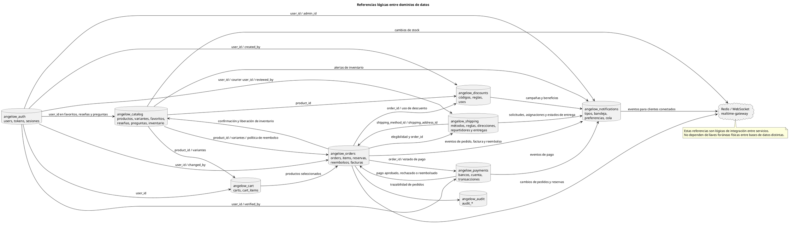

# Referencias lógicas entre bases de datos

<!-- indice:auto:start -->
## Índice rápido

- [Alcance](#alcance)
- [Diagrama](#diagrama)
- [Criterio de lectura](#criterio-de-lectura)
- [Documentos relacionados](#documentos-relacionados)
<!-- indice:auto:end -->

## Alcance

Mapa de referencias lógicas entre bases de datos de microservicios. Las líneas indican integración por identificadores compartidos, llamadas internas, eventos o contratos de negocio; no representan llaves foráneas físicas entre bases distintas.

## Diagrama

## Criterio de lectura

- Cada base mantiene sus tablas propias y consulta otros dominios por API, eventos o identificadores compartidos.
- Los campos `user_id`, `product_id`, `order_id`, `shipping_method_id` y similares representan contratos entre servicios, no integridad referencial física entre bases.
- `shipping-service` conserva la asignación, el destino y la trazabilidad de la entrega; `order-service` mantiene la propiedad del pedido y publica la elegibilidad mediante contrato interno.
- `realtime-gateway` no guarda tablas; solo reenvía eventos publicados por los servicios.

## Documentos relacionados

- [Índice de modelos relacionales](../modelos-relacionales-bases-datos-plantuml.md)
- [Arquitectura web en PlantUML](../arquitectura-web-plantuml.md)
- [Documentación por microservicio](../../microservicios/README.md)
