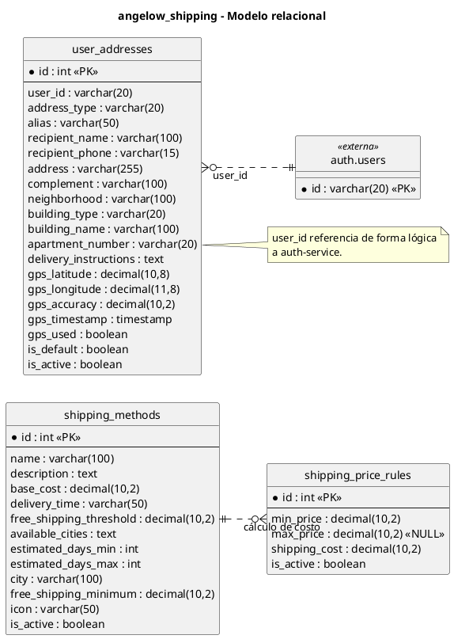

# shipping-service - Modelo relacional en PlantUML

<!-- indice:auto:start -->
## Índice rápido

- [Alcance](#alcance)
- [Diagrama](#diagrama)
- [Fuentes revisadas](#fuentes-revisadas)
- [Documentos relacionados](#documentos-relacionados)
<!-- indice:auto:end -->

## Alcance

Modelo de la base `angelow_shipping`, responsable de métodos de envío, reglas de precio y direcciones del cliente. El contrato vigente de direcciones mantiene alias, datos del destinatario, barrio, tipo de vivienda y geolocalización opcional; el servicio normaliza campos equivalentes cuando recibe datos con nombres distintos.

## Diagrama

## Fuentes revisadas

- `services/shipping-service/database/migrations/0001_01_01_000000_create_users_table.php`
- `services/shipping-service/database/migrations/2026_03_31_000001_create_user_addresses_table.php`
- `services/shipping-service/app/Models/UserAddress.php`
- `services/shipping-service/app/Http/Controllers/ShippingController.php`
- `services/shipping-service/routes/api.php`

## Documentos relacionados

- [Índice de modelos relacionales](../modelos-relacionales-bases-datos-plantuml.md)
- [Documentación por microservicio](../../microservicios/README.md)
