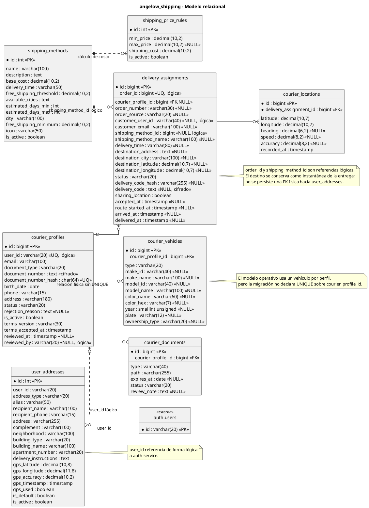

# shipping-service - Modelo relacional en PlantUML

<!-- indice:auto:start -->
## Índice rápido

- [Alcance](#alcance)
- [Diagrama](#diagrama)
- [Fuentes revisadas](#fuentes-revisadas)
- [Documentos relacionados](#documentos-relacionados)
<!-- indice:auto:end -->

## Alcance

Modelo de la base `angelow_shipping`, responsable de métodos y reglas de envío, direcciones del cliente, vinculación operativa de repartidores y ciclo de entregas. La identidad global continúa en `auth-service`; `user_id`, `customer_user_id`, `reviewed_by`, `order_id` y `shipping_method_id` son referencias lógicas entre dominios.

## Diagrama

## Fuentes revisadas

- `services/shipping-service/database/migrations/0001_01_01_000000_create_users_table.php`
- `services/shipping-service/database/migrations/2026_03_31_000001_create_user_addresses_table.php`
- `services/shipping-service/database/migrations/2026_07_22_000001_create_courier_delivery_tables.php`
- `services/shipping-service/database/migrations/2026_07_25_000001_remove_unused_courier_profile_fields.php`
- `services/shipping-service/app/Models/UserAddress.php`
- `services/shipping-service/app/Models/CourierProfile.php`
- `services/shipping-service/app/Models/CourierVehicle.php`
- `services/shipping-service/app/Models/CourierDocument.php`
- `services/shipping-service/app/Models/DeliveryAssignment.php`
- `services/shipping-service/app/Models/CourierLocation.php`
- `services/shipping-service/app/Http/Controllers/ShippingController.php`
- `services/shipping-service/app/Http/Controllers/CourierController.php`
- `services/shipping-service/app/Http/Controllers/Admin/AdminCourierController.php`
- `services/shipping-service/routes/api.php`

## Documentos relacionados

- [Índice de modelos relacionales](../modelos-relacionales-bases-datos-plantuml.md)
- [Documentación por microservicio](../../microservicios/README.md)
