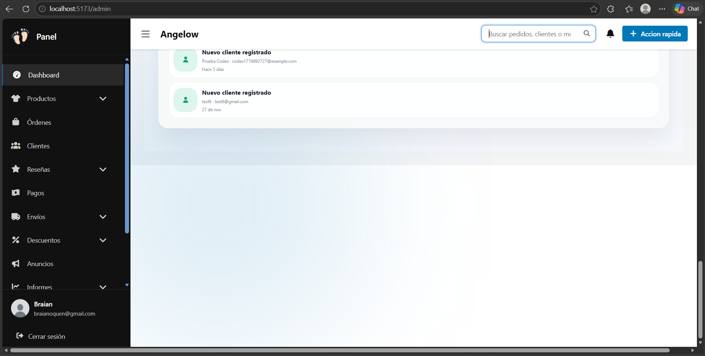
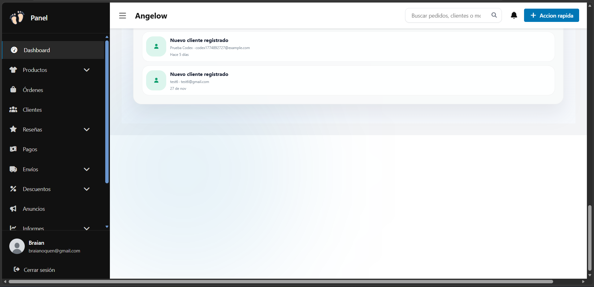
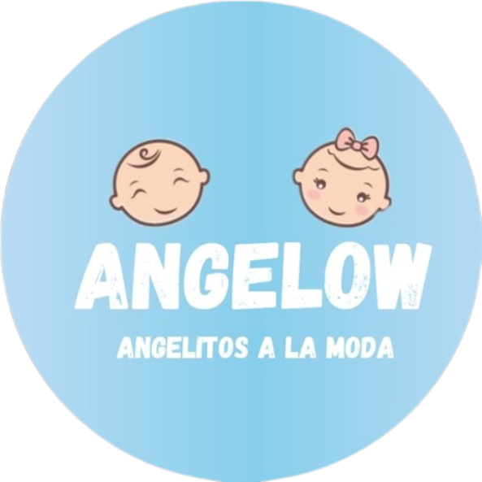

## Descripción paso a paso del desarrollo:
1. Se definió el alcance funcional del sistema para tienda virtual, clientes y administración.
2. Se diseñó una arquitectura por dominios con servicios API separados y frontend SPA.
3. Se configuró la infraestructura local con Docker Compose, PostgreSQL por dominio, Redis y frontend con Vite.
4. Se modelaron e implementaron los datos por dominio (auth, catálogo, carrito, pedidos, pagos, descuentos, envíos, notificaciones y auditoría).
5. Se implementó autenticación, perfil de usuario y control de acceso por rol.
6. Se desarrollaron catálogo, inventario, variaciones de producto, imágenes, reseñas y preguntas.
7. Se implementaron carrito y checkout por pasos, con validaciones en tiempo real por campo.
8. Se implementó el flujo de pagos por transferencia con carga y validación de comprobantes.
9. Se implementó la gestión de envíos, direcciones y geolocalización con mapa.
10. Se construyó y consolidó el panel administrativo, notificaciones, reportes y trazabilidad operativa.

## Resumen del proyecto:
ANGELOW es una plataforma de comercio electrónico para ropa infantil, orientada a venta al detal y mayorista. La solución está compuesta por un frontend SPA en Vue y APIs separadas por dominio de negocio para autenticación, catálogo, carrito, pedidos, pagos, descuentos, envíos, notificaciones y auditoría, permitiendo escalabilidad y mantenimiento modular.

## Evidencias visuales (pantallazos) del sistema, incluyendo colores, diseño y estado actual de la interfaz:

- Colores observados:
- Azul principal: #0077b6.
- Azul alterno: #1a8fc4.
- Acentos: #90e0ef y #48cae4.
- Fondo administrativo: #eef2f7.
- Superficies: #ffffff y #f8fbfe.

- Diseño y estado actual de la interfaz:
- Estructura administrativa con sidebar lateral y cabecera superior con buscador y acciones rápidas.
- Área central basada en tarjetas, listados y tablas con soporte de paginación y estados vacíos.
- Tipografía principal observada: Nunito en frontend general y Segoe UI en panel administrativo.
- Interfaz actual enfocada en productividad operativa para gestión de catálogo, pedidos, clientes y configuración.

## Tecnologías utilizadas: base de datos, lenguaje de programación y framework implementado:

- Base de datos:
  PostgreSQL 17 (una instancia independiente por dominio de servicio) y Redis 7 (colas, caché y tareas asíncronas).

- Lenguaje de programación:
  PHP 8.2 (servicios backend), JavaScript ES Modules (frontend SPA), SQL (modelado y consultas de datos) y CSS (sistema de diseño e interfaz).

- Framework principal (backend):
  Laravel 12 aplicado por servicio independiente: auth-service, catalog-service, cart-service, order-service, payment-service, discount-service, shipping-service, notification-service y audit-service.

- Framework principal (frontend):
  Vue 3.5.22 (SPA), Vue Router 4.6.3 (enrutamiento) y Vite 7.3.1 (build y servidor de desarrollo).

- Autenticación de API:
  Laravel Sanctum 4.x (tokens de acceso personal por servicio).

- Librería de correo electrónico (backend):
  PHPMailer 6.9 (envío de correos transaccionales desde auth-service).

- Librería de generación de PDF (backend):
  dompdf/dompdf 3.1 (generación de facturas y reportes en PDF, usada en order-service, catalog-service y discount-service).

- Librería de procesamiento CSV (backend):
  league/csv 9.18 (exportación e importación de datos en CSV, usada en catalog-service).

- Librerías frontend:
  Axios (cliente HTTP para consumo de APIs), Chart.js (gráficas en dashboard y reportes),
  Leaflet 1.9.4 (mapas interactivos), Font Awesome 7.2.0 (iconografía) y Firebase SDK (autenticación social con Google).

- Servicios externos:
  Firebase Authentication / GoogleAuthProvider (inicio de sesión con Google),
  OpenStreetMap (tiles de mapas) y Nominatim (geocodificación de direcciones).

- Infraestructura y herramientas:
  Docker y Docker Compose (orquestación de todos los contenedores: servicios API, bases de datos, Redis y frontend),
  Workers de cola Laravel (procesamiento asíncrono de notificaciones y correos) y
  carpeta compartida de uploads (almacenamiento local de imágenes, comprobantes y recursos multimedia).
