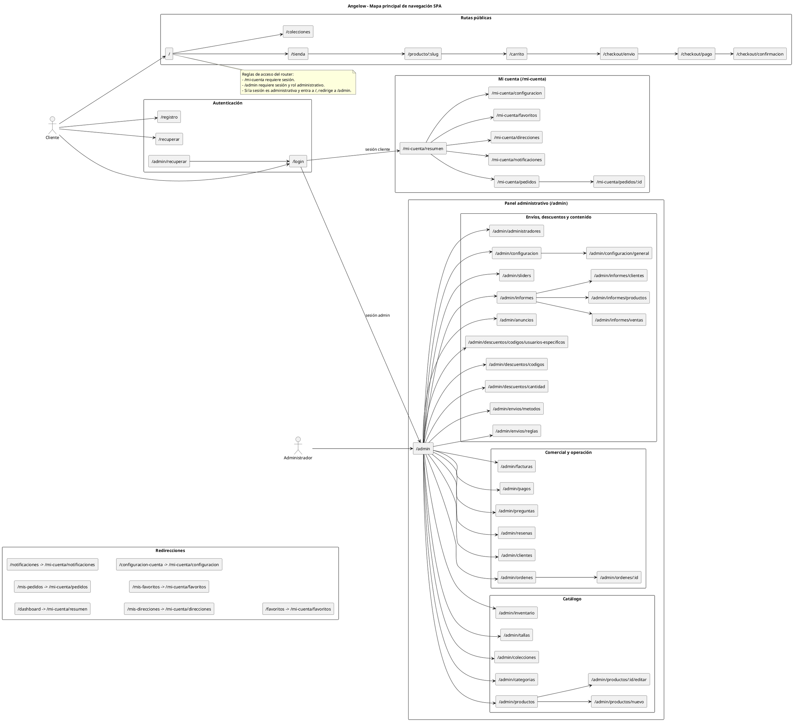
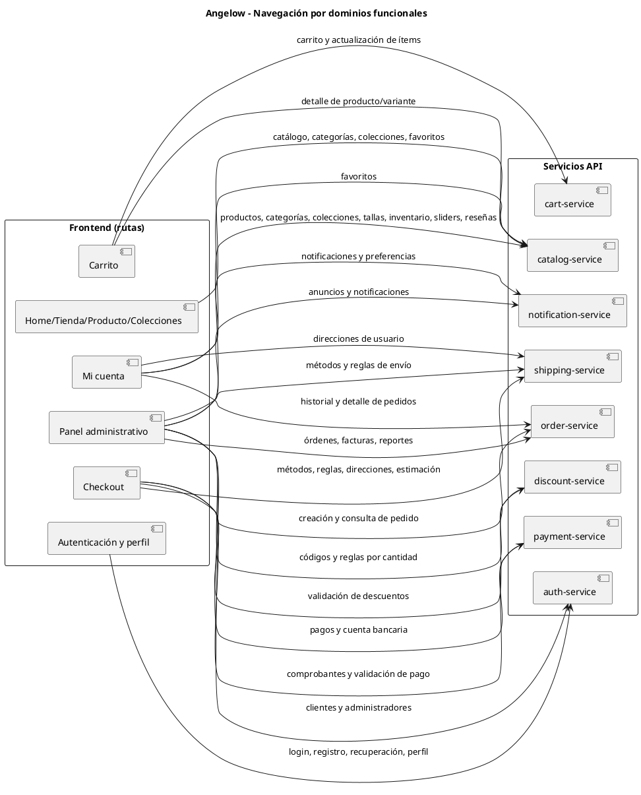

# Mapas de navegación del sistema en PlantUML

## 1) Mapa principal de rutas SPA

```plantuml
@startuml
title Angelow - Mapa principal de navegación SPA
left to right direction
skinparam packageStyle rectangle
skinparam componentStyle rectangle
skinparam shadowing false

actor "Cliente" as Cliente
actor "Administrador" as Admin

package "Rutas públicas" {
  [/] as home
  [/tienda] as store
  [/producto/:slug] as product
  [/colecciones] as collections
  [/carrito] as cart
  [/checkout/envio] as checkout_shipping
  [/checkout/pago] as checkout_payment
  [/checkout/confirmacion] as checkout_confirmation
}

package "Autenticación" {
  [/login] as login
  [/registro] as register
  [/recuperar] as forgot
  [/admin/recuperar] as admin_forgot
}

package "Mi cuenta (/mi-cuenta)" {
  [/mi-cuenta/resumen] as account_dashboard
  [/mi-cuenta/pedidos] as account_orders
  [/mi-cuenta/pedidos/:id] as account_order_detail
  [/mi-cuenta/notificaciones] as account_notifications
  [/mi-cuenta/direcciones] as account_addresses
  [/mi-cuenta/favoritos] as account_wishlist
  [/mi-cuenta/configuracion] as account_settings
}

package "Panel administrativo (/admin)" {
  [/admin] as admin_dashboard

  package "Catálogo" {
    [/admin/productos] as admin_products
    [/admin/productos/nuevo] as admin_product_create
    [/admin/productos/:id/editar] as admin_product_edit
    [/admin/categorias] as admin_categories
    [/admin/colecciones] as admin_collections
    [/admin/tallas] as admin_sizes
    [/admin/inventario] as admin_inventory
  }

  package "Comercial y operación" {
    [/admin/ordenes] as admin_orders
    [/admin/ordenes/:id] as admin_order_detail
    [/admin/clientes] as admin_customers
    [/admin/resenas] as admin_reviews
    [/admin/preguntas] as admin_questions
    [/admin/pagos] as admin_payments
    [/admin/facturas] as admin_invoices
  }

  package "Envíos, descuentos y contenido" {
    [/admin/envios/reglas] as admin_shipping_rules
    [/admin/envios/metodos] as admin_shipping_methods
    [/admin/descuentos/cantidad] as admin_bulk_discounts
    [/admin/descuentos/codigos] as admin_discount_codes
    [/admin/descuentos/codigos/usuarios-especificos] as admin_discount_specific
    [/admin/anuncios] as admin_announcements
    [/admin/informes] as admin_reports
    [/admin/informes/ventas] as admin_reports_sales
    [/admin/informes/productos] as admin_reports_products
    [/admin/informes/clientes] as admin_reports_customers
    [/admin/sliders] as admin_sliders
    [/admin/configuracion] as admin_settings
    [/admin/configuracion/general] as admin_settings_general
    [/admin/administradores] as admin_administrators
  }
}

package "Redirecciones" {
  [/dashboard -> /mi-cuenta/resumen] as r_dashboard
  [/mis-pedidos -> /mi-cuenta/pedidos] as r_orders
  [/notificaciones -> /mi-cuenta/notificaciones] as r_notifications
  [/mis-direcciones -> /mi-cuenta/direcciones] as r_addresses
  [/mis-favoritos -> /mi-cuenta/favoritos] as r_wishlist
  [/configuracion-cuenta -> /mi-cuenta/configuracion] as r_settings
  [/favoritos -> /mi-cuenta/favoritos] as r_favorites
}

Cliente --> home
Cliente --> login
Cliente --> register
Cliente --> forgot

home --> store
home --> collections
store --> product
product --> cart
cart --> checkout_shipping
checkout_shipping --> checkout_payment
checkout_payment --> checkout_confirmation

login --> account_dashboard : sesión cliente
login --> admin_dashboard : sesión admin
admin_forgot --> login

account_dashboard --> account_orders
account_orders --> account_order_detail
account_dashboard --> account_notifications
account_dashboard --> account_addresses
account_dashboard --> account_wishlist
account_dashboard --> account_settings

Admin --> admin_dashboard
admin_dashboard --> admin_products
admin_products --> admin_product_create
admin_products --> admin_product_edit
admin_dashboard --> admin_categories
admin_dashboard --> admin_collections
admin_dashboard --> admin_sizes
admin_dashboard --> admin_inventory
admin_dashboard --> admin_orders
admin_orders --> admin_order_detail
admin_dashboard --> admin_customers
admin_dashboard --> admin_reviews
admin_dashboard --> admin_questions
admin_dashboard --> admin_payments
admin_dashboard --> admin_invoices
admin_dashboard --> admin_shipping_rules
admin_dashboard --> admin_shipping_methods
admin_dashboard --> admin_bulk_discounts
admin_dashboard --> admin_discount_codes
admin_dashboard --> admin_discount_specific
admin_dashboard --> admin_announcements
admin_dashboard --> admin_reports
admin_reports --> admin_reports_sales
admin_reports --> admin_reports_products
admin_reports --> admin_reports_customers
admin_dashboard --> admin_sliders
admin_dashboard --> admin_settings
admin_settings --> admin_settings_general
admin_dashboard --> admin_administrators

note right of home
Reglas de acceso del router:
- /mi-cuenta requiere sesión.
- /admin requiere sesión y rol administrativo.
- Si la sesión es administrativa y entra a /, redirige a /admin.
end note
@enduml
```

## 2) Mapa de navegación por dominios funcionales

```plantuml
@startuml
title Angelow - Navegación por dominios funcionales
left to right direction
skinparam packageStyle rectangle
skinparam shadowing false

package "Frontend (rutas)" {
  [Home/Tienda/Producto/Colecciones] as nav_catalog
  [Carrito] as nav_cart
  [Checkout] as nav_checkout
  [Autenticación y perfil] as nav_auth
  [Mi cuenta] as nav_account
  [Panel administrativo] as nav_admin
}

package "Servicios API" {
  [auth-service] as svc_auth
  [catalog-service] as svc_catalog
  [cart-service] as svc_cart
  [order-service] as svc_order
  [payment-service] as svc_payment
  [discount-service] as svc_discount
  [shipping-service] as svc_shipping
  [notification-service] as svc_notification
}

nav_catalog --> svc_catalog : catálogo, categorías, colecciones, favoritos
nav_cart --> svc_cart : carrito y actualización de ítems
nav_cart --> svc_catalog : detalle de producto/variante

nav_checkout --> svc_shipping : métodos, reglas, direcciones, estimación
nav_checkout --> svc_discount : validación de descuentos
nav_checkout --> svc_order : creación y consulta de pedido
nav_checkout --> svc_payment : comprobantes y validación de pago

nav_auth --> svc_auth : login, registro, recuperación, perfil

nav_account --> svc_order : historial y detalle de pedidos
nav_account --> svc_shipping : direcciones de usuario
nav_account --> svc_notification : notificaciones y preferencias
nav_account --> svc_catalog : favoritos

nav_admin --> svc_auth : clientes y administradores
nav_admin --> svc_catalog : productos, categorías, colecciones, tallas, inventario, sliders, reseñas
nav_admin --> svc_order : órdenes, facturas, reportes
nav_admin --> svc_payment : pagos y cuenta bancaria
nav_admin --> svc_discount : códigos y reglas por cantidad
nav_admin --> svc_shipping : métodos y reglas de envío
nav_admin --> svc_notification : anuncios y notificaciones
@enduml
```
