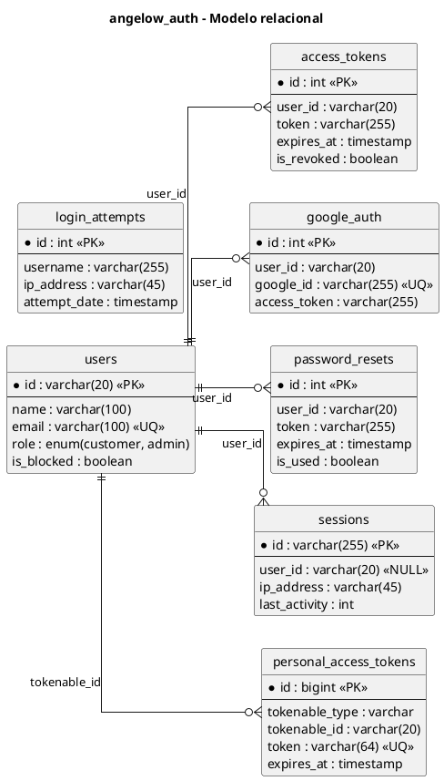
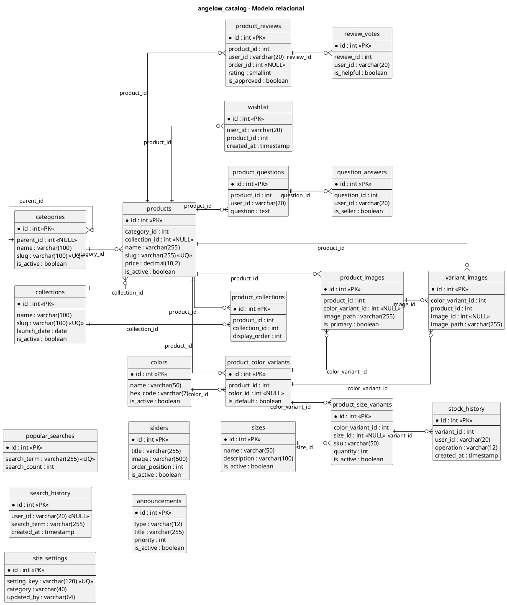
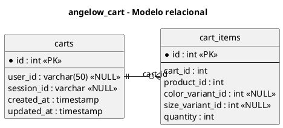
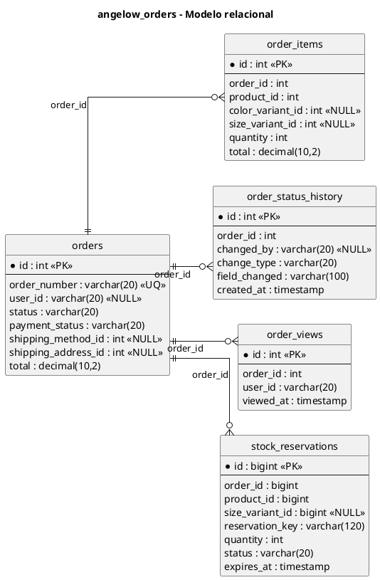
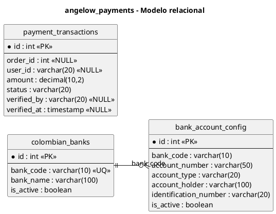
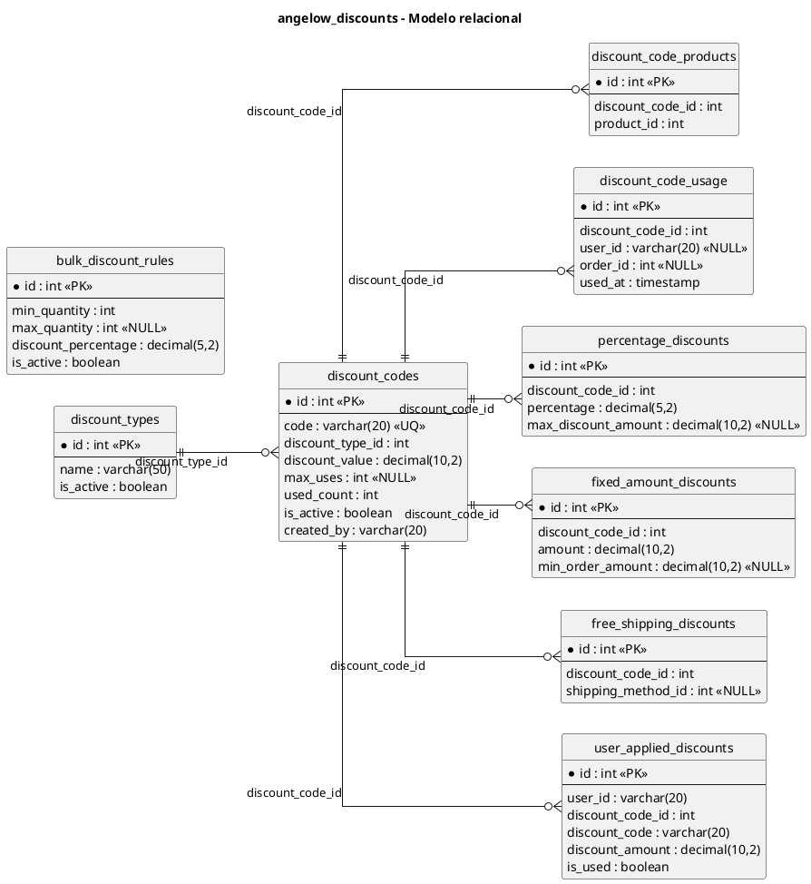
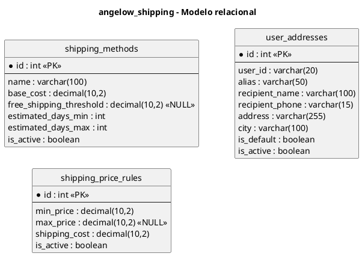
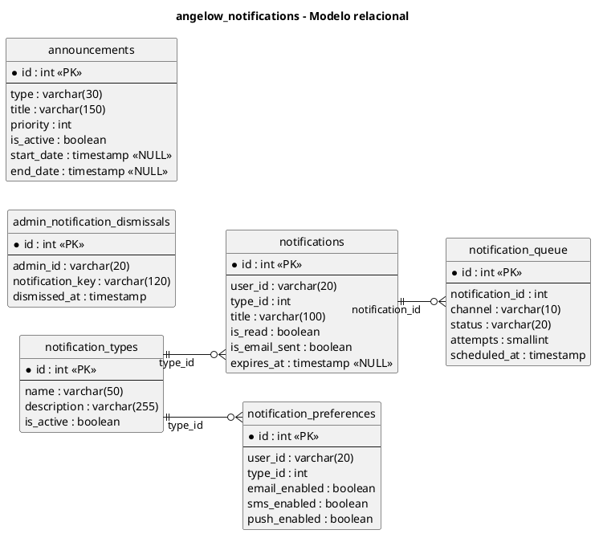
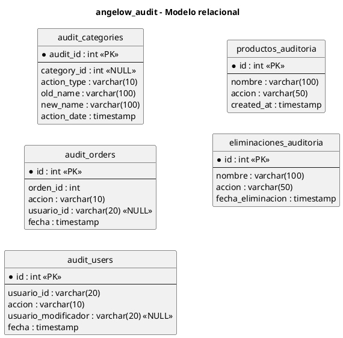
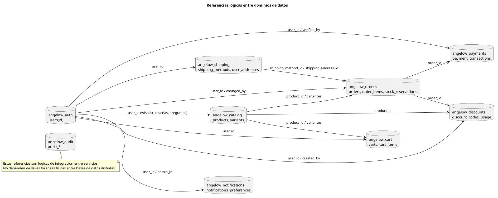

# Modelo relacional por base de datos en PlantUML

## 1) Base de datos angelow_auth (auth-service)

## 2) Base de datos angelow_catalog (catalog-service)

## 3) Base de datos angelow_cart (cart-service)

## 4) Base de datos angelow_orders (order-service)

## 5) Base de datos angelow_payments (payment-service)

## 6) Base de datos angelow_discounts (discount-service)

## 7) Base de datos angelow_shipping (shipping-service)

## 8) Base de datos angelow_notifications (notification-service)

## 9) Base de datos angelow_audit (audit-service)

## 10) Referencias lógicas entre bases de datos

