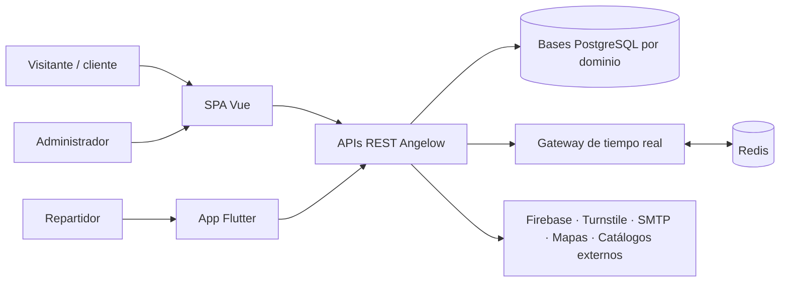
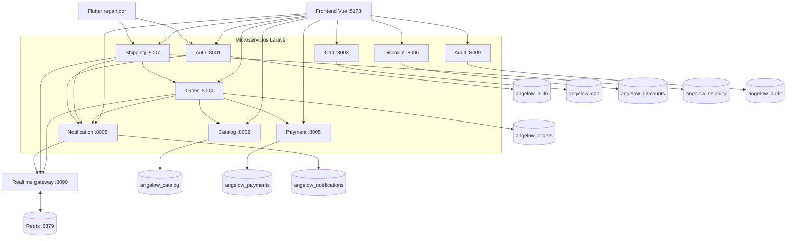
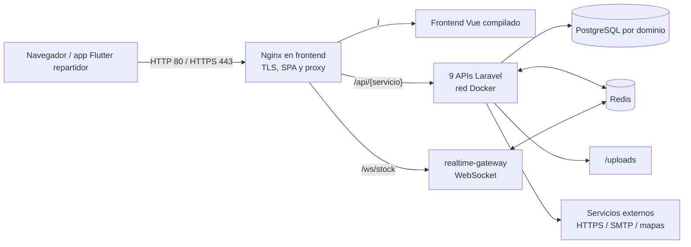
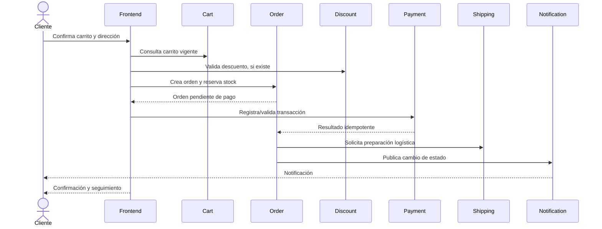

# SERVICIO NACIONAL DE APRENDIZAJE
## SENA
### REGIONAL ANTIOQUIA
### CENTRO DE SERVICIOS Y GESTIÓN EMPRESARIAL

> **Dato institucional por confirmar:** la estructura solicitada para esta entrega indica *Centro de Servicios y Gestión Empresarial*, pero la [ficha vigente del proyecto](../proyecto/FICHA_PROYECTO_ANGELOW.md) registra *Centro Textil y de Gestión Industrial*. El nombre definitivo debe validarse con el instructor antes de aprobar el manual.

**PROGRAMA DE FORMACIÓN:** Tecnólogo en Análisis y Desarrollo de Software (ADSO)

**MANUAL TÉCNICO**

**Estructura base para describir la arquitectura y operación técnica del software**

# ANGELOW

**Desarrollo de un Sistema de Gestión de Ventas para Ropa Infantil**

**Versión del software:** (Por definir)

**Versión del manual:** 1.0

**Aprendiz:** Braian Andrés Oquendo Durango — documento 1023526011

**Instructor titular:** Edilfredo Pineda

**Ficha:** 3147208

**Medellín, julio de 2026**

> **Aquí va la imagen 1:** portada institucional con los logotipos autorizados del SENA y de Angelow. Debe conservar márgenes, proporciones y lineamientos de identidad visual vigentes.

---

# Portadilla

# MANUAL TÉCNICO

## Angelow

**Versión del software:** (Por definir)

**Versión del manual:** 1.0

**Programa:** Tecnólogo en Análisis y Desarrollo de Software (ADSO)

**Autor:** Braian Andrés Oquendo Durango

**SENA — Regional Antioquia — Medellín**

**Fecha:** 28 de julio de 2026

---

# Lista de colaboradores

| Participante o entidad | Identificación / contacto | Rol en el proyecto |
|---|---|---|
| Braian Andrés Oquendo Durango | Documento 1023526011 · braianoquen@gmail.com · 302 261 3326 | Aprendiz, análisis, desarrollo y documentación |
| Edilfredo Pineda | (Correo institucional) | Instructor titular |
| Héctor Maya | (Correo institucional) | Instructor relacionado en la ficha del proyecto |
| Juan David Carvajal | (Correo institucional) | Instructor relacionado en la ficha del proyecto |
| (Nombre y cargo) | (Datos de contacto) | Revisor técnico |
| (Nombre de la empresa, emprendimiento o cliente final) | (NIT, responsable y datos de contacto) | Cliente o entidad beneficiaria |

## Control de versiones y aprobación

| Versión | Fecha | Responsable | Descripción del cambio | Revisó / aprobó | Estado |
|---|---|---|---|---|---|
| 1.0 | 28/07/2026 | Braian Andrés Oquendo Durango | Elaboración integral del manual técnico con base en el repositorio, contenedores activos y documentación canónica. | (Nombre y cargo) | Borrador |

**Versión actual del manual:** 1.0

**Versión actual del software:** (Asignar la versión aprobada de Angelow)

**Elaboró:** Braian Andrés Oquendo Durango

**Revisó / aprobó:** (Nombre y cargo)

**Estado:** Borrador; no se considera aprobado hasta diligenciar la revisión y las firmas.

> **Aquí va la captura 2:** evidencia de aprobación, firma digital o acta de revisión del manual, cuando exista.

---

# Tabla de contenido

1. [Introducción](#1-introducción)
2. [Descripción general del sistema](#2-descripción-general-del-sistema)
3. [Arquitectura y diseño](#3-arquitectura-y-diseño)
4. [Tecnologías y dependencias](#4-tecnologías-y-dependencias)
5. [Requerimientos técnicos](#5-requerimientos-técnicos)
6. [Ambientes de desarrollo, pruebas y producción](#6-ambientes-de-desarrollo-pruebas-y-producción)
7. [Estructura interna: programas, módulos, catálogos y archivos](#7-estructura-interna-programas-módulos-catálogos-y-archivos)
8. [Base de datos](#8-base-de-datos)
9. [Seguridad](#9-seguridad)
10. [Instalación, configuración y despliegue](#10-instalación-configuración-y-despliegue)
11. [Operación y mantenimiento](#11-operación-y-mantenimiento)
12. [Pruebas y calidad](#12-pruebas-y-calidad)
13. [Solución de problemas y asistencia técnica](#13-solución-de-problemas-y-asistencia-técnica)
14. [Apéndices](#14-apéndices)
15. [Glosario](#15-glosario)
16. [Bibliografía](#16-bibliografía)
17. [Índice analítico](#17-índice-analítico)

## Tabla de imágenes y diagramas

| N.º | Evidencia | Sección | Estado |
|---:|---|---|---|
| 1 | Portada institucional SENA y Angelow | Portada | Pendiente de insertar |
| 2 | Aprobación o firma del manual | Control de versiones | Pendiente de insertar |
| 3 | Diagrama de contexto de Angelow | Arquitectura | Incluido como Mermaid; pendiente exportar imagen si la entrega lo exige |
| 4 | Diagrama de componentes y microservicios | Arquitectura | Incluido como Mermaid; pendiente exportar imagen si la entrega lo exige |
| 5 | Diagrama de despliegue | Arquitectura | Incluido como Mermaid; pendiente exportar imagen si la entrega lo exige |
| 6 | Secuencia de compra, pago y envío | Arquitectura | Incluido como Mermaid; pendiente exportar imagen si la entrega lo exige |
| 7 | Mapa de navegación web | Estructura interna | Pendiente de insertar desde la fuente PlantUML |
| 8 | Modelo relacional completo | Base de datos | Pendiente de insertar desde la fuente PlantUML/SVG |
| 9 | Contenedores de desarrollo en ejecución | Operación | Pendiente de captura manual |
| 10 | Panel administrativo | Pruebas y calidad | Pendiente de captura manual |
| 11 | Aplicación móvil del repartidor | Pruebas y calidad | Pendiente de captura manual |
| 12 | Resultado de pruebas automatizadas | Pruebas y calidad | Pendiente de captura manual después de ejecutar la versión candidata |

---

# 1. Introducción

## 1.1 Propósito

Este manual documenta la arquitectura, estructura interna, tecnologías, datos, seguridad, instalación resumida, operación, mantenimiento y estrategia de pruebas de **Angelow**, una solución de comercio electrónico para ropa infantil. Su propósito es permitir que desarrolladores, responsables de infraestructura, personal de soporte, evaluadores técnicos y futuros mantenedores comprendan cómo está construido el sistema y cómo operarlo sin depender exclusivamente del conocimiento del autor.

## 1.2 Alcance

El documento cubre el estado del repositorio inspeccionado el **28 de julio de 2026**:

- SPA web desarrollada con Vue.
- Panel administrativo integrado en la SPA.
- Nueve microservicios Laravel y sus bases de datos PostgreSQL.
- Gateway de eventos en tiempo real con Node.js y Redis.
- Aplicación Flutter para repartidores.
- Integraciones externas de autenticación, captcha, mapas, correo y catálogos vehiculares.
- Contenedores Docker para desarrollo y guía de despliegue en servidor.
- Migraciones, respaldo, registros, pruebas automatizadas y casos de prueba manuales.

No reemplaza los documentos funcionales, el manual de usuario ni el procedimiento detallado de producción. Los complementa y enlaza con sus fuentes canónicas.

## 1.3 Audiencia técnica

- Equipo de desarrollo web, móvil y backend.
- Administradores de servidores y bases de datos.
- Personal encargado de pruebas, soporte y mantenimiento.
- Instructor, revisor técnico y evaluadores del proyecto formativo.
- Personal autorizado del cliente que deba recibir o mantener el software.

## 1.4 Convenciones

- Los comandos se ejecutan desde la raíz del repositorio, salvo indicación contraria.
- Las rutas se escriben entre acentos graves, por ejemplo `services/auth`.
- Los valores entre paréntesis, como **(Por definir)**, deben ser diligenciados por el responsable humano antes de aprobar el documento.
- Las figuras Mermaid son fuentes editables. Cuando el formato final exija imágenes, deben exportarse a SVG o PNG sin eliminar el código fuente.
- Las credenciales mostradas en ejemplos son nombres de variables, nunca secretos reales.
- Los puertos publicados corresponden al ambiente Docker local; producción usa proxy inverso HTTPS.

## 1.5 Documentos relacionados

- [README principal](../../README.md): acceso inicial, comandos y puertos.
- [Diseño y límites arquitectónicos](../../DESIGN.md): decisiones transversales y propiedad de datos.
- [Guía interactiva de usuario](../../frontend/docs/guia-usuario-interactiva.md): comportamiento visible de la SPA.
- [Despliegue en servidor con Nginx](DESPLIEGUE_SERVIDOR_NGINX.md): procedimiento detallado de instalación productiva.
- [Matriz de requerimientos funcionales](../referencias/matriz-requerimientos-funcionales-actualizada.md).
- [Requisitos no funcionales](../referencias/requisitos-no-funcionales-angelow.md).
- [Casos de uso](../referencias/casos-uso-angelow.md) e [historias de usuario](../referencias/historias-usuario-angelow.md).
- [Índice de pruebas](../testing/README.md).

---

# 2. Descripción general del sistema

## 2.1 Objetivo de la solución

Angelow permite publicar y vender ropa infantil al detal y al por mayor, administrar catálogo e inventario, gestionar clientes, pedidos, pagos, promociones, facturación, despachos, notificaciones y auditoría. También ofrece una experiencia móvil separada para que los repartidores se vinculen, consulten asignaciones y reporten ubicación durante una ruta activa y consentida.

## 2.2 Contexto y actores

| Actor | Responsabilidades principales |
|---|---|
| Visitante | Navegar el catálogo, buscar, consultar productos, registrarse e iniciar sesión. |
| Cliente | Gestionar cuenta, direcciones, carrito, favoritos, compra, pago, pedidos, reseñas, preguntas y notificaciones. |
| Administrador | Gestionar catálogo, inventario, ventas, clientes, pagos, envíos, repartidores, descuentos, contenido, reportes y configuración. |
| Repartidor | Registrarse o vincularse, completar perfil y documentos, consultar entregas, iniciar ruta y reportar ubicación con consentimiento. |
| Proveedor de identidad | Firebase/Google autentica identidades federadas. |
| Servicios externos | Turnstile, SMTP, mapas, geocodificación, rutas y catálogos de vehículos/colores. |
| Soporte técnico | Monitorear servicios, logs, datos, incidentes, respaldos y despliegues. |

## 2.3 Módulos funcionales

| Módulo | Funciones incluidas | Componente propietario principal |
|---|---|---|
| Navegación pública | Inicio, tienda, colecciones, detalle de producto y términos | Frontend + Catalog |
| Acceso y usuarios | Registro, verificación de correo, login, recuperación, Google y roles | Auth |
| Catálogo | Productos, categorías, colecciones, colores, tallas, imágenes y búsquedas | Catalog |
| Inventario | Variantes, existencias, alertas e historial de stock | Catalog |
| Carrito | Carrito invitado/autenticado, cantidades y vinculación de sesión | Cart |
| Checkout | Dirección, método de envío, pago y confirmación | Frontend + Order + Payment + Shipping |
| Pedidos | Creación, detalle, estados, historial y reservas temporales | Order |
| Pagos y facturación | Transacciones, configuración bancaria, comprobantes y facturas | Payment + Order |
| Descuentos | Códigos, reglas por cantidad, porcentaje, monto y envío gratis | Discount |
| Direcciones y envíos | Direcciones, métodos, tarifas, asignaciones y seguimiento | Shipping |
| Repartidores | Solicitud, perfil, documentos, vehículo, entregas y ubicación | Shipping + app Flutter |
| Notificaciones | Preferencias, cola y avisos al cliente o administrador | Notification |
| Reseñas y preguntas | Reseñas, votos, preguntas y respuestas | Catalog |
| Favoritos | Lista de deseos del cliente | Catalog |
| Configuración del sitio | Anuncios, sliders y parámetros visibles | Catalog |
| Informes y exportaciones | Informes administrativos, PDF y Excel | Frontend + servicios de dominio |
| Auditoría | Registro de eliminaciones y referencias operativas | Audit + historiales de dominio |

## 2.4 Límites del sistema

- La SPA no es propietaria de datos de negocio; consume APIs.
- Cada microservicio es propietario exclusivo de su base de datos.
- No se permiten consultas SQL directas entre bases de datos de distintos dominios.
- Las relaciones entre dominios se conservan mediante identificadores lógicos como `user_id`, `user_email`, `order_id` o `product_id`.
- Durante la migración desde el sistema PHP anterior puede existir un *fallback* legacy controlado, pero no debe convertirse en una segunda fuente permanente de verdad.
- Los mapas, captcha, correo y autenticación federada dependen de terceros; la operación crítica debe distinguir entre indisponibilidad externa y falla interna.
- El alcance operativo documentado para repartidores está limitado a Medellín mientras el negocio no apruebe otra cobertura.

## 2.5 Flujos principales

1. El visitante consulta el catálogo y agrega productos al carrito.
2. Para continuar al checkout debe autenticarse; un carrito invitado puede vincularse con el usuario.
3. El cliente elige dirección y envío, crea una orden y se reserva temporalmente el inventario.
4. El servicio de pagos registra el resultado y el servicio de pedidos actualiza el estado de forma idempotente.
5. Una orden preparada puede asignarse a un repartidor.
6. El repartidor inicia la ruta y comparte ubicación únicamente después de aceptar el consentimiento.
7. El cliente y el administrador reciben actualizaciones y notificaciones.
8. Los eventos y cambios relevantes quedan disponibles en historiales o auditoría según el dominio.

---

# 3. Arquitectura y diseño

## 3.1 Estilo arquitectónico

Angelow aplica una arquitectura distribuida por dominios:

- **Cliente web:** SPA modular en Vue.
- **Cliente móvil:** aplicación Flutter en capas para repartidores.
- **Backend:** microservicios REST en Laravel.
- **Datos:** PostgreSQL independiente por microservicio.
- **Procesamiento asíncrono:** colas y tareas programadas Laravel en los dominios que lo requieren.
- **Tiempo real:** gateway Node.js conectado a Redis.
- **Despliegue local:** Docker Compose sobre una red privada.
- **Producción:** contenedores detrás de Nginx y HTTPS, según la guía de despliegue.

La fuente arquitectónica normativa es [DESIGN.md](../../DESIGN.md). Si este manual y esa fuente divergen, debe corregirse el documento desactualizado y validarse el cambio transversal.

## 3.2 Vista de contexto



> **Aquí va la imagen 3:** exportación SVG o PNG del diagrama de contexto anterior, con título “Contexto general de Angelow”, número de figura y fuente “Elaboración propia”.

## 3.3 Vista de componentes



> **Aquí va la imagen 4:** exportación del diagrama de componentes. La versión final debe ser legible a tamaño de página; si no lo es, usar orientación horizontal.

## 3.4 Responsabilidades por componente

| Componente | Responsabilidad técnica | Datos propios |
|---|---|---|
| `frontend` | SPA pública, cuenta, checkout y panel administrativo | No almacena datos de negocio; mantiene estado de interfaz y sesión cliente |
| `mobile/repartidor` | Experiencia móvil del repartidor | Sesión segura y estado local de presentación |
| `auth-service` | Identidad, credenciales, perfiles base, roles y recuperación | Usuarios, sesiones, tokens e intentos de acceso |
| `catalog-service` | Catálogo, variantes, inventario, contenido, reseñas y favoritos | Productos y catálogos relacionados |
| `cart-service` | Carritos de invitado y usuario | Carritos e ítems |
| `order-service` | Órdenes, estados, reembolsos y reservas de inventario | Pedidos, ítems, historial y reservas |
| `payment-service` | Transacciones y configuración bancaria | Pagos y bancos |
| `discount-service` | Descuentos, códigos y reglas promocionales | Reglas y aplicaciones de descuento |
| `shipping-service` | Direcciones, tarifas, repartidores, asignaciones y ubicación | Datos logísticos y del repartidor |
| `notification-service` | Avisos, preferencias, colas y notificaciones | Notificaciones y preferencias |
| `audit-service` | Referencias de auditoría y eliminaciones | Registros técnicos de auditoría |
| `realtime-gateway` | Distribución de eventos al navegador o app | No usa base relacional propia; usa Redis |

## 3.5 Vista de despliegue

La vista detallada y el procedimiento asociado están en [Diagrama simple de despliegue e instalación](../arquitectura/diagrama-despliegue-instalacion.md).



En producción, `frontend` es el único servicio publicado y expone `80` y `443`; PostgreSQL, Redis, las APIs y el gateway permanecen en `angelow_network`. La tabla de rutas, puertos locales, instalación y variables está en el documento enlazado.

## 3.6 Secuencia simplificada de compra



> **Aquí va la imagen 6:** exportación del flujo de compra, pago y envío. Si se entrega como captura, debe ocultar datos personales y financieros.

## 3.7 Patrones y decisiones técnicas

- **Separación por dominio:** cada servicio cambia y despliega su lógica sin apropiarse de tablas ajenas.
- **API REST:** comunicación principal entre clientes y backend mediante JSON y HTTP.
- **Capas Laravel:** rutas, controladores, servicios, modelos, validación y persistencia.
- **Frontend modular:** páginas para orquestación, componentes reutilizables, *composables* para lógica y servicios para acceso a APIs.
- **Aplicación móvil en capas:** interfaz, lógica/dominio, datos y configuración.
- **Identidad distribuida:** convivencia temporal mediante `user_id` y `user_email` mientras se completa la migración.
- **Idempotencia:** operaciones sensibles entre pedidos, pagos y envíos deben tolerar reintentos sin duplicar efectos.
- **Serialización logística:** una asignación de entrega no debe quedar activa simultáneamente para varios repartidores.
- **Archivos compartidos:** los servicios persisten rutas relativas reales bajo `/uploads`; el reemplazo debe borrar de forma segura el archivo anterior cuando corresponda.
- **Fallback controlado:** catálogos externos pueden usar datos locales de respaldo; el sistema legacy solo se consulta cuando el flujo de migración lo autorice.

## 3.8 Integraciones externas

| Integración | Uso | Configuración / riesgo operativo |
|---|---|---|
| Firebase Authentication / Google Sign-In | Acceso federado web y móvil | Requiere proyecto Firebase y configuración por plataforma |
| Cloudflare Turnstile | Protección contra automatización maliciosa | Llave pública en frontend y secreta solo en backend |
| SMTP, actualmente compatible con Gmail | Códigos y mensajes de correo | Requiere credencial de aplicación; aplicar límites y monitorear rebotes |
| Leaflet + OpenStreetMap/CARTO | Visualización de mapas web | Respetar atribución y políticas de uso |
| Nominatim | Geocodificación | Respetar política de uso y evitar solicitudes abusivas |
| Mapbox Maps/Directions | Mapa y ruta del repartidor | Token público restringido por aplicación/dominio y cuota monitoreada |
| NHTSA vPIC | Catálogo de marcas/modelos vehiculares | Aplicar timeout y fallback local |
| The Color API | Ayuda para selección de colores | Aplicar timeout y fallback local |

---

# 4. Tecnologías y dependencias

## 4.1 Versiones verificadas

Las siguientes versiones se consultaron en el entorno local y los contenedores activos el 28/07/2026. Deben actualizarse cuando cambien las imágenes base o el archivo de bloqueo de dependencias.

| Tecnología | Versión verificada | Uso |
|---|---:|---|
| Docker Engine | 28.3.3 | Contenedores |
| Docker Compose | 2.39.2 | Orquestación local |
| Node.js | 20.20.2 | Frontend y gateway |
| npm | 10.8.2 | Dependencias JavaScript |
| PHP | 8.4.23 | Microservicios |
| Laravel | 12.51.0 | Framework backend |
| PostgreSQL | 17.9 | Persistencia relacional |
| Redis | 7.4.8 | Mensajería/tiempo real |
| Flutter | 3.41.7 estable | Aplicación móvil |
| Dart | 3.11.5 | Lenguaje de la app móvil |
| Flutter DevTools | 2.54.2 | Diagnóstico móvil |

Los manifiestos backend aceptan PHP `^8.2` y Laravel `^12`; las imágenes Docker usan PHP 8.4. Los valores efectivos del despliegue son los que deben registrarse en la matriz de operación.

## 4.2 Frontend

| Dependencia principal | Versión resuelta | Licencia declarada | Uso |
|---|---:|---|---|
| Vue | 3.5.30 | MIT | Interfaz reactiva |
| Vue Router | 4.6.4 | MIT | Navegación SPA y guardas |
| Vite | 7.3.1 | MIT | Desarrollo y compilación |
| Axios | 1.13.5 | MIT | Cliente HTTP |
| Chart.js | 4.4.0 | MIT | Gráficos administrativos |
| ExcelJS | 4.4.0 | MIT | Exportaciones Excel |
| Firebase | 12.11.0 | Apache-2.0 | Integración de identidad |
| jsPDF | 4.2.1 | MIT | Documentos PDF |
| jsPDF AutoTable | 5.0.8 | MIT | Tablas PDF |
| Intro.js | 8.5.0 | AGPL-3.0 | Recorridos guiados |
| Font Awesome Free | 7.2.0 | Licencia mixta del paquete | Iconos |

> **Revisión de licencias pendiente:** antes de distribución comercial debe evaluarse formalmente la compatibilidad de Intro.js bajo AGPL-3.0 y conservar avisos/licencias de Font Awesome y demás terceros. Esta tabla es informativa y no sustituye asesoría jurídica.

## 4.3 Backend

Todos los microservicios emplean Laravel 12, Sanctum 4, Tinker y PHPUnit 11 en desarrollo. Dependencias especializadas:

- `auth-service`: PHPMailer 6.9 para correo.
- `catalog-service`: Dompdf 3.1 y League CSV 9.18.
- `discount-service` y `order-service`: Dompdf 3.1.
- Extensiones de PHP y controladores PostgreSQL definidos en sus imágenes Docker.

## 4.4 Aplicación móvil

La aplicación usa Flutter/Dart, Firebase Core y Auth, Google Sign-In, `http`, `provider`, `flutter_secure_storage`, `intl`, Mapbox Maps 2.26.0, Geolocator 14.0.3, selector de imágenes y selector de archivos. La fuente detallada es [mobile/repartidor/pubspec.yaml](../../mobile/repartidor/pubspec.yaml).

## 4.5 Archivos de control de dependencias

- JavaScript: `package.json` y `package-lock.json`.
- PHP: `composer.json` y `composer.lock` por servicio.
- Flutter: `pubspec.yaml` y `pubspec.lock`.
- Contenedores: `Dockerfile` por componente y [docker-compose.yml](../../docker-compose.yml).

Los archivos de bloqueo deben versionarse. Las actualizaciones se prueban primero en una rama y nunca directamente en producción.

---

# 5. Requerimientos técnicos

## 5.1 Equipo de desarrollo

| Recurso | Mínimo funcional | Recomendado |
|---|---:|---:|
| CPU | 4 núcleos x64 | 8 núcleos o más |
| RAM | 8 GB; puede ser insuficiente al levantar todo | 16 GB o más |
| Almacenamiento libre | 30 GB SSD | 60 GB SSD o más |
| Pantalla | 1366 × 768 | 1920 × 1080 |
| Virtualización | Habilitada | Habilitada con WSL2/Hyper-V estable |

Para desarrollo móvil Android deben sumarse los recursos del emulador; con 8 GB de RAM se recomienda dispositivo físico o levantar solo los servicios necesarios.

## 5.2 Servidor de producción

La guía de despliegue vigente recomienda como punto de partida:

- Ubuntu Server 22.04 o 24.04 LTS.
- 2 vCPU.
- 8 GB de RAM.
- 100 GB NVMe.
- Dominio DNS, acceso administrativo por SSH, Docker, Nginx y Certbot.

El dimensionamiento definitivo depende de concurrencia, imágenes, retención de logs y crecimiento de bases de datos. Deben definirse métricas, capacidad máxima, RPO y RTO antes de la puesta en producción.

## 5.3 Software requerido

- Git.
- Docker Desktop en Windows o Docker Engine + Compose en Linux.
- PowerShell para los scripts `.ps1` en Windows.
- Navegador moderno para la SPA.
- Flutter estable, Android SDK con API mínima 23 o Xcode para compilar la app.
- Opcional para trabajo sin contenedores: Node.js 20, PHP/Composer compatibles y PostgreSQL 17.

## 5.4 Red y puertos locales

| Puerto host | Componente |
|---:|---|
| 5173 | Frontend Vite |
| 8001–8009 | APIs Auth, Catalog, Cart, Order, Payment, Discount, Shipping, Notification y Audit |
| 8090 | Gateway de tiempo real |
| 6379 | Redis |
| 5433–5441 | Bases PostgreSQL por dominio |

En producción solo deben publicarse los puertos necesarios, normalmente 80/443 y SSH restringido. PostgreSQL, Redis y puertos internos de APIs no deben exponerse a Internet.

Se requiere salida HTTPS hacia Firebase, Turnstile, mapas y catálogos; salida SMTP según el proveedor; DNS funcional; y conectividad desde el dispositivo móvil hacia la API.

## 5.5 Almacenamiento y permisos

- El directorio compartido `uploads/` debe ser escribible por los servicios autorizados y legible por el componente que publica los archivos.
- Los datos PostgreSQL deben vivir en volúmenes persistentes.
- Las copias de seguridad deben almacenarse fuera del mismo servidor o volumen primario.
- Los archivos `.env`, certificados, respaldos y llaves no deben publicarse en Git ni quedar accesibles desde el servidor web.

---

# 6. Ambientes de desarrollo, pruebas y producción

| Característica | Desarrollo | Pruebas / QA | Producción |
|---|---|---|---|
| Propósito | Implementar y depurar | Validar versión candidata | Operación real |
| Orquestación | Docker Compose local | Compose o infraestructura aislada | Docker + Nginx + TLS |
| Datos | Sintéticos o importación controlada | Datos de prueba repetibles y anonimizados | Datos reales protegidos |
| URLs | `localhost` o `10.0.2.2` en emulador | Dominio de QA | Dominio HTTPS oficial |
| Debug | Permitido de forma local | Limitado | Deshabilitado |
| Logs | Verbosos y temporales | Suficientes para evidencia | Centralizados, protegidos y con retención |
| Secretos | `.env` ignorado por Git | Gestor o variables protegidas | Gestor de secretos/variables del servidor |
| Correo/pagos | Sandbox o destinatarios controlados | Sandbox | Proveedor real aprobado |
| Respaldo | Conveniente | Antes de pruebas destructivas | Obligatorio y verificado |

## 6.1 Desarrollo

El ambiente local se define en [docker-compose.yml](../../docker-compose.yml). Contiene frontend, APIs, bases, Redis, gateway, trabajadores y planificadores. Los valores por defecto son exclusivamente de desarrollo; no deben copiarse como credenciales productivas.

## 6.2 Pruebas / QA

Debe usar bases independientes y datos predecibles. Cada ejecución debe registrar versión o commit, responsable, fecha, ambiente, casos ejecutados, resultado y evidencia. No deben utilizarse correos, teléfonos, documentos, direcciones o comprobantes de personas reales sin autorización y anonimización.

## 6.3 Producción

El frontend debe compilarse con variables `VITE_*` del dominio real. Nginx publica el sitio y enruta cada prefijo de API al contenedor correspondiente. Certbot gestiona TLS. `APP_DEBUG` debe estar desactivado, los secretos deben rotarse y las migraciones deben tener respaldo y plan de reversión.

---

# 7. Estructura interna: programas, módulos, catálogos y archivos

## 7.1 Estructura del repositorio

```text
Angelow_microservices/
├── frontend/                 SPA Vue y panel administrativo
├── mobile/repartidor/        Aplicación Flutter para repartidores
├── services/                 Microservicios Laravel
│   ├── auth/
│   ├── catalog/
│   ├── cart/
│   ├── order/
│   ├── payment/
│   ├── discount/
│   ├── shipping/
│   ├── notification/
│   └── audit/
├── realtime-gateway/         Gateway Node.js y Redis
├── docs/                     Documentación canónica
├── scripts/                  Automatización e importación
├── uploads/                  Archivos compartidos en local
├── docker-compose.yml        Orquestación de desarrollo
├── DESIGN.md                 Decisiones arquitectónicas
└── README.md                 Entrada al repositorio
```

## 7.2 Estructura estándar de un microservicio Laravel

```text
services/<dominio>/
├── app/
│   ├── Console/              Comandos programados u operativos
│   ├── Http/                 Controladores y middleware
│   ├── Models/               Entidades persistentes
│   └── Services/             Reglas y coordinación de dominio
├── config/                   Configuración Laravel
├── database/migrations/      Evolución del esquema
├── routes/api.php            Contrato de rutas REST
├── tests/                    Pruebas automatizadas
├── composer.json             Dependencias PHP
└── Dockerfile                Imagen del servicio
```

La estructura exacta puede variar por dominio. Antes de agregar un helper, servicio o contrato debe buscarse un equivalente existente.

## 7.3 Frontend Vue

La SPA se organiza bajo `frontend/src/modules`. El inventario actual incluye:

| Área | Contenido principal |
|---|---|
| `home` | Inicio, colecciones y contenido público |
| `catalog` | Tienda y detalle de producto |
| `cart` | Carrito |
| `checkout` | Envío, pago y confirmación |
| `auth` | Login, registro y recuperación |
| `account` | Resumen, pedidos, direcciones, favoritos, notificaciones y configuración |
| `admin` | Productos, inventario, ventas, clientes, pagos, envíos, promociones, informes y configuración |
| `legal` | Términos y condiciones |

El enrutador registra aproximadamente 60 rutas, incluidas rutas hijas, alias y redirecciones. Las guardas consultan la sesión, separan acceso de cliente y administrador, protegen cuenta/checkout/panel y conservan el destino solicitado al redirigir a login.

La lógica HTTP usa Axios con token Bearer. Las páginas orquestan el flujo; los componentes resuelven presentación; los *composables*, servicios y utilidades concentran comportamiento reutilizable.

> **Aquí va la imagen 7:** mapa de navegación exportado desde [mapas-navegacion-sistema-plantuml.md](../arquitectura/mapas-navegacion-sistema-plantuml.md), con una versión legible para rutas públicas, cuenta y panel administrativo.

## 7.4 Aplicación móvil

`mobile/repartidor` aplica capas de UI, lógica/dominio, datos y configuración. Sus funciones principales son autenticación con OTP o Google, vinculación del repartidor, perfil/documentos/vehículo, listado de entregas, detalle, inicio de ruta, mapa y reporte consentido de ubicación. Las sesiones se guardan con almacenamiento seguro.

## 7.5 Gateway en tiempo real

`realtime-gateway` ejecuta Node.js, recibe eventos autorizados y los distribuye mediante canales soportados por Redis. No sustituye la persistencia de los estados: los datos definitivos permanecen en el microservicio propietario.

## 7.6 Catálogos maestros

| Dominio | Catálogos o parámetros principales |
|---|---|
| Auth | Roles, estados de usuario y umbrales de seguridad |
| Catalog | Categorías, colecciones, colores, tallas, sliders, anuncios y configuración del sitio |
| Payment | Bancos colombianos y cuentas de recepción |
| Discount | Tipos de descuento y reglas promocionales |
| Shipping | Métodos de envío, tarifas, perfiles y vehículos de repartidor |
| Notification | Tipos de notificación y preferencias |
| Mobile | Marcas/modelos/colores con fuentes externas y fallback local |

Los catálogos de negocio se modifican mediante migraciones, semillas, endpoints administrativos o configuración autorizada; no mediante edición manual directa en producción.

## 7.7 Configuración y variables

Grupos principales:

- Laravel: `APP_ENV`, `APP_KEY`, `APP_DEBUG`, `APP_URL`, `LOG_*`.
- Base de datos: `DB_CONNECTION`, `DB_HOST`, `DB_PORT`, `DB_DATABASE`, `DB_USERNAME`, `DB_PASSWORD`.
- Integración interna: URLs de servicios y token interno compartido.
- Frontend: variables públicas `VITE_*` para URLs, Firebase y llave pública Turnstile.
- Seguridad: `TURNSTILE_SECRET_KEY`, umbrales de login y tiempos de verificación.
- Correo: `PHPMAILER_HOST`, `PHPMAILER_PORT`, usuario, contraseña y cifrado.
- Pedidos: TTL de reservas, lotes de conciliación y canales de eventos.
- Mobile: `AUTH_API_URL`, `SHIPPING_API_URL`, `MAPBOX_ACCESS_TOKEN` mediante `--dart-define`.

Una variable con prefijo `VITE_` o incluida en una aplicación cliente es pública. No debe contener contraseñas, tokens internos o llaves secretas.

## 7.8 Archivos y convenciones

- Los nombres de documentación Markdown usan ASCII seguro; su contenido se guarda en UTF-8 real.
- Los precios COP se persisten como enteros sin centavos; el separador de miles es solo visual.
- Cantidades y existencias son enteros positivos iguales o mayores que 1 cuando la regla funcional así lo exige.
- Los archivos subidos se validan por extensión, MIME, tamaño y autorización.
- Las rutas persistidas de archivos deben ser relativas y corresponder al archivo real dentro de `/uploads`.
- Las exportaciones administrativas reutilizan los contratos documentados en [exportaciones-admin-reutilizables.md](../../frontend/docs/exportaciones-admin-reutilizables.md).

## 7.9 Ramas y contribución

No se identificó una política institucional única de ramas en la documentación actual. Como mínimo:

1. Crear una rama de alcance limitado.
2. No mezclar refactorizaciones no relacionadas.
3. Mantener migraciones, código, pruebas y documentación del mismo contrato en el mismo cambio.
4. Ejecutar validaciones proporcionales al riesgo.
5. Revisar que no se incluyan secretos ni artefactos temporales.
6. Registrar un mensaje de cambio entendible y someterlo a revisión.

La estrategia formal de ramas, revisores obligatorios y criterios de aprobación queda **(por definir por el equipo)**.

---

# 8. Base de datos

## 8.1 Motor y propiedad

El sistema utiliza PostgreSQL 17. Cada servicio posee un esquema lógico y una base independiente. Redis no reemplaza a PostgreSQL y se usa para coordinación/tiempo real. Las tablas técnicas de Laravel —migraciones, caché, trabajos y lotes— no se consideran entidades funcionales en los diagramas de negocio.

## 8.2 Inventario de bases y tablas de negocio

| Base | Servicio | Tablas de negocio principales |
|---|---|---|
| `angelow_auth` | Auth | `users`, `sessions`, `personal_access_tokens`, `password_resets`, `google_auth`, intentos de login y tokens de acceso |
| `angelow_catalog` | Catalog | Productos, categorías, colecciones, colores, tallas, variantes, imágenes, inventario, reseñas, preguntas, favoritos, sliders, anuncios y configuración |
| `angelow_cart` | Cart | `carts`, `cart_items` |
| `angelow_orders` | Order | `orders`, `order_items`, historial, vistas, reembolsos y reservas de stock |
| `angelow_payments` | Payment | Transacciones, bancos colombianos y configuración bancaria |
| `angelow_discounts` | Discount | Tipos, códigos, reglas por cantidad, porcentaje, monto, envío gratis, uso y aplicación |
| `angelow_shipping` | Shipping | Direcciones, métodos/tarifas, perfiles/documentos/vehículos, asignaciones y ubicaciones |
| `angelow_notifications` | Notification | Tipos, preferencias, notificaciones, cola, anuncios y descartes administrativos |
| `angelow_audit` | Audit | Categorías, referencias de usuarios/órdenes/productos y eliminaciones auditadas |

El diccionario y los modelos actualizados están en:

- [Índice de modelos por base de datos](../arquitectura/modelos-relacionales-bases-datos-plantuml.md).
- [Modelo relacional completo](../arquitectura/modelo-relacional-completo-plantuml.md).
- [Referencias lógicas entre microservicios](../arquitectura/modelos-relacionales-bases-datos/referencias-logicas.md).
- [Estructura PostgreSQL unificada de referencia](../datos/angelow_microservices_psql_unificada.sql), que sirve para análisis y no reemplaza la separación productiva.

> **Aquí va la imagen 8:** modelo relacional completo exportado desde la fuente PlantUML/SVG. Por su tamaño, se recomienda anexarlo en orientación horizontal o dividirlo por base y conservar una vista general.

## 8.3 Relaciones e integridad

- Las claves foráneas internas se aplican dentro de la base propietaria.
- Entre microservicios existen referencias lógicas; su validez se verifica mediante APIs, eventos o sincronización controlada.
- Los identificadores externos deben documentar origen, tipo y comportamiento cuando el registro remoto ya no existe.
- Las operaciones que modifican inventario, pago o asignación deben usar transacciones locales y mecanismos de idempotencia.

## 8.4 Índices y rendimiento

Los índices deben responder a consultas reales, filtros, llaves únicas y relaciones internas. La guía [rendimiento-bd-microservicios.md](../datos/rendimiento-bd-microservicios.md) registra optimizaciones, vistas y funciones. Antes de agregar o eliminar un índice se debe medir el plan de ejecución y el costo de escritura.

## 8.5 Migraciones

Cada servicio mantiene sus migraciones en `database/migrations`. Se ejecutan por contenedor:

```bash
docker compose exec -T auth-service php artisan migrate --force
docker compose exec -T catalog-service php artisan migrate --force
docker compose exec -T cart-service php artisan migrate --force
docker compose exec -T order-service php artisan migrate --force
docker compose exec -T payment-service php artisan migrate --force
docker compose exec -T discount-service php artisan migrate --force
docker compose exec -T shipping-service php artisan migrate --force
docker compose exec -T notification-service php artisan migrate --force
docker compose exec -T audit-service php artisan migrate --force
```

En producción se debe respaldar antes, revisar el SQL y la compatibilidad, aplicar una ventana de cambio y verificar el estado después. No debe ejecutarse una reversión destructiva sin confirmar que existe recuperación válida.

## 8.6 Importación legacy

El script `scripts/importar-datos-microservicios.ps1` distribuye información del volcado legacy hacia los dominios. Detecta codificación para conservar UTF-8 y puede normalizar un origen Windows-1252. El procedimiento está en [importacion-datos.md](../datos/importacion-datos.md). Una importación debe probarse primero en una copia aislada y registrar cantidades de origen/destino, descartes y errores.

## 8.7 Usuarios técnicos y secretos

Cada base debe utilizar una cuenta técnica con el mínimo privilegio necesario. Producción no debe mantener usuarios, contraseñas o nombres inseguros del Compose local. Las credenciales deben rotarse, no compartirse entre ambientes y almacenarse fuera del repositorio.

## 8.8 Respaldo y recuperación

La guía de despliegue incluye copia mediante `pg_dumpall` y respaldo comprimido de `uploads`. Como política mínima:

1. Respaldar todas las bases y archivos persistidos.
2. Cifrar copias que contengan datos personales.
3. Conservar una copia fuera del servidor principal.
4. Verificar integridad y realizar restauraciones de ensayo.
5. Registrar fecha, responsable, tamaño y resultado.
6. Definir retención, **RPO (por definir)** y **RTO (por definir)** con el cliente.

Un respaldo que nunca se ha restaurado no debe considerarse evidencia suficiente de recuperación.

---

# 9. Seguridad

## 9.1 Objetivos

Los controles deben preservar confidencialidad, integridad y disponibilidad, y proteger datos personales durante captura, transporte, almacenamiento, consulta y eliminación. Estas metas se alinean con la Política de Seguridad y Privacidad de la Información del SENA citada en la bibliografía.

## 9.2 Autenticación y sesiones

- Laravel Sanctum emite y valida tokens Bearer para las APIs.
- Firebase/Google soporta autenticación federada.
- Las contraseñas se almacenan mediante hash; nunca en texto plano.
- El frontend separa sesión de cliente y administrador y consulta `/auth/me` para sincronizar identidad.
- La app móvil conserva credenciales mediante almacenamiento seguro del sistema.
- Los tokens deben expirar o revocarse según el riesgo; la política definitiva de duración queda **(por aprobar)**.

## 9.3 Autorización y roles

Roles principales: visitante, cliente, administrador y repartidor. Las guardas del frontend mejoran la navegación, pero la autorización definitiva siempre se verifica en el backend mediante middleware, política o regla de dominio. Ocultar un botón no constituye control de acceso.

## 9.4 Protección del inicio de sesión

- Turnstile se solicita después de 3 intentos fallidos configurables.
- Se aplica bloqueo temporal después de 8 intentos fallidos configurables.
- Duración predeterminada del bloqueo: 15 minutos.
- Los códigos de registro/recuperación tienen TTL predeterminado de 900 segundos.
- El reenvío se limita con una espera predeterminada de 60 segundos.

Las llaves secretas permanecen en backend. Un error general `503` en formularios protegidos puede indicar que `auth-service` no recibió `TURNSTILE_SECRET_KEY`.

## 9.5 Protección de datos

- El número de documento del repartidor se cifra y se complementa con hash cuando se requiere búsqueda/validación.
- El código de entrega se maneja cifrado y mediante hash, se oculta en respuestas y se elimina cuando deja de ser necesario.
- La ubicación se captura solo durante una ruta activa y después del consentimiento del repartidor.
- Direcciones, teléfonos, documentos, comprobantes y coordenadas no deben aparecer completos en logs o evidencias.
- Las bases de QA deben usar datos sintéticos o anonimizados.
- La retención y eliminación de datos personales debe ser aprobada por el responsable de tratamiento **(por definir)**.

## 9.6 Secretos y configuración

No deben versionarse:

- `APP_KEY`, contraseñas de bases y token interno.
- Llave secreta de Turnstile.
- Credenciales SMTP.
- Llaves privadas de Firebase o certificados.
- Respaldos productivos.
- Tokens de administración o acceso de terceros.

Los tokens públicos de cliente, como el de Mapbox, deben restringirse por aplicación, dominio, huella y cuota cuando el proveedor lo permita.

## 9.7 Seguridad de red y transporte

- Producción usa HTTPS y redirección desde HTTP.
- Nginx actúa como único punto público para frontend y APIs.
- PostgreSQL y Redis permanecen en red privada.
- CORS admite únicamente orígenes necesarios.
- Las solicitudes internas sensibles validan token de servicio.
- Firewall y SSH deben restringirse a operadores autorizados.

## 9.8 Archivos

Todo archivo se valida por autorización, propósito, tamaño, extensión y MIME. El nombre físico debe evitar ejecución y colisiones. Los documentos sensibles no deben ser públicos por una URL predecible. Al reemplazar o eliminar, se coordina base de datos y sistema de archivos para no dejar referencias rotas o archivos huérfanos.

## 9.9 Auditoría y respuesta a incidentes

Los historiales de pedidos, transacciones, asignaciones y eliminaciones aportan trazabilidad. Los logs deben tener hora sincronizada, correlación y protección contra acceso no autorizado. Ante un incidente:

1. Preservar evidencia y evitar cambios destructivos.
2. Contener la exposición o credencial afectada.
3. Identificar alcance, datos y usuarios comprometidos.
4. Rotar secretos y corregir la causa.
5. Restaurar servicio de manera verificada.
6. Documentar acciones y notificar por el canal aprobado.

**Responsable y canal de incidentes:** (Nombre, cargo, correo y teléfono).

**Tiempo de notificación y escalamiento:** (Definir con el cliente y la política aplicable).

---

# 10. Instalación, configuración y despliegue

Esta sección resume el proceso. El flujo canónico vigente está en [Diagrama simple de despliegue e instalación](../arquitectura/diagrama-despliegue-instalacion.md); el paso a paso operativo de Nginx/Certbot está en [DESPLIEGUE_SERVIDOR_NGINX.md](DESPLIEGUE_SERVIDOR_NGINX.md), cuya variante de Nginx externo debe revisarse antes de combinarla con el Compose actual.

## 10.1 Instalación local resumida

1. Instalar Git, Docker y Docker Compose.
2. Clonar el repositorio y entrar a su raíz.
3. Crear/configurar los `.env` requeridos a partir de los ejemplos disponibles, sin modificar secretos versionados.
4. Confirmar que los puertos estén libres y que Docker tenga memoria suficiente.
5. Construir y levantar:

```bash
docker compose up -d --build
docker compose ps
```

6. Ejecutar las migraciones del apartado 8.5.
7. Importar o sembrar datos solo si el ambiente lo requiere.
8. Abrir `http://localhost:5173` y validar APIs.

> **Aquí va la captura 9:** salida de `docker compose ps` con los componentes requeridos en estado saludable/`Up`. Ocultar datos sensibles si los hubiera.

## 10.2 Frontend

Para instalar y compilar dentro del contenedor:

```bash
docker compose exec frontend sh -c "npm ci"
docker compose exec frontend sh -c "npm run build"
```

Si un cambio no aparece:

```bash
docker compose exec frontend sh -c "rm -rf /app/node_modules/.vite"
docker compose restart frontend
docker compose logs --tail=120 frontend
```

En producción, si el bundle llama a `http://localhost:800x`, se debe recompilar con `.env.production` y URLs públicas del proxy; no se corrige únicamente ampliando CORS.

## 10.3 Aplicación Flutter

```powershell
Set-Location mobile/repartidor
flutter pub get
flutter run --dart-define=AUTH_API_URL=http://10.0.2.2:8001/api `
  --dart-define=SHIPPING_API_URL=http://10.0.2.2:8007/api `
  --dart-define=MAPBOX_ACCESS_TOKEN=TU_TOKEN_PUBLICO
```

`10.0.2.2` corresponde al host desde un emulador Android. En dispositivo físico se utiliza una IP alcanzable o el dominio HTTPS. Para regenerar configuración:

```powershell
flutterfire configure --project=angelow-4e5fe
dart run flutter_native_splash:create
```

## 10.4 Despliegue productivo resumido

1. Aprovisionar servidor, DNS, firewall y cuenta administrativa.
2. Instalar Docker, Compose, Nginx y Certbot.
3. Transferir una versión identificable del repositorio.
4. Crear variables productivas y secretos únicos.
5. Respaldar el estado anterior.
6. Construir imágenes y ejecutar migraciones revisadas.
7. Compilar frontend con URLs productivas.
8. Configurar proxy por prefijos de API y gateway.
9. Emitir certificado TLS y forzar HTTPS.
10. Verificar salud, rutas, autenticación, compra, archivos, workers y logs.
11. Registrar versión, fecha, responsable y plan de reversión.

## 10.5 Validación posterior

- Página pública y archivos estáticos responden por HTTPS.
- Registro/login y recuperación funcionan.
- APIs no exponen trazas de depuración.
- No existen llamadas del navegador a `localhost`.
- Migraciones quedan aplicadas en las nueve bases.
- Worker y scheduler requeridos están activos.
- Carga/consulta de `/uploads` funciona.
- Redis y gateway responden sin quedar publicados innecesariamente.
- Se ejecuta una prueba controlada de compra y seguimiento.
- Se conserva respaldo anterior y procedimiento de reversión.

---

# 11. Operación y mantenimiento

## 11.1 Inicio, estado, reinicio y parada

```bash
docker compose up -d
docker compose ps
docker compose restart <servicio>
docker compose stop
docker compose down
```

`docker compose down` elimina contenedores y red del proyecto, pero no debe acompañarse de `-v` en un ambiente con datos que deban conservarse. Antes de cualquier eliminación de volúmenes se requiere respaldo y autorización explícita.

## 11.2 Logs

```bash
docker compose logs --tail=120 <servicio>
docker compose logs -f <servicio>
```

Los logs de aplicación Laravel se consultan dentro del almacenamiento del servicio cuando corresponda. No deben registrar contraseñas, tokens completos, documentos, códigos de entrega o payloads financieros.

## 11.3 Procesos asíncronos

El Compose define, entre otros:

- `catalog-scheduler`.
- `order-worker` y `order-scheduler`.
- `notification-worker`.

Debe monitorearse que no reinicien continuamente y que la cola no acumule trabajos fallidos. La conciliación de reservas de stock se ejecuta con:

```bash
docker compose exec -T order-service php artisan reservations:reconcile --batch=200
docker compose logs --tail=120 order-worker
docker compose logs --tail=120 order-scheduler
```

Al vencer `ORDER_STOCK_RESERVATION_TTL`, la reserva se libera y la orden se cancela con motivo `reservation_ttl_expired`; no debe introducirse un estado final paralelo “expired/vencido”.

## 11.4 Monitoreo mínimo

| Área | Indicador mínimo | Acción inicial |
|---|---|---|
| Disponibilidad | Respuesta HTTP y estado de contenedores | Revisar proxy, contenedor y dependencia |
| Errores | Tasa 4xx/5xx y excepciones | Correlacionar ruta, usuario anonimizado y servicio |
| Base de datos | Conexiones, espacio, consultas lentas | Revisar capacidad, locks e índices |
| Colas | Pendientes, fallidos y antigüedad | Revisar worker, Redis/DB y error de trabajo |
| Almacenamiento | Espacio de volúmenes y `uploads` | Archivar/limpiar según política, ampliar si procede |
| Integraciones | Latencia y fallas por proveedor | Activar fallback o escalar sin ocultar el incidente |
| Seguridad | Intentos fallidos, bloqueos y accesos anómalos | Contener, preservar evidencia y rotar si procede |

Las herramientas, umbrales y alertas productivas quedan **(por definir)**. No se encontró una plataforma centralizada de observabilidad declarada.

## 11.5 Mantenimiento preventivo

| Frecuencia sugerida | Actividad |
|---|---|
| Diaria | Revisar disponibilidad, errores críticos, colas y almacenamiento |
| Semanal | Revisar respaldos, trabajos fallidos e integraciones externas |
| Mensual | Probar restauración parcial, revisar dependencias y certificados |
| Trimestral | Auditoría de accesos, secretos, capacidad y licencias |
| Por versión | Pruebas, migraciones, seguridad, documentación y plan de reversión |

La frecuencia definitiva debe ajustarse a los acuerdos de servicio y riesgo.

## 11.6 Actualizaciones y cambios

1. Identificar alcance, dueño del dominio y contratos afectados.
2. Preparar rama y cambio limitado.
3. Actualizar pruebas y documentación.
4. Validar en desarrollo y QA.
5. Respaldar antes de migraciones o cambios de datos.
6. Desplegar en ventana aprobada.
7. Ejecutar comprobaciones posteriores.
8. Revertir si incumple criterios de aceptación.
9. Registrar versión, resultado e incidentes.

---

# 12. Pruebas y calidad

## 12.1 Estrategia

La calidad combina pruebas automatizadas de servicios y app móvil, construcción del frontend, casos manuales funcionales, validaciones de integración, seguridad básica, revisión responsive y evidencias. Cada caso debe ser repetible, usar datos entendibles y registrar resultado real; no debe marcarse como aprobado sin ejecución.

## 12.2 Inventario disponible

- Los nueve microservicios contienen suites PHPUnit; Shipping posee un inventario mayor por su alcance logístico.
- La aplicación Flutter contiene ocho archivos de prueba identificados.
- La matriz manual contiene **486 casos** organizados en 17 módulos, inicialmente pendientes hasta que se ejecuten.
- El frontend no tiene actualmente un script de pruebas automatizadas ni archivos de prueba identificados; esta es una brecha real.

La fuente de los casos manuales es [casos-de-prueba/README.md](../testing/casos-de-prueba/README.md).

## 12.3 Comandos backend

```bash
docker compose exec -T auth-service php artisan test
docker compose exec -T catalog-service php artisan test
docker compose exec -T cart-service php artisan test
docker compose exec -T order-service php artisan test
docker compose exec -T payment-service php artisan test
docker compose exec -T discount-service php artisan test
docker compose exec -T shipping-service php artisan test
docker compose exec -T notification-service php artisan test
docker compose exec -T audit-service php artisan test
```

## 12.4 Comandos frontend y móvil

```bash
docker compose exec frontend sh -c "npm run build"
```

```powershell
Set-Location mobile/repartidor
flutter analyze
flutter test
```

## 12.5 Tipos de prueba

| Tipo | Alcance |
|---|---|
| Unitarias | Reglas, validadores y transformaciones aisladas |
| Integración | API + base propia, colas e integraciones internas |
| Contrato | Payload, estado HTTP, autenticación e idempotencia entre dominios |
| Funcionales | Flujos del usuario y administrador basados en casos de prueba |
| End-to-end | Registro, compra, pago, despacho y notificación |
| Seguridad | Acceso por roles, captcha, sesiones, archivos y exposición de secretos |
| Responsive | Escritorio, tableta y móvil en rutas afectadas |
| Rendimiento | Consultas críticas, carga y capacidad según requisitos no funcionales |
| Recuperación | Respaldo, restauración y reversión |

## 12.6 Datos y evidencias

- Usar cuentas, documentos, teléfonos y direcciones sintéticos.
- Aislar datos por ambiente y restablecerlos cuando el caso lo necesite.
- Registrar caso, pasos, entrada, resultado esperado, resultado obtenido, estado, fecha y responsable.
- Conservar capturas únicamente cuando aporten evidencia; ocultar datos personales y secretos.
- Asociar fallos con servicio, versión y log relevante.

> **Aquí va la captura 10:** panel administrativo con datos de prueba, sin información personal real.
>
> **Aquí va la captura 11:** aplicación del repartidor mostrando una entrega sintética y el consentimiento de ubicación.
>
> **Aquí va la captura 12:** salida consolidada de PHPUnit, `flutter test` y compilación frontend correspondiente a la versión candidata.

## 12.7 Criterios mínimos de aceptación técnica

- Contenedores requeridos activos y sin errores fatales de inicio.
- Migraciones aplicadas y datos de referencia coherentes.
- Pruebas automatizadas aplicables aprobadas.
- Casos críticos manuales ejecutados con evidencia.
- Sin defectos críticos/altos abiertos para el alcance liberado.
- Construcción frontend y análisis/pruebas móviles aprobados.
- Validación de roles, datos, archivos, responsive y APIs afectadas.
- Documentación y control de versión actualizados.
- Respaldo y reversión definidos para producción.

**Resultado de la versión documentada:** (Pendiente de diligenciar después de ejecutar la campaña completa).

**Responsable de pruebas:** (Nombre y cargo).

**Fecha y ambiente:** (dd/mm/aaaa — URL/versión del ambiente).

---

# 13. Solución de problemas y asistencia técnica

## 13.1 Incidencias frecuentes

| Síntoma | Causa probable | Acción correctiva inicial | Escalamiento |
|---|---|---|---|
| Un contenedor no queda `Up` | Variable faltante, puerto ocupado, DB no lista o migración fallida | Revisar `docker compose ps` y logs del contenedor; validar `.env` y dependencia | Backend/infraestructura |
| El cambio visual no aparece | Caché de Vite o contenedor antiguo | Limpiar `/app/node_modules/.vite`, reconstruir y recargar duro | Frontend |
| Producción llama a `localhost:800x` | Bundle compilado con variables locales | Recompilar con `.env.production`, revisar `dist` y proxy | Frontend/infraestructura |
| Respuesta 401/403 | Token vencido, rol incorrecto o sesión desincronizada | Consultar `/auth/me`, renovar sesión y revisar middleware | Auth/dominio |
| Formularios protegidos responden 503 | Secreto Turnstile ausente o proveedor no disponible | Confirmar variable en `auth-service` y conectividad | Auth/infraestructura |
| No llega código por correo | SMTP inválido, cuota, spam o cooldown | Revisar configuración y logs sin exponer contraseña; probar destinatario controlado | Auth/proveedor de correo |
| API no conecta a PostgreSQL | Host/credencial/red/volumen incorrectos | Revisar salud de DB, variables, red y logs | Backend/DBA |
| Imagen da 404 | Ruta persistida incorrecta, volumen sin montar o archivo eliminado | Comparar ruta relativa con `/uploads` y permisos | Servicio propietario/infraestructura |
| Stock queda reservado | Worker/scheduler detenido o error al conciliar | Ejecutar `reservations:reconcile`, revisar workers e historial | Order/Catalog |
| No llegan eventos en tiempo real | Gateway/Redis/canal caído o token inválido | Revisar gateway, Redis, canal configurado y conexión cliente | Backend/infraestructura |
| App Android no conecta a API local | Uso incorrecto de `localhost` | Usar `10.0.2.2` en emulador o IP alcanzable en dispositivo | Mobile/red |
| Mapa o ruta móvil falla | Token Mapbox, permiso, GPS o cuota | Revisar `dart-define`, permisos, servicio de ubicación y consola del proveedor | Mobile/proveedor |
| Catálogo vehicular no responde | Proveedor externo indisponible | Aplicar timeout y fallback local documentado | Mobile/Shipping |
| Error CORS | Origen no autorizado o proxy incorrecto | Confirmar origen exacto, HTTPS y ruta de Nginx antes de ampliar CORS | Backend/infraestructura |

## 13.2 Proceso de diagnóstico

1. Registrar hora, usuario anonimizado, ruta y pasos para reproducir.
2. Identificar componente propietario según este manual.
3. Revisar estado y logs sin modificar datos.
4. Verificar dependencias internas y externas.
5. Reproducir en un ambiente seguro con datos sintéticos.
6. Aplicar una corrección limitada, probarla y documentarla.
7. Escalar si afecta seguridad, pérdida de datos, pagos o disponibilidad general.

## 13.3 Niveles de soporte

| Nivel | Alcance | Responsable |
|---|---|---|
| Nivel 1 | Recepción, evidencia, preguntas operativas y validaciones básicas | (Nombre/equipo) |
| Nivel 2 | Diagnóstico de aplicación, configuración y base de datos | (Nombre/equipo técnico) |
| Nivel 3 | Corrección de código, arquitectura, seguridad o proveedor externo | (Líder técnico/proveedor) |

**Canal de soporte:** (Correo, teléfono, mesa de servicio o URL).

**Horario:** (Horario y zona horaria).

**SLA por severidad:** (Tiempos de respuesta y solución aprobados).

**Contacto de emergencia:** (Nombre, cargo y teléfono).

---

# 14. Apéndices

## Apéndice A. Servicios, puertos, bases y contratos

Los conteos corresponden al inventario de rutas de los contenedores activos el 28/07/2026 e incluyen rutas GET y de escritura; pueden cambiar con nuevas versiones.

| Servicio | Puerto API | Puerto DB | Base | Rutas API inventariadas | Fuente del contrato |
|---|---:|---:|---|---:|---|
| Auth | 8001 | 5433 | `angelow_auth` | 33 | `services/auth/routes/api.php` |
| Catalog | 8002 | 5434 | `angelow_catalog` | 61 | `services/catalog/routes/api.php` |
| Cart | 8003 | 5435 | `angelow_cart` | 12 | `services/cart/routes/api.php` |
| Order | 8004 | 5436 | `angelow_orders` | 26 | `services/order/routes/api.php` |
| Payment | 8005 | 5437 | `angelow_payments` | 15 | `services/payment/routes/api.php` |
| Discount | 8006 | 5438 | `angelow_discounts` | 20 | `services/discount/routes/api.php` |
| Shipping | 8007 | 5439 | `angelow_shipping` | 38 | `services/shipping/routes/api.php` |
| Notification | 8008 | 5440 | `angelow_notifications` | 21 | `services/notification/routes/api.php` |
| Audit | 8009 | 5441 | `angelow_audit` | 9 | `services/audit/routes/api.php` |

Gateway: host `8090`, contenedor `8080`. Redis: `6379`.

## Apéndice B. Rutas web principales

| Grupo | Rutas representativas |
|---|---|
| Públicas | `/`, `/tienda`, `/producto/:slug`, `/carrito`, `/colecciones`, `/terminos-y-condiciones` |
| Autenticación | `/login`, `/registro`, `/recuperar`, `/admin/recuperar` |
| Checkout | `/checkout/envio`, `/checkout/pago`, `/checkout/confirmacion` |
| Cuenta | `/mi-cuenta/resumen`, `/pedidos`, `/notificaciones`, `/direcciones`, `/favoritos`, `/configuracion` |
| Administración | `/admin/productos`, `/inventario`, `/ordenes`, `/clientes`, `/pagos`, `/envios`, `/repartidores`, `/descuentos`, `/informes`, `/configuracion` |

El contrato vigente se obtiene del archivo de enrutamiento Vue; esta tabla orienta y no reemplaza el código.

## Apéndice C. Comandos de consulta rápida

```bash
docker compose up -d --build
docker compose ps
docker compose logs --tail=120 <servicio>
docker compose exec -T <servicio> php artisan migrate:status
docker compose exec -T <servicio> php artisan test
docker compose exec frontend sh -c "npm run build"
```

```powershell
powershell -NoProfile -ExecutionPolicy Bypass -File .\scripts\importar-datos-microservicios.ps1
Set-Location mobile/repartidor
flutter analyze
flutter test
```

## Apéndice D. Mapa documental

| Tema | Fuente canónica |
|---|---|
| Arquitectura | [DESIGN.md](../../DESIGN.md) |
| Clases por servicio | [diagramas-clases-microservicios-plantuml.md](../arquitectura/diagramas-clases-microservicios-plantuml.md) |
| Bases de datos | [modelos-relacionales-bases-datos-plantuml.md](../arquitectura/modelos-relacionales-bases-datos-plantuml.md) |
| Modelo completo | [modelo-relacional-completo-plantuml.md](../arquitectura/modelo-relacional-completo-plantuml.md) |
| Navegación | [mapas-navegacion-sistema-plantuml.md](../arquitectura/mapas-navegacion-sistema-plantuml.md) |
| Requerimientos | [Matriz de requerimientos funcionales](../referencias/matriz-requerimientos-funcionales-actualizada.md) |
| Pruebas | [docs/testing](../testing/README.md) |
| Datos | [Importación de datos](../datos/importacion-datos.md) y [rendimiento de bases](../datos/rendimiento-bd-microservicios.md) |
| Microservicios | [docs/microservicios](../microservicios/README.md) |
| Producción | [DESPLIEGUE_SERVIDOR_NGINX.md](DESPLIEGUE_SERVIDOR_NGINX.md) |
| Frontend | [frontend/README.md](../../frontend/README.md) |
| Mobile | [mobile/repartidor/README.md](../../mobile/repartidor/README.md) |

## Apéndice E. Documentos y evidencias pendientes de anexar

- Logotipos institucionales autorizados.
- Firma o acta de aprobación.
- Confirmación del centro SENA correcto.
- Versión oficial del software.
- Datos del cliente, revisor y responsables de soporte.
- Diagramas exportados con numeración final.
- Capturas de UI con datos sintéticos.
- Evidencia de contenedores y campaña de pruebas de la versión candidata.
- Política aprobada de respaldo, retención, RPO, RTO y SLA.
- Diccionario de datos final si la entrega exige formato tabular independiente.
- Contrato OpenAPI/Postman consolidado, si el equipo decide publicarlo.

---

# 15. Glosario

| Término | Definición |
|---|---|
| API | Interfaz que permite comunicación controlada entre aplicaciones. |
| Bearer token | Credencial enviada en el encabezado HTTP para autenticar una solicitud. |
| Catálogo maestro | Conjunto administrado de valores reutilizables del negocio. |
| CI/CD | Automatización de integración, prueba y despliegue de cambios. No se identificó una canalización declarada en este alcance. |
| Compose | Archivo/herramienta que orquesta varios contenedores Docker. |
| Contenedor | Unidad aislada que empaqueta una aplicación y sus dependencias. |
| CORS | Política del navegador que controla orígenes autorizados para consumir una API. |
| Dominio | Área funcional con reglas y datos propios, como pedidos o envíos. |
| Fallback | Alternativa controlada cuando una fuente principal no está disponible. |
| Gateway | Componente de entrada o distribución; en Angelow gestiona eventos en tiempo real. |
| Hash | Resultado irreversible usado para verificar secretos o datos sin recuperar su valor original. |
| Idempotencia | Propiedad que permite repetir una operación sin duplicar su efecto. |
| JWT | Formato común de token; no debe asumirse que todo Bearer token de Sanctum es JWT. |
| Migración | Cambio versionado del esquema de base de datos. |
| Microservicio | Aplicación autónoma enfocada en un dominio y propietaria de sus datos. |
| Nginx | Servidor web y proxy inverso usado en producción. |
| OTP | Código de un solo uso para verificar identidad o acción. |
| PostgreSQL | Motor relacional usado por los microservicios. |
| Proxy inverso | Componente que recibe solicitudes públicas y las dirige al servicio interno correcto. |
| QA | Ambiente y proceso de aseguramiento de calidad. |
| Redis | Almacén en memoria usado para coordinación y tiempo real. |
| RPO | Máxima pérdida de datos aceptable medida en tiempo. |
| RTO | Tiempo máximo objetivo para recuperar el servicio. |
| Sanctum | Componente Laravel utilizado para autenticación por tokens. |
| SLA | Acuerdo de niveles y tiempos de servicio. |
| SPA | Aplicación web que navega dinámicamente sin recargar cada página completa. |
| TLS/HTTPS | Cifrado del tráfico entre cliente y servidor. |
| Turnstile | Servicio de Cloudflare utilizado como protección anti-bot. |
| Worker | Proceso que consume trabajos en segundo plano. |

---

# 16. Bibliografía

## 16.1 Fuentes internas del proyecto

- Angelow. [README principal](../../README.md). Estado del repositorio consultado el 28/07/2026.
- Angelow. [Diseño y límites arquitectónicos](../../DESIGN.md).
- Angelow. [Ficha del proyecto](../proyecto/FICHA_PROYECTO_ANGELOW.md).
- Angelow. [Matriz de requerimientos funcionales](../referencias/matriz-requerimientos-funcionales-actualizada.md).
- Angelow. [Requisitos no funcionales](../referencias/requisitos-no-funcionales-angelow.md).
- Angelow. [Guía de despliegue con Nginx](DESPLIEGUE_SERVIDOR_NGINX.md).
- Angelow. [Modelos relacionales por base](../arquitectura/modelos-relacionales-bases-datos-plantuml.md).
- Angelow. [Índice de casos de prueba](../testing/casos-de-prueba/README.md).
- Plantilla de estructura de manual técnico suministrada por el usuario para esta entrega, 2026.

## 16.2 Fuentes institucionales y técnicas

- Servicio Nacional de Aprendizaje — SENA. [Acuerdo 0013 de 2019: Política de Seguridad y Privacidad de la Información](https://normograma.sena.edu.co/compilacion/docs/acuerdo_sena_0013_2019.htm). Consultado el 28/07/2026.
- Servicio Nacional de Aprendizaje — SENA. [Laboratorio de software](https://repositorio.sena.edu.co/handle/11404/7846?show=full). Repositorio institucional, consultado el 28/07/2026.
- Laravel. [Documentación de Laravel 12.x](https://laravel.com/docs/12.x).
- Vue.js. [Documentación oficial](https://vuejs.org/guide/introduction.html).
- Vite. [Documentación oficial](https://vite.dev/guide/).
- Docker. [Docker Compose](https://docs.docker.com/compose/).
- PostgreSQL Global Development Group. [PostgreSQL 17 Documentation](https://www.postgresql.org/docs/17/).
- Redis. [Documentación oficial](https://redis.io/docs/latest/).
- Flutter. [Documentación oficial](https://docs.flutter.dev/).
- Firebase. [Firebase Authentication](https://firebase.google.com/docs/auth).
- Cloudflare. [Turnstile documentation](https://developers.cloudflare.com/turnstile/).
- Mapbox. [Maps SDK for Flutter](https://docs.mapbox.com/flutter/maps/guides/).
- OpenStreetMap Foundation. [Copyright and License](https://www.openstreetmap.org/copyright).
- Nominatim. [Usage Policy](https://operations.osmfoundation.org/policies/nominatim/).

---

# 17. Índice analítico

| Término | Secciones |
|---|---|
| APIs y contratos | 3.3, 3.4, 14.A |
| Arquitectura | 3 |
| Auditoría | 2.3, 3.4, 9.9, 14.A |
| Autenticación | 2.3, 3.8, 9.2–9.4 |
| Base de datos | 5.4, 6, 8 |
| Catálogo | 2.3, 3.4, 7.6, 8.2 |
| Contenedores | 3.5, 5, 10, 11 |
| Descuentos | 2.3, 3.4, 8.2, 14.A |
| Despliegue | 3.5, 6.3, 10.4 |
| Docker Compose | 5.3, 6.1, 10, 11 |
| Envíos y repartidores | 2.3, 3.4, 7.4, 9.5 |
| Frontend Vue | 3.1, 4.2, 7.3, 10.2 |
| Gateway y Redis | 3.3, 3.5, 7.5, 11.4 |
| Instalación | 10 |
| Licencias | 4.2 |
| Logs | 9.9, 11.2, 13 |
| Mantenimiento | 11 |
| Migraciones | 8.5, 10 |
| Mobile / Flutter | 3.1, 4.4, 7.4, 10.3 |
| Notificaciones | 2.3, 3.4, 14.A |
| Pagos | 2.3, 3.6, 8.2 |
| Pedidos | 2.3, 3.6, 11.3 |
| PostgreSQL | 4.1, 8 |
| Pruebas | 12 |
| Respaldos y recuperación | 8.8, 10.4, 11.5 |
| Requerimientos técnicos | 5 |
| Seguridad | 9 |
| Soporte e incidentes | 13 |
| Variables y secretos | 6, 7.7, 9.6 |

---

**Fin del Manual Técnico de Angelow — versión 1.0 (borrador).**
