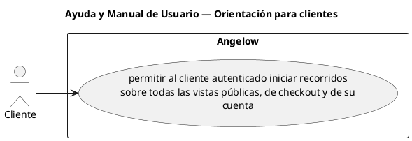

# Ayuda y Manual de Usuario — Orientación para clientes

> 1 casos de uso del subproceso.

## Casos cubiertos

- El sistema debe permitir al cliente autenticado iniciar recorridos sobre todas las vistas públicas, de checkout y de su cuenta.

## Referencias

- [Índice de diagramas](../README.md)
- [Matriz de requerimientos funcionales](../../matriz-requerimientos-funcionales-actualizada.md)
- [Especificación de casos de uso](../../casos-uso-angelow.md)
