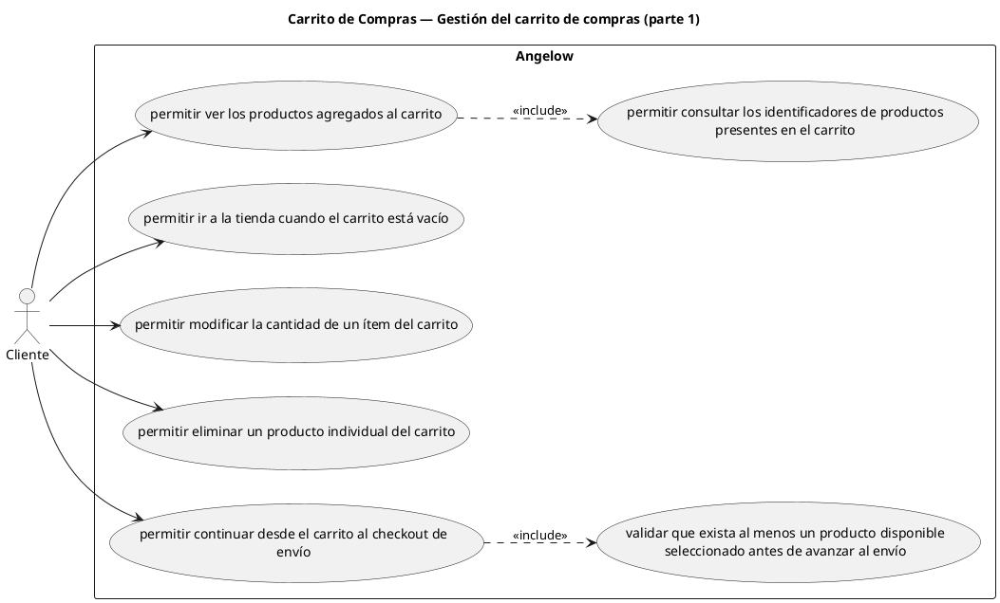

# Carrito de Compras — Gestión del carrito de compras (parte 1)

> 7 casos de uso del subproceso.

## Casos cubiertos

- El sistema debe permitir ver los productos agregados al carrito.
- El sistema debe permitir ir a la tienda cuando el carrito está vacío.
- El sistema debe permitir modificar la cantidad de un ítem del carrito.
- El sistema debe permitir eliminar un producto individual del carrito.
- El sistema debe permitir continuar desde el carrito al checkout de envío.
- El sistema debe permitir consultar los identificadores de productos presentes en el carrito.
- El sistema debe impedir avanzar al envío cuando no exista al menos un producto disponible seleccionado.

## Referencias

- [Índice de diagramas](../README.md)
- [Matriz de requerimientos funcionales](../../matriz-requerimientos-funcionales-actualizada.md)
- [Especificación de casos de uso](../../casos-uso-angelow.md)
