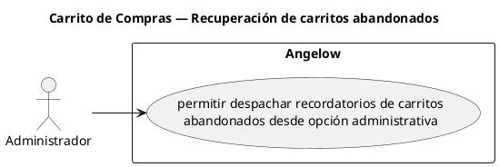

# Carrito de Compras — Recuperación de carritos abandonados

> 1 casos de uso del subproceso.

## Casos cubiertos

- El sistema debe permitir despachar recordatorios de carritos abandonados desde opción administrativa.

## Referencias

- [Índice de diagramas](../README.md)
- [Matriz de requerimientos funcionales](../../matriz-requerimientos-funcionales-actualizada.md)
- [Especificación de casos de uso](../../casos-uso-angelow.md)
