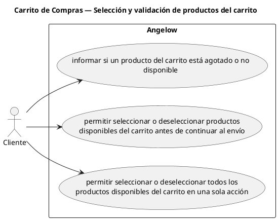

# Carrito de Compras — Selección y validación de productos del carrito

> 3 casos de uso del subproceso.

## Casos cubiertos

- El sistema debe informar si un producto del carrito está agotado o no disponible.
- El sistema debe permitir seleccionar o deseleccionar productos disponibles del carrito antes de continuar al envío.
- El sistema debe permitir seleccionar o deseleccionar todos los productos disponibles del carrito en una sola acción.

## Referencias

- [Índice de diagramas](../README.md)
- [Matriz de requerimientos funcionales](../../matriz-requerimientos-funcionales-actualizada.md)
- [Especificación de casos de uso](../../casos-uso-angelow.md)
