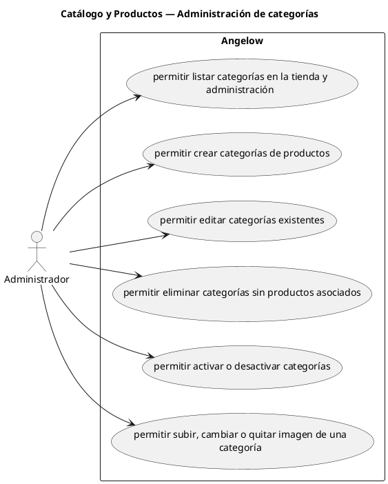

# Catálogo y Productos — Administración de categorías

> 6 casos de uso del subproceso.

## Casos cubiertos

- El sistema debe permitir listar categorías en la tienda y administración.
- El sistema debe permitir crear categorías de productos.
- El sistema debe permitir editar categorías existentes.
- El sistema debe permitir eliminar categorías sin productos asociados.
- El sistema debe permitir activar o desactivar categorías.
- El sistema debe permitir subir, cambiar o quitar imagen de una categoría.

## Referencias

- [Índice de diagramas](../README.md)
- [Matriz de requerimientos funcionales](../../matriz-requerimientos-funcionales-actualizada.md)
- [Especificación de casos de uso](../../casos-uso-angelow.md)
