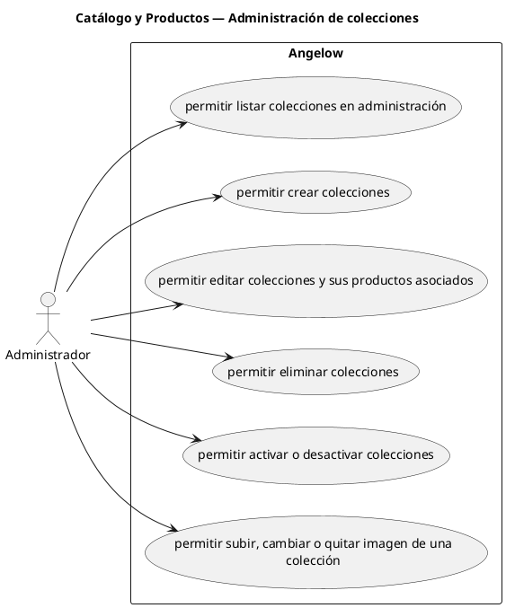

# Catálogo y Productos — Administración de colecciones

> 6 casos de uso del subproceso.

## Casos cubiertos

- El sistema debe permitir listar colecciones en administración.
- El sistema debe permitir crear colecciones.
- El sistema debe permitir editar colecciones y sus productos asociados.
- El sistema debe permitir eliminar colecciones.
- El sistema debe permitir activar o desactivar colecciones.
- El sistema debe permitir subir, cambiar o quitar imagen de una colección.

## Referencias

- [Índice de diagramas](../README.md)
- [Matriz de requerimientos funcionales](../../matriz-requerimientos-funcionales-actualizada.md)
- [Especificación de casos de uso](../../casos-uso-angelow.md)
