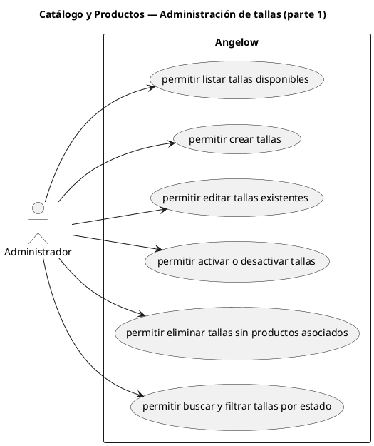

# Catálogo y Productos — Administración de tallas (parte 1)

> 6 casos de uso del subproceso.

## Casos cubiertos

- El sistema debe permitir listar tallas disponibles.
- El sistema debe permitir crear tallas.
- El sistema debe permitir editar tallas existentes.
- El sistema debe permitir activar o desactivar tallas.
- El sistema debe permitir eliminar tallas sin productos asociados.
- El sistema debe permitir buscar y filtrar tallas por estado.

## Referencias

- [Índice de diagramas](../README.md)
- [Matriz de requerimientos funcionales](../../matriz-requerimientos-funcionales-actualizada.md)
- [Especificación de casos de uso](../../casos-uso-angelow.md)
