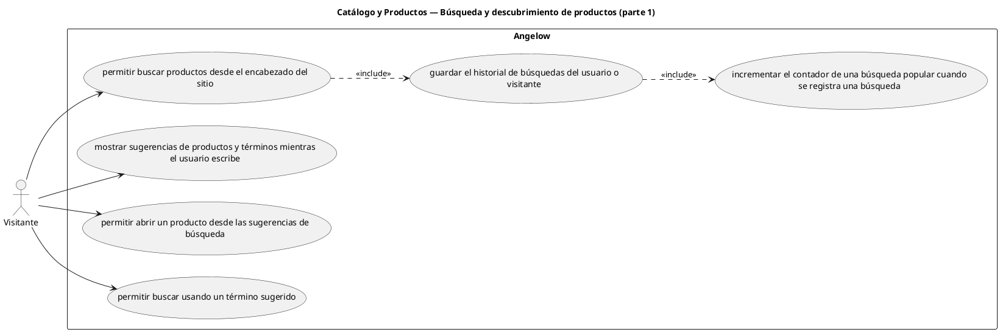

# Catálogo y Productos — Búsqueda y descubrimiento de productos (parte 1)

> 6 casos de uso y 1 requerimientos internos relacionados del subproceso.

## Casos cubiertos

- El sistema debe permitir buscar productos desde el encabezado del sitio.
- El sistema debe mostrar sugerencias de productos y términos mientras el usuario escribe.
- El sistema debe guardar el historial de búsquedas del usuario o visitante.
- El sistema debe permitir abrir un producto desde las sugerencias de búsqueda.
- El sistema debe permitir buscar usando un término sugerido.
- El sistema debe incrementar el contador de una búsqueda popular cuando se registra una búsqueda.

## Requerimientos internos relacionados

## Requerimientos internos relacionados

- El sistema debe incluir términos populares dentro de las sugerencias de búsqueda.
  - Tipo: cálculo interno de sugerencias.
  - Disparador: se preparan sugerencias de búsqueda.
  - Actor directo: no aplica.
  - Contexto: búsqueda en curso.
  - Representación: composición interna de términos populares dentro de las sugerencias.

## Referencias

- [Índice de diagramas](../README.md)
- [Matriz de requerimientos funcionales](../../matriz-requerimientos-funcionales-actualizada.md)
- [Especificación de casos de uso](../../casos-uso-angelow.md)
