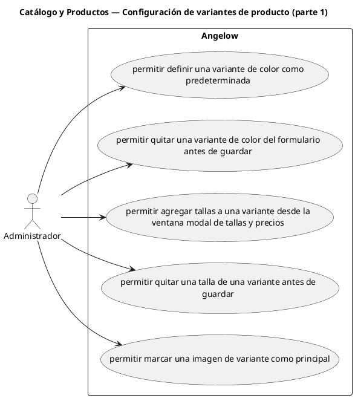

# Catálogo y Productos — Configuración de variantes de producto (parte 1)

> 5 casos de uso y 1 requerimientos internos relacionados del subproceso.

## Casos cubiertos

- El sistema debe permitir definir una variante de color como predeterminada.
- El sistema debe permitir quitar una variante de color del formulario antes de guardar.
- El sistema debe permitir agregar tallas a una variante desde la ventana modal de tallas y precios.
- El sistema debe permitir quitar una talla de una variante antes de guardar.
- El sistema debe permitir marcar una imagen de variante como principal.

## Requerimientos internos relacionados

## Requerimientos internos relacionados

- El sistema debe generar SKU para variantes usando marca, categoría, género, estilo, color y talla.
  - Tipo: generación automática.
  - Disparador: se modifican los atributos que componen el SKU y este no fue editado manualmente.
  - Actor directo: no aplica.
  - Contexto: formulario de variante.
  - Representación: comportamiento interno del formulario.

## Referencias

- [Índice de diagramas](../README.md)
- [Matriz de requerimientos funcionales](../../matriz-requerimientos-funcionales-actualizada.md)
- [Especificación de casos de uso](../../casos-uso-angelow.md)
