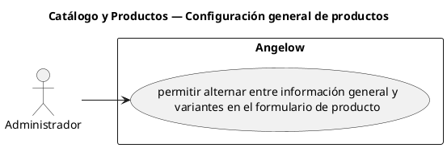

# Catálogo y Productos — Configuración general de productos

> 1 casos de uso y 2 requerimientos internos relacionados del subproceso.

## Casos cubiertos

- El sistema debe permitir alternar entre información general y variantes en el formulario de producto.

## Requerimientos internos relacionados

## Requerimientos internos relacionados

- El sistema debe generar automáticamente el identificador de navegación del producto a partir del nombre cuando no ha sido editado manualmente.
  - Tipo: automatismo interno.
  - Disparador: se modifica el nombre de un producto sin editar manualmente su identificador de navegación.
  - Actor directo: no aplica.
  - Representación: comportamiento interno del formulario.
- El sistema debe cargar categorías, colecciones, colores y tallas antes de editar productos.
  - Tipo: carga interna de información.
  - Disparador: se abre la edición de un producto.
  - Actor directo: no aplica.
  - Representación: preparación interna del formulario.

## Referencias

- [Índice de diagramas](../README.md)
- [Matriz de requerimientos funcionales](../../matriz-requerimientos-funcionales-actualizada.md)
- [Especificación de casos de uso](../../casos-uso-angelow.md)
