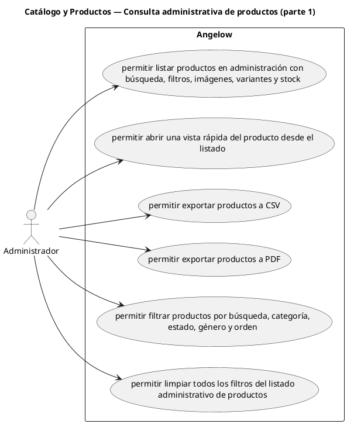

# Catálogo y Productos — Consulta administrativa de productos (parte 1)

> 6 casos de uso del subproceso.

## Casos cubiertos

- El sistema debe permitir listar productos en administración con búsqueda, filtros, imágenes, variantes y stock.
- El sistema debe permitir abrir una vista rápida del producto desde el listado.
- El sistema debe permitir exportar productos a CSV.
- El sistema debe permitir exportar productos a PDF.
- El sistema debe permitir filtrar productos por búsqueda, categoría, estado, género y orden.
- El sistema debe permitir limpiar todos los filtros del listado administrativo de productos.

## Referencias

- [Índice de diagramas](../README.md)
- [Matriz de requerimientos funcionales](../../matriz-requerimientos-funcionales-actualizada.md)
- [Especificación de casos de uso](../../casos-uso-angelow.md)
