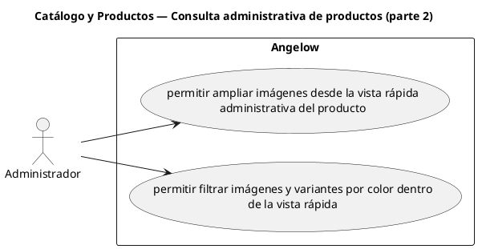

# Catálogo y Productos — Consulta administrativa de productos (parte 2)

> 2 casos de uso del subproceso.

## Casos cubiertos

- El sistema debe permitir ampliar imágenes desde la vista rápida administrativa del producto.
- El sistema debe permitir filtrar imágenes y variantes por color dentro de la vista rápida.

## Referencias

- [Índice de diagramas](../README.md)
- [Matriz de requerimientos funcionales](../../matriz-requerimientos-funcionales-actualizada.md)
- [Especificación de casos de uso](../../casos-uso-angelow.md)
