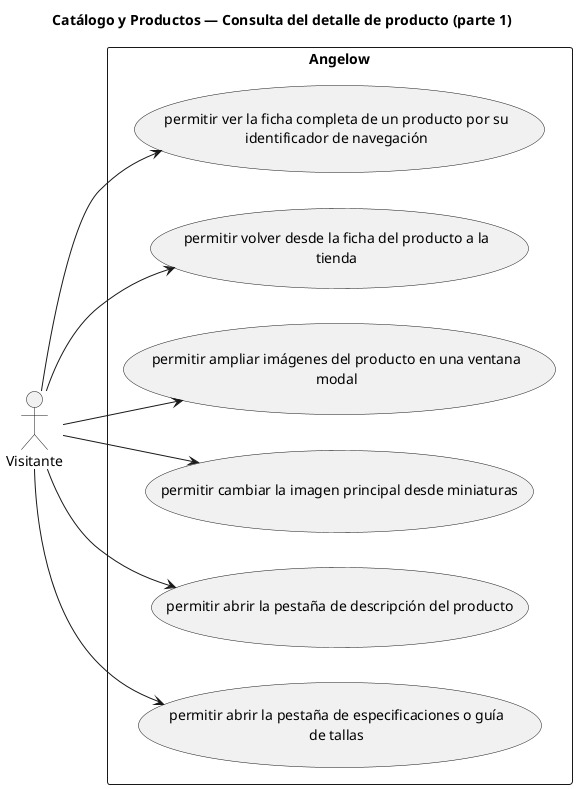

# Catálogo y Productos — Consulta del detalle de producto (parte 1)

> 6 casos de uso del subproceso.

## Casos cubiertos

- El sistema debe permitir ver la ficha completa de un producto por su identificador de navegación.
- El sistema debe permitir volver desde la ficha del producto a la tienda.
- El sistema debe permitir ampliar imágenes del producto en una ventana modal.
- El sistema debe permitir cambiar la imagen principal desde miniaturas.
- El sistema debe permitir abrir la pestaña de descripción del producto.
- El sistema debe permitir abrir la pestaña de especificaciones o guía de tallas.

## Referencias

- [Índice de diagramas](../README.md)
- [Matriz de requerimientos funcionales](../../matriz-requerimientos-funcionales-actualizada.md)
- [Especificación de casos de uso](../../casos-uso-angelow.md)
