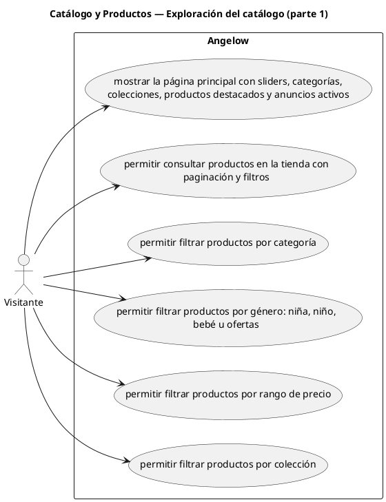

# Catálogo y Productos — Exploración del catálogo (parte 1)

> 6 casos de uso del subproceso.

## Casos cubiertos

- El sistema debe mostrar la página principal con sliders, categorías, colecciones, productos destacados y anuncios activos.
- El sistema debe permitir consultar productos en la tienda con paginación y filtros.
- El sistema debe permitir filtrar productos por categoría.
- El sistema debe permitir filtrar productos por género: niña, niño, bebé u ofertas.
- El sistema debe permitir filtrar productos por rango de precio.
- El sistema debe permitir filtrar productos por colección.

## Referencias

- [Índice de diagramas](../README.md)
- [Matriz de requerimientos funcionales](../../matriz-requerimientos-funcionales-actualizada.md)
- [Especificación de casos de uso](../../casos-uso-angelow.md)
