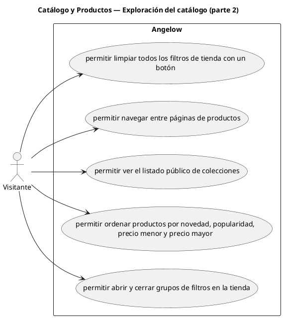

# Catálogo y Productos — Exploración del catálogo (parte 2)

> 5 casos de uso del subproceso.

## Casos cubiertos

- El sistema debe permitir limpiar todos los filtros de tienda con un botón.
- El sistema debe permitir navegar entre páginas de productos.
- El sistema debe permitir ver el listado público de colecciones.
- El sistema debe permitir ordenar productos por novedad, popularidad, precio menor y precio mayor.
- El sistema debe permitir abrir y cerrar grupos de filtros en la tienda.

## Referencias

- [Índice de diagramas](../README.md)
- [Matriz de requerimientos funcionales](../../matriz-requerimientos-funcionales-actualizada.md)
- [Especificación de casos de uso](../../casos-uso-angelow.md)
