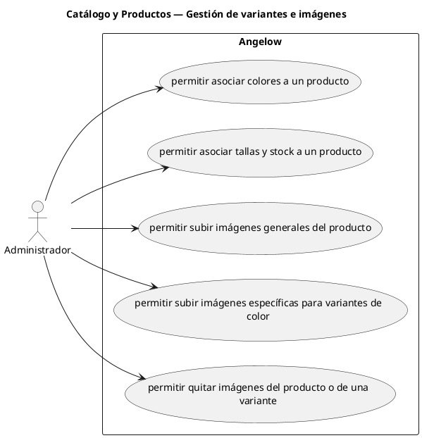

# Catálogo y Productos — Gestión de variantes e imágenes

> 5 casos de uso del subproceso.

## Casos cubiertos

- El sistema debe permitir asociar colores a un producto.
- El sistema debe permitir asociar tallas y stock a un producto.
- El sistema debe permitir subir imágenes generales del producto.
- El sistema debe permitir subir imágenes específicas para variantes de color.
- El sistema debe permitir quitar imágenes del producto o de una variante.

## Referencias

- [Índice de diagramas](../README.md)
- [Matriz de requerimientos funcionales](../../matriz-requerimientos-funcionales-actualizada.md)
- [Especificación de casos de uso](../../casos-uso-angelow.md)
