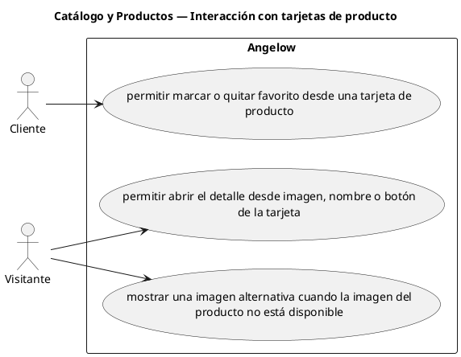

# Catálogo y Productos — Interacción con tarjetas de producto

> 3 casos de uso del subproceso.

## Casos cubiertos

- El sistema debe permitir marcar o quitar favorito desde una tarjeta de producto.
- El sistema debe permitir abrir el detalle desde imagen, nombre o botón de la tarjeta.
- El sistema debe mostrar una imagen alternativa cuando la imagen del producto no está disponible.

## Referencias

- [Índice de diagramas](../README.md)
- [Matriz de requerimientos funcionales](../../matriz-requerimientos-funcionales-actualizada.md)
- [Especificación de casos de uso](../../casos-uso-angelow.md)
