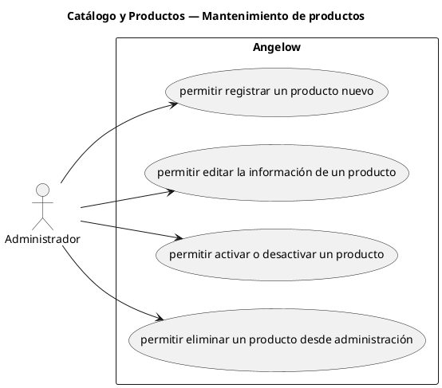

# Catálogo y Productos — Mantenimiento de productos

> 4 casos de uso del subproceso.

## Casos cubiertos

- El sistema debe permitir registrar un producto nuevo.
- El sistema debe permitir editar la información de un producto.
- El sistema debe permitir activar o desactivar un producto.
- El sistema debe permitir eliminar un producto desde administración.

## Referencias

- [Índice de diagramas](../README.md)
- [Matriz de requerimientos funcionales](../../matriz-requerimientos-funcionales-actualizada.md)
- [Especificación de casos de uso](../../casos-uso-angelow.md)
