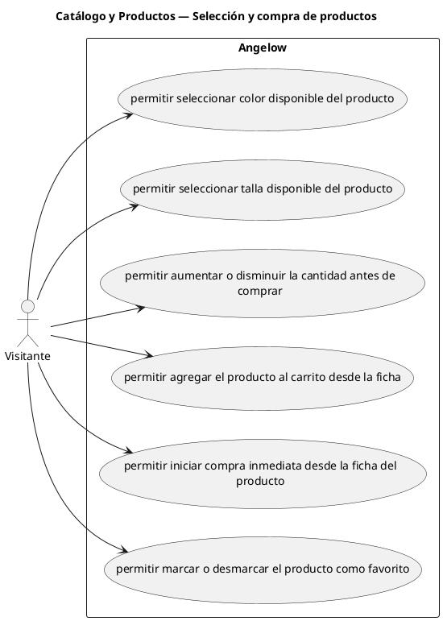

# Catálogo y Productos — Selección y compra de productos

> 6 casos de uso del subproceso.

## Casos cubiertos

- El sistema debe permitir seleccionar color disponible del producto.
- El sistema debe permitir seleccionar talla disponible del producto.
- El sistema debe permitir aumentar o disminuir la cantidad antes de comprar.
- El sistema debe permitir agregar el producto al carrito desde la ficha.
- El sistema debe permitir iniciar compra inmediata desde la ficha del producto.
- El sistema debe permitir marcar o desmarcar el producto como favorito.

## Referencias

- [Índice de diagramas](../README.md)
- [Matriz de requerimientos funcionales](../../matriz-requerimientos-funcionales-actualizada.md)
- [Especificación de casos de uso](../../casos-uso-angelow.md)
