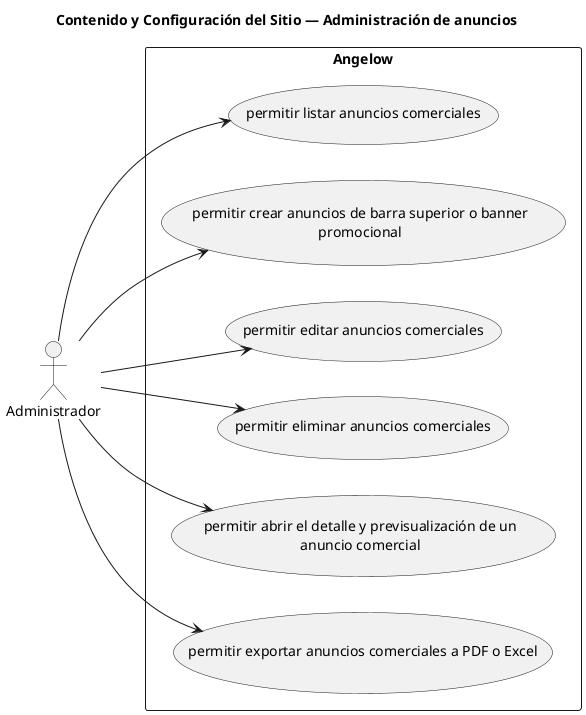

# Contenido y Configuración del Sitio — Administración de anuncios

> 6 casos de uso del subproceso.

## Casos cubiertos

- El sistema debe permitir listar anuncios comerciales.
- El sistema debe permitir crear anuncios de barra superior o banner promocional.
- El sistema debe permitir editar anuncios comerciales.
- El sistema debe permitir eliminar anuncios comerciales.
- El sistema debe permitir abrir el detalle y previsualización de un anuncio comercial.
- El sistema debe permitir exportar anuncios comerciales a PDF o Excel.

## Referencias

- [Índice de diagramas](../README.md)
- [Matriz de requerimientos funcionales](../../matriz-requerimientos-funcionales-actualizada.md)
- [Especificación de casos de uso](../../casos-uso-angelow.md)
