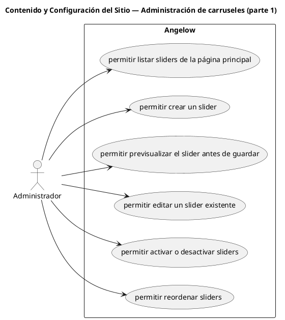

# Contenido y Configuración del Sitio — Administración de carruseles (parte 1)

> 6 casos de uso del subproceso.

## Casos cubiertos

- El sistema debe permitir listar sliders de la página principal.
- El sistema debe permitir crear un slider.
- El sistema debe permitir previsualizar el slider antes de guardar.
- El sistema debe permitir editar un slider existente.
- El sistema debe permitir activar o desactivar sliders.
- El sistema debe permitir reordenar sliders.

## Referencias

- [Índice de diagramas](../README.md)
- [Matriz de requerimientos funcionales](../../matriz-requerimientos-funcionales-actualizada.md)
- [Especificación de casos de uso](../../casos-uso-angelow.md)
