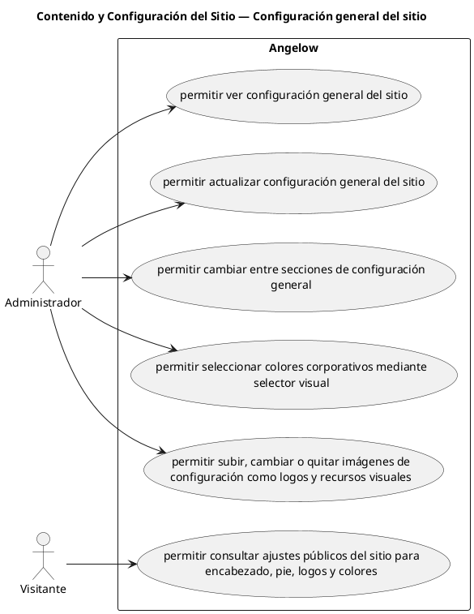

# Contenido y Configuración del Sitio — Configuración general del sitio

> 6 casos de uso del subproceso.

## Casos cubiertos

- El sistema debe permitir ver configuración general del sitio.
- El sistema debe permitir actualizar configuración general del sitio.
- El sistema debe permitir cambiar entre secciones de configuración general.
- El sistema debe permitir seleccionar colores corporativos mediante selector visual.
- El sistema debe permitir subir, cambiar o quitar imágenes de configuración como logos y recursos visuales.
- El sistema debe permitir consultar ajustes públicos del sitio para encabezado, pie, logos y colores.

## Referencias

- [Índice de diagramas](../README.md)
- [Matriz de requerimientos funcionales](../../matriz-requerimientos-funcionales-actualizada.md)
- [Especificación de casos de uso](../../casos-uso-angelow.md)
